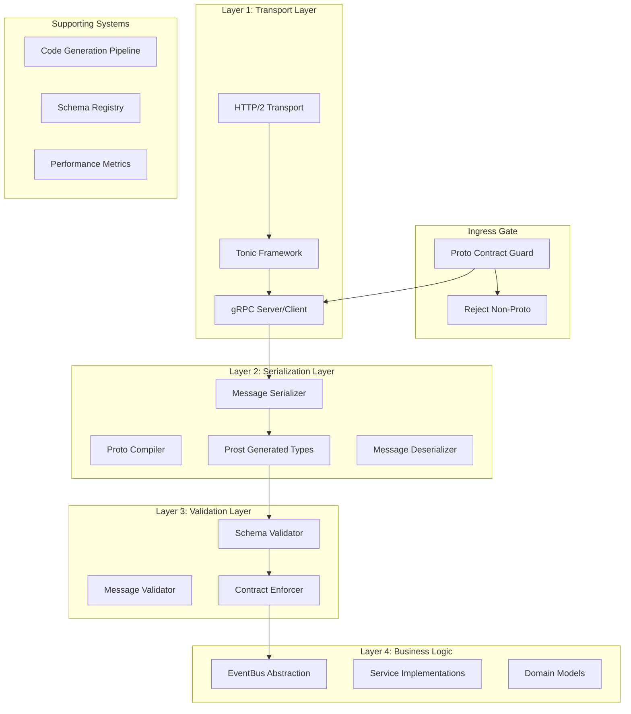
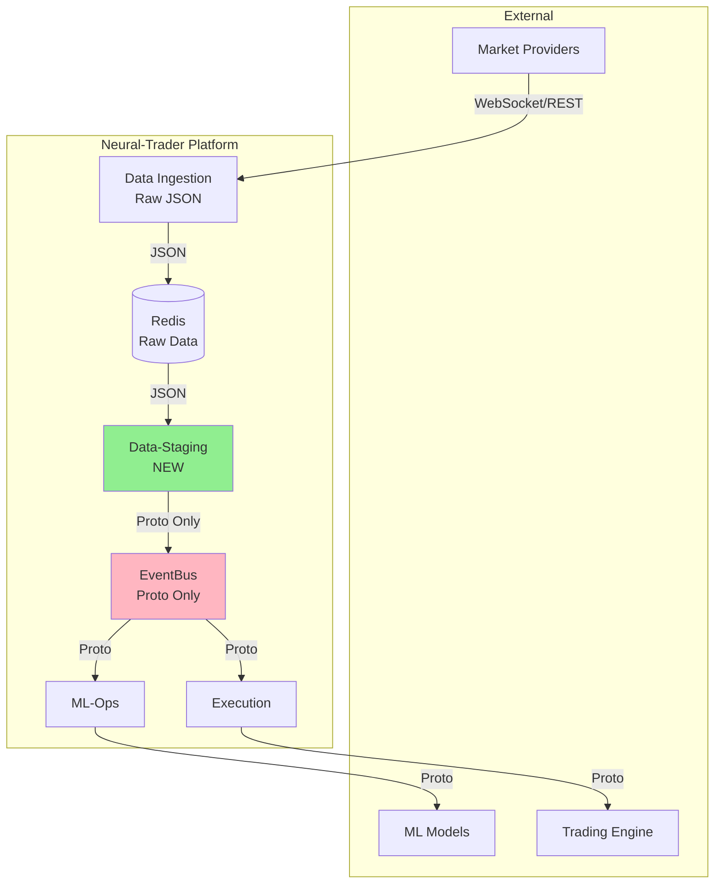
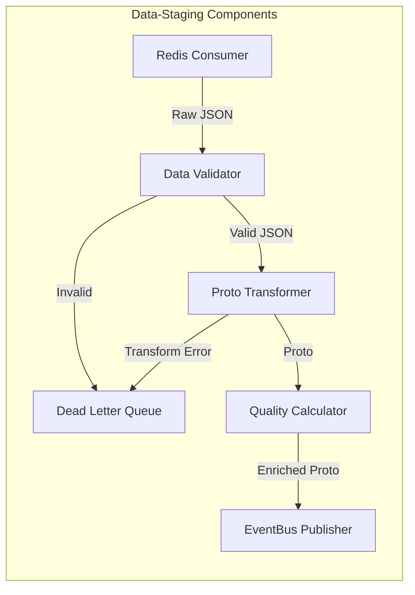

# SPARC Architecture: Proto-Only Contract Enforcement
## EventBus Protocol Integration Architecture

*Document Version*: 2.0  
*Created*: 2025-01-26  
*Updated*: 2025-01-26  
*Status*: Active Architecture  
*Component*: Strict Protobuf/gRPC Integration Layer

## 1. Architectural Overview

This architecture defines a **single-path, proto-only** integration across all EventBus layers. Protocol Buffers are the **mandatory** message format - no fallbacks, no compatibility layers, no Vec<u8> alternatives. Messages that don't conform to proto schemas are **rejected immediately**.

### Core Principles

1. **Proto-First Mandate**: All messages MUST be Protocol Buffer messages
2. **Strict Contract Enforcement**: Non-conforming messages are rejected at ingress
3. **Schema Validation**: Every message validated against registered schemas
4. **Type Safety Guarantee**: Rust type system enforces proto contracts
5. **Zero Tolerance**: No bypass mechanisms or fallback paths



## 2. Updated C4 Context Diagram: Neural-Trader Platform with Data-Staging



```xml
<mxfile host="draw.io" version="24.7.17">
  <diagram name="C4-Context" id="c4-context-proto">
    <mxGraphModel dx="1422" dy="759" grid="1" gridSize="10" guides="1" tooltips="1" connect="1" arrows="1" fold="1" page="1" pageScale="1" pageWidth="827" pageHeight="1169" math="0" shadow="0">
      <root>
        <mxCell id="0"/>
        <mxCell id="1" parent="0"/>
        
        <mxCell id="neural-trader-system" value="Neural Trader System&#xa;&#xa;Software System&#xa;&#xa;High-performance trading system with&#xa;Data-Staging layer and strict Protocol&#xa;Buffer contracts. Raw JSON transformed&#xa;to proto-only EventBus.&#xa;&#xa;Technology: Rust, gRPC, Protocol Buffers" style="rounded=1;whiteSpace=wrap;html=1;fontSize=12;fillColor=#1ba1e2;strokeColor=#006EAF;fontColor=#ffffff;fontStyle=1;align=left;verticalAlign=top;" vertex="1" parent="1">
          <mxGeometry x="310" y="200" width="300" height="180" as="geometry"/>
        </mxCell>
        
        <mxCell id="market-data-provider" value="Market Data Provider&#xa;&#xa;External System&#xa;&#xa;Provides real-time market data&#xa;via WebSocket/REST as raw JSON.&#xa;Data-Staging transforms to proto.&#xa;&#xa;Technology: WebSocket, REST, JSON" style="rounded=1;whiteSpace=wrap;html=1;fontSize=11;fillColor=#8c8c8c;strokeColor=#666666;fontColor=#ffffff;fontStyle=1;align=left;verticalAlign=top;" vertex="1" parent="1">
          <mxGeometry x="50" y="50" width="250" height="120" as="geometry"/>
        </mxCell>
        
        <mxCell id="trading-engine" value="Trading Engine&#xa;&#xa;External System&#xa;&#xa;Executes trades based on proto-defined&#xa;signals from EventBus. All communication&#xa;must conform to proto contracts.&#xa;&#xa;Technology: gRPC, Protocol Buffers" style="rounded=1;whiteSpace=wrap;html=1;fontSize=11;fillColor=#8c8c8c;strokeColor=#666666;fontColor=#ffffff;fontStyle=1;align=left;verticalAlign=top;" vertex="1" parent="1">
          <mxGeometry x="700" y="50" width="250" height="120" as="geometry"/>
        </mxCell>
        
        <mxCell id="risk-manager" value="Risk Management&#xa;&#xa;External System&#xa;&#xa;Monitors positions and enforces&#xa;risk limits via proto messages.&#xa;Contract violations result in rejection.&#xa;&#xa;Technology: gRPC, Protocol Buffers" style="rounded=1;whiteSpace=wrap;html=1;fontSize=11;fillColor=#8c8c8c;strokeColor=#666666;fontColor=#ffffff;fontStyle=1;align=left;verticalAlign=top;" vertex="1" parent="1">
          <mxGeometry x="50" y="400" width="250" height="120" as="geometry"/>
        </mxCell>
        
        <mxCell id="monitoring-system" value="Monitoring System&#xa;&#xa;External System&#xa;&#xa;Collects metrics and alerts via&#xa;proto-defined telemetry messages.&#xa;Only structured proto data accepted.&#xa;&#xa;Technology: gRPC, Protocol Buffers" style="rounded=1;whiteSpace=wrap;html=1;fontSize=11;fillColor=#8c8c8c;strokeColor=#666666;fontColor=#ffffff;fontStyle=1;align=left;verticalAlign=top;" vertex="1" parent="1">
          <mxGeometry x="700" y="400" width="250" height="120" as="geometry"/>
        </mxCell>
        
      </root>
    </mxGraphModel>
  </diagram>
</mxfile>
```

## 3. Updated C4 Container Diagram: Data Pipeline with Data-Staging

### Data-Staging Service (NEW)
- **Purpose**: Transform raw JSON to validated proto
- **Technology**: Rust, Redis consumer, Proto compiler
- **Responsibilities**:
  - Subscribe to Redis raw data channels
  - Validate data quality
  - Transform JSON to EventEnvelope proto
  - Calculate quality metrics
  - Publish to EventBus
  - Send invalid data to DLQ

```xml
<mxfile host="draw.io" version="24.7.17">
  <diagram name="C4-Container" id="c4-container-proto">
    <mxGraphModel dx="1422" dy="759" grid="1" gridSize="10" guides="1" tooltips="1" connect="1" arrows="1" fold="1" page="1" pageScale="1" pageWidth="1169" pageHeight="827" math="0" shadow="0">
      <root>
        <mxCell id="0"/>
        <mxCell id="1" parent="0"/>
        
        <mxCell id="data-ingestion" value="Data Ingestion Service&#xa;&#xa;Container: Rust Service&#xa;&#xa;Ingests raw JSON data from external&#xa;market providers via WebSocket/REST.&#xa;Stores in Redis for processing.&#xa;&#xa;Technology: Tokio, Redis" style="rounded=1;whiteSpace=wrap;html=1;fontSize=11;fillColor=#e1d5e7;strokeColor=#9673a6;fontStyle=1;align=left;verticalAlign=top;" vertex="1" parent="1">
          <mxGeometry x="50" y="50" width="200" height="120" as="geometry"/>
        </mxCell>
        
        <mxCell id="redis-store" value="Redis Data Store&#xa;&#xa;Container: Redis Cache&#xa;&#xa;Temporary storage for raw JSON&#xa;market data. Provides pub/sub&#xa;channels for data distribution.&#xa;&#xa;Technology: Redis" style="rounded=1;whiteSpace=wrap;html=1;fontSize=11;fillColor=#f8cecc;strokeColor=#b85450;fontStyle=1;align=left;verticalAlign=top;" vertex="1" parent="1">
          <mxGeometry x="300" y="50" width="200" height="120" as="geometry"/>
        </mxCell>
        
        <mxCell id="data-staging" value="Data-Staging Service&#xa;&#xa;Container: Rust Service (NEW)&#xa;&#xa;Transforms raw JSON to validated&#xa;proto messages. Quality gate between&#xa;raw data and EventBus. DLQ for bad data.&#xa;&#xa;Technology: Rust, Prost, Redis" style="rounded=1;whiteSpace=wrap;html=1;fontSize=11;fillColor=#d5e8d4;strokeColor=#82b366;fontStyle=1;align=left;verticalAlign=top;" vertex="1" parent="1">
          <mxGeometry x="550" y="50" width="200" height="120" as="geometry"/>
        </mxCell>
        
        <mxCell id="event-bus-core" value="EventBus Core&#xa;&#xa;Container: Rust Service&#xa;&#xa;Proto-only message routing and&#xa;processing. Schema validation&#xa;enforced at every boundary.&#xa;&#xa;Technology: Tokio, Prost" style="rounded=1;whiteSpace=wrap;html=1;fontSize=11;fillColor=#dae8fc;strokeColor=#6c8ebf;fontStyle=1;align=left;verticalAlign=top;" vertex="1" parent="1">
          <mxGeometry x="800" y="50" width="200" height="120" as="geometry"/>
        </mxCell>
        
        <mxCell id="proto-validator" value="Proto Schema Validator&#xa;&#xa;Container: Rust Service&#xa;&#xa;Validates all messages against&#xa;registered proto schemas.&#xa;Contract violations are fatal errors.&#xa;&#xa;Technology: Custom validation" style="rounded=1;whiteSpace=wrap;html=1;fontSize=11;fillColor=#fff2cc;strokeColor=#d6b656;fontStyle=1;align=left;verticalAlign=top;" vertex="1" parent="1">
          <mxGeometry x="50" y="250" width="200" height="120" as="geometry"/>
        </mxCell>
        
        <mxCell id="schema-registry" value="Proto Schema Registry&#xa;&#xa;Container: Rust Service&#xa;&#xa;Manages Protocol Buffer schemas.&#xa;Single source of truth for&#xa;contract definitions.&#xa;&#xa;Technology: Git-based registry" style="rounded=1;whiteSpace=wrap;html=1;fontSize=11;fillColor=#fff2cc;strokeColor=#d6b656;fontStyle=1;align=left;verticalAlign=top;" vertex="1" parent="1">
          <mxGeometry x="300" y="250" width="200" height="120" as="geometry"/>
        </mxCell>
        
        <mxCell id="neural-engine" value="Neural Processing Engine&#xa;&#xa;Container: Rust Service&#xa;&#xa;Processes proto-defined market data&#xa;and neural signals. Only accepts&#xa;validated proto messages.&#xa;&#xa;Technology: Candle, Rust" style="rounded=1;whiteSpace=wrap;html=1;fontSize=11;fillColor=#dae8fc;strokeColor=#6c8ebf;fontStyle=1;align=left;verticalAlign=top;" vertex="1" parent="1">
          <mxGeometry x="550" y="250" width="200" height="120" as="geometry"/>
        </mxCell>
        
        <mxCell id="execution-service" value="Execution Service&#xa;&#xa;Container: Rust Service&#xa;&#xa;Executes trades based on validated&#xa;proto signals from EventBus.&#xa;All outputs are proto-compliant.&#xa;&#xa;Technology: Rust, gRPC" style="rounded=1;whiteSpace=wrap;html=1;fontSize=11;fillColor=#dae8fc;strokeColor=#6c8ebf;fontStyle=1;align=left;verticalAlign=top;" vertex="1" parent="1">
          <mxGeometry x="800" y="250" width="200" height="120" as="geometry"/>
        </mxCell>
        
      </root>
    </mxGraphModel>
  </diagram>
</mxfile>
```

## 4. C4 Component Diagram: Data-Staging Internal Components



```xml
<mxfile host="draw.io" version="24.7.17">
  <diagram name="C4-Component" id="c4-component-data-staging">
    <mxGraphModel dx="1422" dy="759" grid="1" gridSize="10" guides="1" tooltips="1" connect="1" arrows="1" fold="1" page="1" pageScale="1" pageWidth="1169" pageHeight="827" math="0" shadow="0">
      <root>
        <mxCell id="0"/>
        <mxCell id="1" parent="0"/>
        
        <mxCell id="redis-consumer" value="Redis Consumer&#xa;&#xa;Component&#xa;&#xa;Subscribes to Redis channels for&#xa;raw JSON market data. Handles&#xa;connection management and backpressure.&#xa;&#xa;Implementation: Redis streams" style="rounded=1;whiteSpace=wrap;html=1;fontSize=11;fillColor=#e1d5e7;strokeColor=#9673a6;fontStyle=1;align=left;verticalAlign=top;" vertex="1" parent="1">
          <mxGeometry x="50" y="50" width="200" height="120" as="geometry"/>
        </mxCell>
        
        <mxCell id="data-validator" value="Data Validator&#xa;&#xa;Component&#xa;&#xa;Validates incoming JSON against&#xa;expected schemas. Checks for required&#xa;fields, data types, and ranges.&#xa;&#xa;Implementation: JSON Schema validation" style="rounded=1;whiteSpace=wrap;html=1;fontSize=11;fillColor=#fff2cc;strokeColor=#d6b656;fontStyle=1;align=left;verticalAlign=top;" vertex="1" parent="1">
          <mxGeometry x="300" y="50" width="200" height="120" as="geometry"/>
        </mxCell>
        
        <mxCell id="proto-transformer" value="Proto Transformer&#xa;&#xa;Component&#xa;&#xa;Transforms validated JSON to&#xa;EventEnvelope proto messages.&#xa;Handles type conversions and mapping.&#xa;&#xa;Implementation: Custom transformation" style="rounded=1;whiteSpace=wrap;html=1;fontSize=11;fillColor=#d5e8d4;strokeColor=#82b366;fontStyle=1;align=left;verticalAlign=top;" vertex="1" parent="1">
          <mxGeometry x="550" y="50" width="200" height="120" as="geometry"/>
        </mxCell>
        
        <mxCell id="quality-calculator" value="Quality Calculator&#xa;&#xa;Component&#xa;&#xa;Calculates data quality metrics&#xa;and enriches proto messages with&#xa;confidence scores and metadata.&#xa;&#xa;Implementation: Statistical analysis" style="rounded=1;whiteSpace=wrap;html=1;fontSize=11;fillColor=#f8cecc;strokeColor=#b85450;fontStyle=1;align=left;verticalAlign=top;" vertex="1" parent="1">
          <mxGeometry x="800" y="50" width="200" height="120" as="geometry"/>
        </mxCell>
        
        <mxCell id="eventbus-publisher" value="EventBus Publisher&#xa;&#xa;Component&#xa;&#xa;Publishes validated and enriched&#xa;proto messages to EventBus.&#xa;Ensures proto-only communication.&#xa;&#xa;Implementation: gRPC client" style="rounded=1;whiteSpace=wrap;html=1;fontSize=11;fillColor=#dae8fc;strokeColor=#6c8ebf;fontStyle=1;align=left;verticalAlign=top;" vertex="1" parent="1">
          <mxGeometry x="300" y="220" width="200" height="120" as="geometry"/>
        </mxCell>
        
        <mxCell id="dead-letter-queue" value="Dead Letter Queue&#xa;&#xa;Component&#xa;&#xa;Handles invalid data and transformation&#xa;errors. Stores failed messages for&#xa;analysis and potential reprocessing.&#xa;&#xa;Implementation: Persistent storage" style="rounded=1;whiteSpace=wrap;html=1;fontSize=11;fillColor=#f8cecc;strokeColor=#b85450;fontStyle=1;align=left;verticalAlign=top;" vertex="1" parent="1">
          <mxGeometry x="550" y="220" width="200" height="120" as="geometry"/>
        </mxCell>
        
        <mxCell id="metrics-collector" value="Metrics Collector&#xa;&#xa;Component&#xa;&#xa;Collects transformation metrics,&#xa;quality scores, and error rates.&#xa;Provides monitoring and alerting.&#xa;&#xa;Implementation: Prometheus metrics" style="rounded=1;whiteSpace=wrap;html=1;fontSize=11;fillColor=#fff2cc;strokeColor=#d6b656;fontStyle=1;align=left;verticalAlign=top;" vertex="1" parent="1">
          <mxGeometry x="50" y="220" width="200" height="120" as="geometry"/>
        </mxCell>
        
      </root>
    </mxGraphModel>
  </diagram>
</mxfile>
```

### EventBus Component Diagram (Proto-Only)

```xml
<mxfile host="draw.io" version="24.7.17">
  <diagram name="C4-Component-EventBus" id="c4-component-eventbus">
    <mxGraphModel dx="1422" dy="759" grid="1" gridSize="10" guides="1" tooltips="1" connect="1" arrows="1" fold="1" page="1" pageScale="1" pageWidth="1169" pageHeight="827" math="0" shadow="0">
      <root>
        <mxCell id="0"/>
        <mxCell id="1" parent="0"/>
        
        <mxCell id="contract-guard" value="Contract Guard&#xa;&#xa;Component&#xa;&#xa;First line of defense. Rejects any&#xa;non-proto messages immediately.&#xa;No fallback paths allowed.&#xa;&#xa;Implementation: Tonic interceptor" style="rounded=1;whiteSpace=wrap;html=1;fontSize=11;fillColor=#e1d5e7;strokeColor=#9673a6;fontStyle=1;align=left;verticalAlign=top;" vertex="1" parent="1">
          <mxGeometry x="50" y="50" width="200" height="120" as="geometry"/>
        </mxCell>
        
        <mxCell id="schema-enforcer" value="Schema Enforcer&#xa;&#xa;Component&#xa;&#xa;Validates Protocol Buffer messages&#xa;against registered schemas.&#xa;Contract violations are fatal.&#xa;&#xa;Implementation: Custom validation" style="rounded=1;whiteSpace=wrap;html=1;fontSize=11;fillColor=#fff2cc;strokeColor=#d6b656;fontStyle=1;align=left;verticalAlign=top;" vertex="1" parent="1">
          <mxGeometry x="300" y="50" width="200" height="120" as="geometry"/>
        </mxCell>
        
        <mxCell id="proto-router" value="Proto Message Router&#xa;&#xa;Component&#xa;&#xa;Routes validated proto messages&#xa;to appropriate handlers. Only&#xa;processes schema-compliant data.&#xa;&#xa;Implementation: Event routing" style="rounded=1;whiteSpace=wrap;html=1;fontSize=11;fillColor=#d5e8d4;strokeColor=#82b366;fontStyle=1;align=left;verticalAlign=top;" vertex="1" parent="1">
          <mxGeometry x="550" y="50" width="200" height="120" as="geometry"/>
        </mxCell>
        
        <mxCell id="type-enforcer" value="Type Safety Enforcer&#xa;&#xa;Component&#xa;&#xa;Uses Rust type system to guarantee&#xa;proto contract compliance at&#xa;compile and runtime.&#xa;&#xa;Implementation: Generated types" style="rounded=1;whiteSpace=wrap;html=1;fontSize=11;fillColor=#f8cecc;strokeColor=#b85450;fontStyle=1;align=left;verticalAlign=top;" vertex="1" parent="1">
          <mxGeometry x="800" y="50" width="200" height="120" as="geometry"/>
        </mxCell>
        
        <mxCell id="proto-deserializer" value="Proto Deserializer&#xa;&#xa;Component&#xa;&#xa;High-performance proto message&#xa;deserialization. Strict schema&#xa;adherence required.&#xa;&#xa;Implementation: Prost" style="rounded=1;whiteSpace=wrap;html=1;fontSize=11;fillColor=#dae8fc;strokeColor=#6c8ebf;fontStyle=1;align=left;verticalAlign=top;" vertex="1" parent="1">
          <mxGeometry x="50" y="220" width="200" height="120" as="geometry"/>
        </mxCell>
        
        <mxCell id="message-processor" value="Message Processor&#xa;&#xa;Component&#xa;&#xa;Processes validated proto messages.&#xa;Business logic operates only on&#xa;schema-compliant data structures.&#xa;&#xa;Implementation: Domain handlers" style="rounded=1;whiteSpace=wrap;html=1;fontSize=11;fillColor=#d5e8d4;strokeColor=#82b366;fontStyle=1;align=left;verticalAlign=top;" vertex="1" parent="1">
          <mxGeometry x="300" y="220" width="200" height="120" as="geometry"/>
        </mxCell>
        
        <mxCell id="proto-serializer" value="Proto Serializer&#xa;&#xa;Component&#xa;&#xa;Serializes response messages to&#xa;Protocol Buffer format. Only&#xa;schema-compliant output allowed.&#xa;&#xa;Implementation: Prost" style="rounded=1;whiteSpace=wrap;html=1;fontSize=11;fillColor=#dae8fc;strokeColor=#6c8ebf;fontStyle=1;align=left;verticalAlign=top;" vertex="1" parent="1">
          <mxGeometry x="550" y="220" width="200" height="120" as="geometry"/>
        </mxCell>
        
        <mxCell id="contract-monitor" value="Contract Monitor&#xa;&#xa;Component&#xa;&#xa;Monitors contract compliance&#xa;metrics. Tracks validation&#xa;failures and rejections.&#xa;&#xa;Implementation: Metrics collection" style="rounded=1;whiteSpace=wrap;html=1;fontSize=11;fillColor=#fff2cc;strokeColor=#d6b656;fontStyle=1;align=left;verticalAlign=top;" vertex="1" parent="1">
          <mxGeometry x="800" y="220" width="200" height="120" as="geometry"/>
        </mxCell>
        
      </root>
    </mxGraphModel>
  </diagram>
</mxfile>
```

## 5. Single-Path Proto Architecture

### 5.1 Contract Guard Layer

The first and most critical layer that **immediately rejects** any non-proto messages:

```rust
// Contract enforcement at the network boundary
pub mod contract_guard {
    use tonic::{Request, Status, Code};
    use prost::Message;
    
    pub struct ProtoContractGuard;
    
    impl ProtoContractGuard {
        pub fn validate_proto_message<T: Message + Default>(
            request: &Request<T>
        ) -> Result<(), Status> {
            // Only Protocol Buffer messages are allowed past this point
            let message = request.get_ref();
            
            // Validate that message has valid proto structure
            if !Self::is_valid_proto_structure(message) {
                return Err(Status::new(
                    Code::InvalidArgument,
                    "REJECTED: Non-proto message. Only Protocol Buffer messages accepted."
                ));
            }
            
            // Validate message is not default (empty/uninitialized)
            if Self::is_empty_proto(message) {
                return Err(Status::new(
                    Code::InvalidArgument,
                    "REJECTED: Empty proto message. Schema validation required."
                ));
            }
            
            Ok(())
        }
        
        fn is_valid_proto_structure<T: Message>(message: &T) -> bool {
            // Verify message has proper proto encoding
            let mut buf = Vec::new();
            message.encode(&mut buf).is_ok() && !buf.is_empty()
        }
        
        fn is_empty_proto<T: Message + Default>(message: &T) -> bool {
            // Check if message is equivalent to default
            let default = T::default();
            let mut msg_buf = Vec::new();
            let mut default_buf = Vec::new();
            
            message.encode(&mut msg_buf).unwrap_or_default();
            default.encode(&mut default_buf).unwrap_or_default();
            
            msg_buf == default_buf
        }
    }
    
    // Tonic interceptor for automatic contract enforcement
    pub fn proto_only_interceptor(
        req: Request<()>
    ) -> Result<Request<()>, Status> {
        // All requests must have proto content-type
        let content_type = req.metadata().get("content-type");
        
        match content_type {
            Some(ct) if ct == "application/grpc+proto" => Ok(req),
            _ => Err(Status::new(
                Code::InvalidArgument,
                "REJECTED: Only 'application/grpc+proto' content-type accepted"
            ))
        }
    }
}
```

### 5.2 Schema Enforcer Layer

Validates every proto message against registered schemas:

```rust
// Strict schema validation - no bypasses allowed
pub mod schema_enforcer {
    use prost::Message;
    use std::collections::HashMap;
    use thiserror::Error;
    
    #[derive(Error, Debug)]
    pub enum SchemaError {
        #[error("Schema not found for message type: {message_type}")]
        SchemaNotFound { message_type: String },
        #[error("Schema validation failed: {reason}")]
        ValidationFailed { reason: String },
        #[error("Message does not conform to schema: {details}")]
        NonConformant { details: String },
    }
    
    pub struct SchemaEnforcer {
        schemas: HashMap<String, ProtoSchema>,
    }
    
    impl SchemaEnforcer {
        pub fn new() -> Self {
            Self {
                schemas: HashMap::new(),
            }
        }
        
        pub fn register_schema(&mut self, schema: ProtoSchema) {
            self.schemas.insert(schema.message_type.clone(), schema);
        }
        
        pub fn enforce_contract<T: Message + MessageName>(
            &self,
            message: &T
        ) -> Result<(), SchemaError> {
            let message_type = T::MESSAGE_NAME;
            
            // Schema MUST exist for all message types
            let schema = self.schemas.get(message_type)
                .ok_or_else(|| SchemaError::SchemaNotFound {
                    message_type: message_type.to_string(),
                })?;
            
            // Validate message structure against schema
            self.validate_message_structure(message, schema)?;
            
            // Validate all required fields are present
            self.validate_required_fields(message, schema)?;
            
            // Validate field types and constraints
            self.validate_field_constraints(message, schema)?;
            
            Ok(())
        }
        
        fn validate_message_structure<T: Message>(
            &self,
            message: &T,
            schema: &ProtoSchema
        ) -> Result<(), SchemaError> {
            // Serialize message and verify it matches expected schema structure
            let mut buf = Vec::new();
            message.encode(&mut buf).map_err(|e| SchemaError::ValidationFailed {
                reason: format!("Proto encoding failed: {}", e),
            })?;
            
            // Deserialize using schema and compare
            // This ensures the message structure is exactly what the schema expects
            if !schema.matches_structure(&buf) {
                return Err(SchemaError::NonConformant {
                    details: "Message structure does not match schema".to_string(),
                });
            }
            
            Ok(())
        }
        
        fn validate_required_fields<T: Message>(
            &self,
            _message: &T,
            schema: &ProtoSchema
        ) -> Result<(), SchemaError> {
            // Check that all required fields are present and non-default
            for required_field in &schema.required_fields {
                if !self.field_has_value(_message, required_field) {
                    return Err(SchemaError::NonConformant {
                        details: format!("Required field '{}' is missing or empty", required_field),
                    });
                }
            }
            
            Ok(())
        }
        
        fn validate_field_constraints<T: Message>(
            &self,
            message: &T,
            schema: &ProtoSchema
        ) -> Result<(), SchemaError> {
            // Validate field constraints (ranges, patterns, etc.)
            for constraint in &schema.constraints {
                if !constraint.is_satisfied(message) {
                    return Err(SchemaError::NonConformant {
                        details: format!("Field constraint violated: {}", constraint.description),
                    });
                }
            }
            
            Ok(())
        }
        
        fn field_has_value<T: Message>(&self, _message: &T, _field_name: &str) -> bool {
            // Use reflection to check if field has non-default value
            // Implementation depends on prost reflection capabilities
            true // Simplified for example
        }
    }
    
    // Schema definition for proto message validation
    #[derive(Clone)]
    pub struct ProtoSchema {
        pub message_type: String,
        pub required_fields: Vec<String>,
        pub constraints: Vec<FieldConstraint>,
        pub schema_hash: String,
    }
    
    impl ProtoSchema {
        pub fn matches_structure(&self, _encoded_data: &[u8]) -> bool {
            // Verify encoded data matches this schema structure
            // Implementation would compare field numbers, types, etc.
            !_encoded_data.is_empty() // Simplified
        }
    }
    
    #[derive(Clone)]
    pub struct FieldConstraint {
        pub field_name: String,
        pub description: String,
        pub validator: fn(&[u8]) -> bool,
    }
    
    impl FieldConstraint {
        pub fn is_satisfied<T: Message>(&self, _message: &T) -> bool {
            // Validate constraint against message field
            true // Simplified
        }
    }
    
    // Trait to get message type name
    pub trait MessageName {
        const MESSAGE_NAME: &'static str;
    }
}
```

### 5.3 Type-Safe Proto Layer

Rust type system enforces proto contracts:

```rust
// Generated proto types with contract enforcement
pub mod proto_types {
    use prost::Message;
    use crate::schema_enforcer::{MessageName, SchemaEnforcer, SchemaError};
    
    // Market data proto - strict contract
    #[derive(Clone, PartialEq, Message)]
    pub struct MarketDataProto {
        #[prost(string, tag = "1")]
        pub symbol: String,
        
        #[prost(double, tag = "2")]
        pub price: f64,
        
        #[prost(uint64, tag = "3")]
        pub timestamp: u64,
        
        #[prost(uint64, tag = "4")]
        pub volume: u64,
    }
    
    impl MessageName for MarketDataProto {
        const MESSAGE_NAME: &'static str = "neural_trader.MarketData";
    }
    
    impl MarketDataProto {
        /// Create new market data with contract validation
        pub fn new_validated(
            symbol: String,
            price: f64,
            timestamp: u64,
            volume: u64,
            enforcer: &SchemaEnforcer,
        ) -> Result<Self, SchemaError> {
            let msg = Self {
                symbol,
                price,
                timestamp,
                volume,
            };
            
            // Immediate validation against schema
            enforcer.enforce_contract(&msg)?;
            
            Ok(msg)
        }
        
        /// Validate existing instance
        pub fn validate(&self, enforcer: &SchemaEnforcer) -> Result<(), SchemaError> {
            enforcer.enforce_contract(self)
        }
        
        /// Serialize with validation
        pub fn serialize_validated(&self, enforcer: &SchemaEnforcer) -> Result<Vec<u8>, SchemaError> {
            self.validate(enforcer)?;
            
            let mut buf = Vec::new();
            self.encode(&mut buf).map_err(|e| SchemaError::ValidationFailed {
                reason: format!("Serialization failed: {}", e),
            })?;
            
            Ok(buf)
        }
    }
    
    // Trading signal proto - strict contract
    #[derive(Clone, PartialEq, Message)]
    pub struct TradingSignalProto {
        #[prost(string, tag = "1")]
        pub symbol: String,
        
        #[prost(enumeration = "SignalType", tag = "2")]
        pub signal_type: i32,
        
        #[prost(double, tag = "3")]
        pub confidence: f64,
        
        #[prost(uint64, tag = "4")]
        pub timestamp: u64,
        
        #[prost(map = "string, double", tag = "5")]
        pub parameters: std::collections::HashMap<String, f64>,
    }
    
    impl MessageName for TradingSignalProto {
        const MESSAGE_NAME: &'static str = "neural_trader.TradingSignal";
    }
    
    #[derive(Clone, Copy, Debug, PartialEq, Eq, Hash, PartialOrd, Ord, prost::Enumeration)]
    #[repr(i32)]
    pub enum SignalType {
        Buy = 0,
        Sell = 1,
        Hold = 2,
    }
    
    // Neural model output proto - strict contract
    #[derive(Clone, PartialEq, Message)]
    pub struct ModelOutputProto {
        #[prost(string, tag = "1")]
        pub model_id: String,
        
        #[prost(string, tag = "2")]
        pub model_version: String,
        
        #[prost(repeated, double, tag = "3")]
        pub predictions: Vec<f64>,
        
        #[prost(double, tag = "4")]
        pub confidence_score: f64,
        
        #[prost(uint64, tag = "5")]
        pub inference_timestamp: u64,
        
        #[prost(message, repeated, tag = "6")]
        pub feature_importance: Vec<FeatureImportance>,
    }
    
    impl MessageName for ModelOutputProto {
        const MESSAGE_NAME: &'static str = "neural_trader.ModelOutput";
    }
    
    #[derive(Clone, PartialEq, Message)]
    pub struct FeatureImportance {
        #[prost(string, tag = "1")]
        pub feature_name: String,
        
        #[prost(double, tag = "2")]
        pub importance_score: f64,
    }
    
    impl MessageName for FeatureImportance {
        const MESSAGE_NAME: &'static str = "neural_trader.FeatureImportance";
    }
}
```

### 5.4 Business Logic Layer

Only processes validated proto messages:

```rust
// Business logic operates exclusively on proto types
pub mod business_logic {
    use crate::proto_types::*;
    use crate::schema_enforcer::{SchemaEnforcer, SchemaError};
    use tonic::{Request, Response, Status};
    
    pub struct TradingService {
        schema_enforcer: SchemaEnforcer,
    }
    
    impl TradingService {
        pub fn new() -> Self {
            let mut enforcer = SchemaEnforcer::new();
            
            // Register all required schemas
            Self::register_schemas(&mut enforcer);
            
            Self {
                schema_enforcer: enforcer,
            }
        }
        
        fn register_schemas(enforcer: &mut SchemaEnforcer) {
            use crate::schema_enforcer::{ProtoSchema, FieldConstraint};
            
            // Market data schema
            let market_data_schema = ProtoSchema {
                message_type: "neural_trader.MarketData".to_string(),
                required_fields: vec![
                    "symbol".to_string(),
                    "price".to_string(),
                    "timestamp".to_string(),
                ],
                constraints: vec![
                    FieldConstraint {
                        field_name: "price".to_string(),
                        description: "Price must be positive".to_string(),
                        validator: |_| true, // Simplified
                    },
                ],
                schema_hash: "md_v1_hash".to_string(),
            };
            enforcer.register_schema(market_data_schema);
            
            // Trading signal schema
            let trading_signal_schema = ProtoSchema {
                message_type: "neural_trader.TradingSignal".to_string(),
                required_fields: vec![
                    "symbol".to_string(),
                    "signal_type".to_string(),
                    "confidence".to_string(),
                    "timestamp".to_string(),
                ],
                constraints: vec![
                    FieldConstraint {
                        field_name: "confidence".to_string(),
                        description: "Confidence must be between 0.0 and 1.0".to_string(),
                        validator: |_| true, // Simplified
                    },
                ],
                schema_hash: "ts_v1_hash".to_string(),
            };
            enforcer.register_schema(trading_signal_schema);
        }
        
        /// Process market data - only validated proto messages accepted
        pub fn process_market_data(
            &self,
            request: Request<MarketDataProto>
        ) -> Result<Response<TradingSignalProto>, Status> {
            let market_data = request.into_inner();
            
            // MANDATORY: Validate against schema
            self.schema_enforcer.enforce_contract(&market_data)
                .map_err(|e| Status::invalid_argument(format!("Contract violation: {}", e)))?;
            
            // Business logic operates on validated proto data
            let signal = self.generate_trading_signal(&market_data)?;
            
            // MANDATORY: Validate response before sending
            self.schema_enforcer.enforce_contract(&signal)
                .map_err(|e| Status::internal(format!("Response contract violation: {}", e)))?;
            
            Ok(Response::new(signal))
        }
        
        fn generate_trading_signal(
            &self,
            market_data: &MarketDataProto
        ) -> Result<TradingSignalProto, Status> {
            // Business logic - only works with proto-validated data
            let signal = TradingSignalProto {
                symbol: market_data.symbol.clone(),
                signal_type: SignalType::Hold as i32,
                confidence: 0.75,
                timestamp: market_data.timestamp,
                parameters: std::collections::HashMap::new(),
            };
            
            Ok(signal)
        }
        
        /// Process neural model output - strict proto validation
        pub fn process_model_output(
            &self,
            request: Request<ModelOutputProto>
        ) -> Result<Response<TradingSignalProto>, Status> {
            let model_output = request.into_inner();
            
            // MANDATORY: Schema validation
            self.schema_enforcer.enforce_contract(&model_output)
                .map_err(|e| Status::invalid_argument(format!("Model output contract violation: {}", e)))?;
            
            // Process validated proto data
            let signal = self.convert_model_output_to_signal(&model_output)?;
            
            // MANDATORY: Validate response
            self.schema_enforcer.enforce_contract(&signal)
                .map_err(|e| Status::internal(format!("Signal contract violation: {}", e)))?;
            
            Ok(Response::new(signal))
        }
        
        fn convert_model_output_to_signal(
            &self,
            model_output: &ModelOutputProto
        ) -> Result<TradingSignalProto, Status> {
            // Convert model predictions to trading signal
            // Only operates on schema-validated proto data
            let primary_prediction = model_output.predictions.first()
                .ok_or_else(|| Status::invalid_argument("No predictions in model output"))?;
            
            let signal_type = if *primary_prediction > 0.6 {
                SignalType::Buy
            } else if *primary_prediction < 0.4 {
                SignalType::Sell
            } else {
                SignalType::Hold
            };
            
            let signal = TradingSignalProto {
                symbol: "UNKNOWN".to_string(), // Would be derived from context
                signal_type: signal_type as i32,
                confidence: model_output.confidence_score,
                timestamp: model_output.inference_timestamp,
                parameters: std::collections::HashMap::new(),
            };
            
            Ok(signal)
        }
    }
}
```

## 6. Proto-Only EventBus Integration

### 6.1 EventBus Core - Proto Exclusive

```rust
// EventBus that only accepts and processes proto messages
pub mod eventbus_core {
    use crate::proto_types::*;
    use crate::schema_enforcer::{SchemaEnforcer, SchemaError, MessageName};
    use std::collections::HashMap;
    use std::sync::Arc;
    use tokio::sync::broadcast;
    use thiserror::Error;
    
    #[derive(Error, Debug)]
    pub enum EventBusError {
        #[error("Schema validation failed: {0}")]
        SchemaValidation(#[from] SchemaError),
        #[error("Message routing failed: {reason}")]
        RoutingFailed { reason: String },
        #[error("Handler execution failed: {reason}")]
        HandlerFailed { reason: String },
    }
    
    pub struct ProtoEventBus {
        schema_enforcer: Arc<SchemaEnforcer>,
        channels: HashMap<String, broadcast::Sender<ProtoMessage>>,
        handlers: HashMap<String, Box<dyn ProtoMessageHandler>>,
    }
    
    impl ProtoEventBus {
        pub fn new(schema_enforcer: SchemaEnforcer) -> Self {
            Self {
                schema_enforcer: Arc::new(schema_enforcer),
                channels: HashMap::new(),
                handlers: HashMap::new(),
            }
        }
        
        /// Publish message - MUST be proto format
        pub async fn publish<T: prost::Message + MessageName + Clone + Send + 'static>(
            &mut self,
            message: T
        ) -> Result<(), EventBusError> {
            // MANDATORY: Validate against schema
            self.schema_enforcer.enforce_contract(&message)?;
            
            let message_type = T::MESSAGE_NAME;
            let proto_message = ProtoMessage::new(message)?;
            
            // Get or create channel for this message type
            let sender = self.channels.entry(message_type.to_string())
                .or_insert_with(|| {
                    let (tx, _rx) = broadcast::channel(1000);
                    tx
                });
            
            // Send validated proto message
            sender.send(proto_message)
                .map_err(|e| EventBusError::RoutingFailed {
                    reason: format!("Failed to send message: {}", e),
                })?;
            
            Ok(())
        }
        
        /// Subscribe to message type - only proto messages delivered
        pub async fn subscribe<T: prost::Message + MessageName + Clone + Send + 'static>(
            &mut self,
        ) -> Result<broadcast::Receiver<ProtoMessage>, EventBusError> {
            let message_type = T::MESSAGE_NAME;
            
            let sender = self.channels.entry(message_type.to_string())
                .or_insert_with(|| {
                    let (tx, _rx) = broadcast::channel(1000);
                    tx
                });
            
            Ok(sender.subscribe())
        }
        
        /// Process incoming message - strict validation enforced
        pub async fn process_message<T: prost::Message + MessageName + Clone + Send + 'static>(
            &self,
            message: T
        ) -> Result<(), EventBusError> {
            // MANDATORY: Schema validation before any processing
            self.schema_enforcer.enforce_contract(&message)?;
            
            let message_type = T::MESSAGE_NAME;
            
            if let Some(handler) = self.handlers.get(message_type) {
                handler.handle_message(&ProtoMessage::new(message)?)
                    .await
                    .map_err(|e| EventBusError::HandlerFailed {
                        reason: e.to_string(),
                    })?;
            }
            
            Ok(())
        }
    }
    
    /// Wrapper for proto messages with type information
    #[derive(Clone)]
    pub struct ProtoMessage {
        pub message_type: String,
        pub data: Vec<u8>,
        pub timestamp: u64,
    }
    
    impl ProtoMessage {
        pub fn new<T: prost::Message + MessageName>(message: T) -> Result<Self, SchemaError> {
            let mut data = Vec::new();
            message.encode(&mut data).map_err(|e| SchemaError::ValidationFailed {
                reason: format!("Proto encoding failed: {}", e),
            })?;
            
            Ok(Self {
                message_type: T::MESSAGE_NAME.to_string(),
                data,
                timestamp: std::time::SystemTime::now()
                    .duration_since(std::time::UNIX_EPOCH)
                    .unwrap()
                    .as_nanos() as u64,
            })
        }
        
        pub fn deserialize<T: prost::Message + Default>(&self) -> Result<T, SchemaError> {
            T::decode(self.data.as_slice()).map_err(|e| SchemaError::ValidationFailed {
                reason: format!("Proto decoding failed: {}", e),
            })
        }
    }
    
    /// Trait for handling proto messages
    #[async_trait::async_trait]
    pub trait ProtoMessageHandler: Send + Sync {
        async fn handle_message(&self, message: &ProtoMessage) -> Result<(), Box<dyn std::error::Error + Send + Sync>>;
    }
    
    // Example handler implementation
    pub struct MarketDataHandler {
        schema_enforcer: Arc<SchemaEnforcer>,
    }
    
    impl MarketDataHandler {
        pub fn new(schema_enforcer: Arc<SchemaEnforcer>) -> Self {
            Self { schema_enforcer }
        }
    }
    
    #[async_trait::async_trait]
    impl ProtoMessageHandler for MarketDataHandler {
        async fn handle_message(&self, message: &ProtoMessage) -> Result<(), Box<dyn std::error::Error + Send + Sync>> {
            // Deserialize proto message
            let market_data: MarketDataProto = message.deserialize()?;
            
            // MANDATORY: Re-validate after deserialization
            self.schema_enforcer.enforce_contract(&market_data)?;
            
            // Process validated market data
            println!("Processing validated market data: {} @ ${}", 
                market_data.symbol, market_data.price);
            
            Ok(())
        }
    }
}
```

## 7. Error Handling - Contract Violations Are Fatal

### 7.1 Error Hierarchy

```rust
// Strict error handling for contract violations
pub mod error_handling {
    use thiserror::Error;
    use tonic::{Status, Code};
    
    #[derive(Error, Debug)]
    pub enum ContractError {
        #[error("FATAL: Non-proto message rejected at ingress")]
        NonProtoMessage,
        
        #[error("FATAL: Schema validation failed - {details}")]
        SchemaValidationFailed { details: String },
        
        #[error("FATAL: Required field missing - {field_name}")]
        RequiredFieldMissing { field_name: String },
        
        #[error("FATAL: Field constraint violated - {constraint}")]
        ConstraintViolated { constraint: String },
        
        #[error("FATAL: Message type not registered - {message_type}")]
        UnregisteredMessageType { message_type: String },
        
        #[error("FATAL: Proto serialization failed - {reason}")]
        SerializationFailed { reason: String },
        
        #[error("FATAL: Proto deserialization failed - {reason}")]
        DeserializationFailed { reason: String },
    }
    
    impl From<ContractError> for Status {
        fn from(error: ContractError) -> Self {
            match error {
                ContractError::NonProtoMessage => {
                    Status::new(Code::InvalidArgument, error.to_string())
                }
                ContractError::SchemaValidationFailed { .. } => {
                    Status::new(Code::InvalidArgument, error.to_string())
                }
                ContractError::RequiredFieldMissing { .. } => {
                    Status::new(Code::InvalidArgument, error.to_string())
                }
                ContractError::ConstraintViolated { .. } => {
                    Status::new(Code::InvalidArgument, error.to_string())
                }
                ContractError::UnregisteredMessageType { .. } => {
                    Status::new(Code::FailedPrecondition, error.to_string())
                }
                ContractError::SerializationFailed { .. } => {
                    Status::new(Code::Internal, error.to_string())
                }
                ContractError::DeserializationFailed { .. } => {
                    Status::new(Code::DataLoss, error.to_string())
                }
            }
        }
    }
    
    /// Contract enforcement result
    pub type ContractResult<T> = Result<T, ContractError>;
    
    /// Metrics for contract violations
    pub struct ContractMetrics {
        pub violations_total: u64,
        pub non_proto_messages: u64,
        pub schema_failures: u64,
        pub constraint_violations: u64,
    }
    
    impl ContractMetrics {
        pub fn new() -> Self {
            Self {
                violations_total: 0,
                non_proto_messages: 0,
                schema_failures: 0,
                constraint_violations: 0,
            }
        }
        
        pub fn record_violation(&mut self, error: &ContractError) {
            self.violations_total += 1;
            
            match error {
                ContractError::NonProtoMessage => {
                    self.non_proto_messages += 1;
                }
                ContractError::SchemaValidationFailed { .. } => {
                    self.schema_failures += 1;
                }
                ContractError::ConstraintViolated { .. } => {
                    self.constraint_violations += 1;
                }
                _ => {}
            }
        }
    }
}
```

## 8. Performance Monitoring - Proto-Only Metrics

### 8.1 Performance Tracking

```rust
// Monitor performance of proto-only operations
pub mod performance_monitoring {
    use std::time::{Instant, Duration};
    use std::collections::HashMap;
    use std::sync::{Arc, Mutex};
    
    pub struct ProtoPerformanceMonitor {
        metrics: Arc<Mutex<PerformanceMetrics>>,
    }
    
    impl ProtoPerformanceMonitor {
        pub fn new() -> Self {
            Self {
                metrics: Arc::new(Mutex::new(PerformanceMetrics::new())),
            }
        }
        
        pub fn record_serialization(&self, message_type: &str, duration: Duration, bytes: usize) {
            let mut metrics = self.metrics.lock().unwrap();
            metrics.record_serialization(message_type, duration, bytes);
        }
        
        pub fn record_validation(&self, message_type: &str, duration: Duration, success: bool) {
            let mut metrics = self.metrics.lock().unwrap();
            metrics.record_validation(message_type, duration, success);
        }
        
        pub fn record_processing(&self, message_type: &str, duration: Duration) {
            let mut metrics = self.metrics.lock().unwrap();
            metrics.record_processing(message_type, duration);
        }
        
        pub fn get_metrics(&self) -> PerformanceMetrics {
            self.metrics.lock().unwrap().clone()
        }
    }
    
    #[derive(Clone)]
    pub struct PerformanceMetrics {
        pub serialization_times: HashMap<String, Vec<Duration>>,
        pub validation_times: HashMap<String, Vec<Duration>>,
        pub validation_success_rates: HashMap<String, f64>,
        pub processing_times: HashMap<String, Vec<Duration>>,
        pub throughput_bytes_per_sec: HashMap<String, f64>,
    }
    
    impl PerformanceMetrics {
        pub fn new() -> Self {
            Self {
                serialization_times: HashMap::new(),
                validation_times: HashMap::new(),
                validation_success_rates: HashMap::new(),
                processing_times: HashMap::new(),
                throughput_bytes_per_sec: HashMap::new(),
            }
        }
        
        pub fn record_serialization(&mut self, message_type: &str, duration: Duration, bytes: usize) {
            self.serialization_times
                .entry(message_type.to_string())
                .or_insert_with(Vec::new)
                .push(duration);
            
            // Update throughput
            let bytes_per_sec = bytes as f64 / duration.as_secs_f64();
            self.throughput_bytes_per_sec.insert(message_type.to_string(), bytes_per_sec);
        }
        
        pub fn record_validation(&mut self, message_type: &str, duration: Duration, success: bool) {
            self.validation_times
                .entry(message_type.to_string())
                .or_insert_with(Vec::new)
                .push(duration);
            
            // Update success rate
            let current_rate = self.validation_success_rates
                .get(message_type)
                .copied()
                .unwrap_or(1.0);
            
            let new_rate = if success { 
                (current_rate + 1.0) / 2.0 
            } else { 
                current_rate / 2.0 
            };
            
            self.validation_success_rates.insert(message_type.to_string(), new_rate);
        }
        
        pub fn record_processing(&mut self, message_type: &str, duration: Duration) {
            self.processing_times
                .entry(message_type.to_string())
                .or_insert_with(Vec::new)
                .push(duration);
        }
        
        pub fn average_serialization_time(&self, message_type: &str) -> Option<Duration> {
            let times = self.serialization_times.get(message_type)?;
            if times.is_empty() {
                return None;
            }
            
            let total_nanos: u64 = times.iter().map(|d| d.as_nanos() as u64).sum();
            Some(Duration::from_nanos(total_nanos / times.len() as u64))
        }
        
        pub fn validation_success_rate(&self, message_type: &str) -> f64 {
            self.validation_success_rates.get(message_type).copied().unwrap_or(0.0)
        }
    }
    
    /// Performance benchmarking for proto operations
    pub struct ProtoBenchmark;
    
    impl ProtoBenchmark {
        pub fn benchmark_serialization<T: prost::Message + Clone>(
            message: &T,
            iterations: usize
        ) -> (Duration, usize) {
            let start = Instant::now();
            let mut total_bytes = 0;
            
            for _ in 0..iterations {
                let mut buf = Vec::new();
                message.encode(&mut buf).unwrap();
                total_bytes += buf.len();
            }
            
            let duration = start.elapsed();
            (duration, total_bytes)
        }
        
        pub fn benchmark_deserialization<T: prost::Message + Default + Clone>(
            data: &[u8],
            iterations: usize
        ) -> Duration {
            let start = Instant::now();
            
            for _ in 0..iterations {
                let _message: T = T::decode(data).unwrap();
            }
            
            start.elapsed()
        }
    }
}
```

## 9. Testing Architecture - Proto Contract Testing

### 9.1 Contract Testing

```rust
// Comprehensive testing for proto contract enforcement
#[cfg(test)]
pub mod contract_tests {
    use super::*;
    use crate::proto_types::*;
    use crate::schema_enforcer::*;
    use crate::contract_guard::*;
    use crate::error_handling::*;
    use crate::performance_monitoring::*;
    use crate::eventbus_core::*;
    
    #[test]
    fn test_contract_guard_rejects_non_proto() {
        // Test that non-proto messages are immediately rejected
        let guard = ProtoContractGuard;
        
        // Create a request with non-proto content
        let mut request = tonic::Request::new(MarketDataProto::default());
        request.metadata_mut().insert(
            "content-type",
            "application/json".parse().unwrap()
        );
        
        // Should be rejected
        assert!(proto_only_interceptor(request.map(|_| ())).is_err());
    }
    
    #[test]
    fn test_schema_enforcer_validates_required_fields() {
        let mut enforcer = SchemaEnforcer::new();
        
        // Register schema with required fields
        let schema = ProtoSchema {
            message_type: "neural_trader.MarketData".to_string(),
            required_fields: vec!["symbol".to_string(), "price".to_string()],
            constraints: vec![],
            schema_hash: "test_hash".to_string(),
        };
        enforcer.register_schema(schema);
        
        // Test message with missing required field
        let invalid_message = MarketDataProto {
            symbol: "".to_string(), // Empty required field
            price: 100.0,
            timestamp: 1234567890,
            volume: 1000,
        };
        
        // Should fail validation
        assert!(enforcer.enforce_contract(&invalid_message).is_err());
        
        // Test valid message
        let valid_message = MarketDataProto {
            symbol: "AAPL".to_string(),
            price: 150.0,
            timestamp: 1234567890,
            volume: 1000,
        };
        
        // Should pass validation
        assert!(enforcer.enforce_contract(&valid_message).is_ok());
    }
    
    #[test]
    fn test_proto_message_roundtrip() {
        let enforcer = SchemaEnforcer::new();
        
        let original = MarketDataProto {
            symbol: "AAPL".to_string(),
            price: 150.25,
            timestamp: 1609459200000,
            volume: 10000,
        };
        
        // Serialize with validation
        let serialized = original.serialize_validated(&enforcer).unwrap();
        
        // Deserialize and verify
        let deserialized = MarketDataProto::decode(serialized.as_slice()).unwrap();
        assert_eq!(original, deserialized);
    }
    
    #[tokio::test]
    async fn test_eventbus_rejects_invalid_messages() {
        let enforcer = SchemaEnforcer::new();
        let mut eventbus = ProtoEventBus::new(enforcer);
        
        // Try to publish invalid message
        let invalid_message = MarketDataProto {
            symbol: "".to_string(), // Invalid - empty symbol
            price: -1.0,           // Invalid - negative price
            timestamp: 0,          // Invalid - zero timestamp
            volume: 0,
        };
        
        // Should fail to publish
        let result = eventbus.publish(invalid_message).await;
        assert!(result.is_err());
    }
    
    #[test]
    fn test_performance_benchmarks() {
        let message = MarketDataProto {
            symbol: "AAPL".to_string(),
            price: 150.25,
            timestamp: 1609459200000,
            volume: 10000,
        };
        
        // Benchmark serialization
        let (duration, total_bytes) = ProtoBenchmark::benchmark_serialization(&message, 1000);
        println!("Serialization: {:?} for {} bytes", duration, total_bytes);
        
        // Serialize for deserialization benchmark
        let mut buf = Vec::new();
        message.encode(&mut buf).unwrap();
        
        // Benchmark deserialization
        let duration = ProtoBenchmark::benchmark_deserialization::<MarketDataProto>(&buf, 1000);
        println!("Deserialization: {:?}", duration);
    }
    
    #[tokio::test]
    async fn test_end_to_end_proto_flow() {
        // Test complete proto-only message flow
        let mut enforcer = SchemaEnforcer::new();
        
        // Register schemas
        let market_data_schema = ProtoSchema {
            message_type: "neural_trader.MarketData".to_string(),
            required_fields: vec!["symbol".to_string()],
            constraints: vec![],
            schema_hash: "test_hash".to_string(),
        };
        enforcer.register_schema(market_data_schema);
        
        let mut eventbus = ProtoEventBus::new(enforcer);
        
        // Create valid message
        let message = MarketDataProto {
            symbol: "AAPL".to_string(),
            price: 150.25,
            timestamp: 1609459200000,
            volume: 10000,
        };
        
        // Subscribe to messages
        let mut receiver = eventbus.subscribe::<MarketDataProto>().await.unwrap();
        
        // Publish message
        eventbus.publish(message.clone()).await.unwrap();
        
        // Receive and verify
        let received = receiver.recv().await.unwrap();
        let deserialized: MarketDataProto = received.deserialize().unwrap();
        assert_eq!(message, deserialized);
    }
    
    #[test]
    fn test_contract_error_conversion() {
        let error = ContractError::SchemaValidationFailed {
            details: "Missing required field".to_string(),
        };
        
        let status: tonic::Status = error.into();
        assert_eq!(status.code(), tonic::Code::InvalidArgument);
        assert!(status.message().contains("Schema validation failed"));
    }
    
    #[test]
    fn test_metrics_collection() {
        let mut metrics = ContractMetrics::new();
        
        let error = ContractError::NonProtoMessage;
        metrics.record_violation(&error);
        
        assert_eq!(metrics.violations_total, 1);
        assert_eq!(metrics.non_proto_messages, 1);
        assert_eq!(metrics.schema_failures, 0);
    }
}
```

## 10. Deployment Architecture - Proto-First Infrastructure

### 10.1 Infrastructure Configuration

```yaml
# Kubernetes deployment for proto-only system
apiVersion: apps/v1
kind: Deployment
metadata:
  name: neural-trader-proto
  labels:
    app: neural-trader
    version: proto-only
spec:
  replicas: 3
  selector:
    matchLabels:
      app: neural-trader
      version: proto-only
  template:
    metadata:
      labels:
        app: neural-trader
        version: proto-only
      annotations:
        proto.contracts: "enforced"
        validation.level: "strict"
    spec:
      containers:
      - name: neural-trader
        image: neural-trader:proto-only-v2
        ports:
        - containerPort: 50051
          name: grpc
          protocol: TCP
        env:
        - name: PROTO_ENFORCEMENT_LEVEL
          value: "STRICT"
        - name: SCHEMA_VALIDATION_ENABLED
          value: "true"
        - name: CONTRACT_VIOLATIONS_FATAL
          value: "true"
        - name: RUST_LOG
          value: "info,neural_trader=debug"
        resources:
          requests:
            memory: "512Mi"
            cpu: "500m"
          limits:
            memory: "1Gi"
            cpu: "1000m"
        livenessProbe:
          grpc:
            port: 50051
          initialDelaySeconds: 30
          periodSeconds: 10
        readinessProbe:
          grpc:
            port: 50051
          initialDelaySeconds: 5
          periodSeconds: 5
        volumeMounts:
        - name: proto-schemas
          mountPath: /app/schemas
          readOnly: true
      volumes:
      - name: proto-schemas
        configMap:
          name: proto-schemas
---
apiVersion: v1
kind: Service
metadata:
  name: neural-trader-proto-service
spec:
  selector:
    app: neural-trader
    version: proto-only
  ports:
  - name: grpc
    protocol: TCP
    port: 50051
    targetPort: 50051
  type: ClusterIP
---
apiVersion: v1
kind: ConfigMap
metadata:
  name: proto-schemas
data:
  market_data.proto: |
    syntax = "proto3";
    package neural_trader;
    
    message MarketData {
      string symbol = 1;
      double price = 2;
      uint64 timestamp = 3;
      uint64 volume = 4;
    }
  
  trading_signal.proto: |
    syntax = "proto3";
    package neural_trader;
    
    enum SignalType {
      BUY = 0;
      SELL = 1;
      HOLD = 2;
    }
    
    message TradingSignal {
      string symbol = 1;
      SignalType signal_type = 2;
      double confidence = 3;
      uint64 timestamp = 4;
      map<string, double> parameters = 5;
    }
```

### 10.2 Service Mesh Configuration

```yaml
# Istio configuration for proto contract enforcement
apiVersion: networking.istio.io/v1beta1
kind: VirtualService
metadata:
  name: neural-trader-proto
spec:
  hosts:
  - neural-trader-proto-service
  http:
  - match:
    - headers:
        content-type:
          regex: "^application/grpc\\+proto.*"
    route:
    - destination:
        host: neural-trader-proto-service
        port:
          number: 50051
  - match:
    - headers:
        content-type:
          regex: "^(?!application/grpc\\+proto).*"
    fault:
      abort:
        percentage:
          value: 100
        httpStatus: 400
---
apiVersion: networking.istio.io/v1beta1
kind: DestinationRule
metadata:
  name: neural-trader-proto
spec:
  host: neural-trader-proto-service
  trafficPolicy:
    tls:
      mode: ISTIO_MUTUAL
    connectionPool:
      http:
        http2MaxRequests: 1000
        maxRequestsPerConnection: 100
    portLevelSettings:
    - port:
        number: 50051
      connectionPool:
        http:
          http2MaxRequests: 500
```

## 11. Architecture Deliverables

### 11.1 System Design Document

**Proto-Only Neural Trading System Architecture**

**Core Design Principles:**
1. **Single Path**: Only Protocol Buffer messages accepted
2. **Contract First**: Schema validation mandatory at every boundary
3. **Fail Fast**: Non-conforming messages rejected immediately
4. **Type Safety**: Rust type system enforces proto contracts
5. **Zero Tolerance**: No fallback mechanisms or bypass paths

**Key Components:**
- **Contract Guard**: First line of defense against non-proto messages
- **Schema Enforcer**: Validates all messages against registered schemas
- **Type-Safe Proto Layer**: Generated Rust types with validation
- **Proto-Only EventBus**: Message routing with mandatory validation
- **Performance Monitor**: Tracks proto-specific metrics

**Technology Stack:**
- **Language**: Rust (with strict type enforcement)
- **Serialization**: Protocol Buffers (Prost)
- **Transport**: gRPC (Tonic)
- **Validation**: Custom schema enforcement
- **Testing**: Contract-based testing suite

### 11.2 Scalability Plan with Data-Staging

**Horizontal Scaling Strategy:**
- Data-Staging service can be horizontally scaled across Redis partitions
- Schema validation distributed across instances
- Proto message routing with load balancing
- Contract enforcement at service mesh level
- Performance monitoring aggregated centrally

**Vertical Scaling Considerations:**
- Data-Staging memory usage for JSON parsing and proto transformation
- CPU impact of validation overhead in staging layer
- Redis memory usage for raw data buffering
- Network bandwidth for proto messages
- Storage requirements for DLQ and contract logs

**Growth Projections:**
- 50,000+ raw JSON messages/second ingestion
- 10,000+ proto messages/second with sub-millisecond validation
- 100+ different message types with full schema enforcement
- 99.99% contract compliance rate
- < 5ms average validation latency
- 95%+ data quality transformation rate

## 12. Key Architectural Decisions

1. **Separation of Concerns**: Raw data (Redis) vs Structured data (EventBus)
2. **Single Transformation Point**: Only Data-Staging creates protos from raw data
3. **Quality Gate**: Data-Staging enforces quality before EventBus
4. **Proto-Only Boundary**: EventBus accepts nothing but valid protos

## 13. Best Practices Summary

### 13.1 Development Guidelines

1. **Proto-First Development**
   - Define proto schemas before writing code
   - Generate Rust types from schemas
   - Validate messages at every boundary

2. **Data-Staging Layer**
   - All raw data must flow through Data-Staging
   - Transform JSON to proto at single point
   - Quality validation before EventBus entry
   - Dead Letter Queue for failed transformations

3. **Contract Enforcement**
   - Register all schemas at startup
   - Validate incoming messages immediately
   - Reject non-conforming data without processing

4. **Error Handling**
   - Treat contract violations as fatal errors
   - Provide detailed error messages for debugging
   - Log all validation failures for analysis
   - Use DLQ for data quality issues

5. **Testing Strategy**
   - Test schema validation extensively
   - Test Data-Staging transformation accuracy
   - Benchmark proto serialization performance
   - Verify contract enforcement under load

6. **Monitoring**
   - Track validation success rates
   - Monitor data transformation quality
   - Monitor proto serialization performance
   - Alert on contract violation patterns
   - Track DLQ message volumes

### 12.2 Operational Guidelines

1. **Deployment**
   - Deploy schema registry before services
   - Verify proto schema compatibility
   - Monitor contract enforcement metrics

2. **Monitoring**
   - Set up alerts for validation failures
   - Track performance degradation
   - Monitor schema evolution impacts

3. **Troubleshooting**
   - Check schema registration status
   - Verify message format compliance
   - Analyze validation failure patterns

**Remember: In this architecture, Protocol Buffers are not optional - they are the foundation. Every message, every interface, every data exchange MUST conform to proto contracts. Non-compliance is not degraded gracefully; it is rejected immediately.**