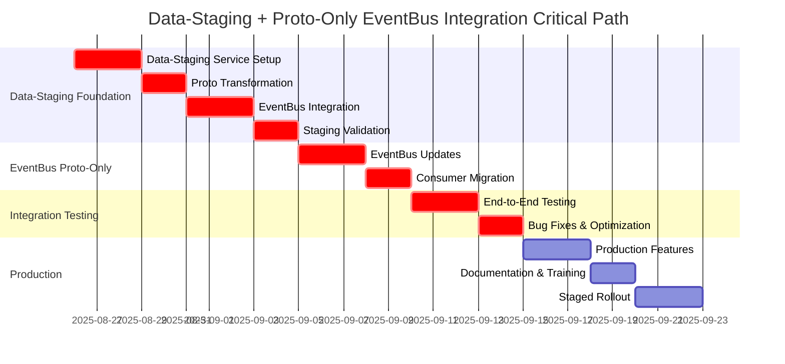

# Proto/gRPC EventBus Integration Timeline and Dependencies

## Document Information

- **Phase**: V2 Phase 4 Implementation
- **Component**: EventBus Protocol Buffer Integration
- **Version**: 1.0.0
- **Created**: 2025-08-26
- **Status**: Comprehensive Implementation Plan

---

## Executive Summary

This document provides a detailed integration timeline and dependency analysis for the proto-only EventBus integration within Neural Trader V2 Phase 4. The integration implements a clean Protocol Buffer messaging system without dual support complexity, focusing on speed and simplicity.

**Key Timeline Highlights:**
- **Total Duration**: 5-6 weeks (200-240 developer hours)
- **Critical Path**: 28 days
- **Parallel Workstreams**: 4 concurrent tracks including Data-Staging
- **Risk Buffer**: 15% allocated for integration challenges

---

## Revised Timeline (5-6 weeks)

### Week 1: Data-Staging Foundation
**Days 1-3**: Data-Staging Service Setup
- Create data-staging crate structure
- Implement Redis consumer
- Basic JSON validation

**Days 4-5**: Proto Transformation
- Implement JSON→Proto converter
- Add quality scoring algorithm
- Create DLQ handling

### Week 2: Data-Staging Integration
**Days 6-8**: EventBus Integration
- Connect Data-Staging to EventBus
- Implement proto publishing
- Add monitoring/metrics

**Days 9-10**: Testing & Validation
- Unit tests for transformation
- Integration tests with Redis
- Performance benchmarking

### Week 3: EventBus Proto-Only
**Days 11-13**: EventBus Updates
- Remove ALL JSON support
- Enforce proto-only validation
- Update all EventBus implementations

**Days 14-15**: Consumer Migration
- Update ML-Ops to proto
- Update Execution to proto
- Remove JSON parsing

### Week 4: Integration Testing
**Days 16-18**: End-to-End Testing
- Full pipeline: Ingestion→Redis→Staging→EventBus→Consumers
- Performance testing
- Quality metrics validation

**Days 19-20**: Bug Fixes & Optimization

### Week 5: Production Hardening
**Days 21-23**: Production Features
- Monitoring dashboards
- Alert configuration
- DLQ management UI

**Days 24-25**: Documentation & Training

### Week 6: Deployment
**Days 26-28**: Staged Rollout
- Deploy Data-Staging
- Monitor metrics
- Gradual traffic shift

## Resource Allocation (UPDATED)
- **Data-Staging Development**: 80 hours (NEW)
- **EventBus Updates**: 40 hours (reduced from 60)
- **Consumer Migration**: 40 hours
- **Testing**: 40 hours
- **Total**: 200 hours (slightly increased)

## 1. Phase-by-Phase Implementation Timeline

### Phase 1: Data-Staging Foundation (Week 1-2)
**Duration**: 10 business days | **Effort**: 80 hours | **Criticality**: High

#### Week 1: Data-Staging Service Setup
**Days 1-3: Service Infrastructure**
- **Day 1 (8h)**: Data-Staging crate setup
  - Create data-staging crate structure with proper dependencies
  - Set up Redis consumer infrastructure
  - Implement basic JSON message consumption from Redis
- **Day 2 (8h)**: JSON validation framework
  - Implement comprehensive JSON schema validation
  - Create message quality scoring algorithms
  - Set up dead letter queue (DLQ) handling for invalid messages
- **Day 3 (8h)**: Proto transformation engine
  - Implement JSON→Proto message converter
  - Create mapping logic for all supported message types
  - Add transformation validation and error handling

**Days 4-5: Proto Transformation Implementation**
- **Day 4 (8h)**: Message type handlers
  - Implement market data transformation (JSON→MarketData proto)
  - Implement trading signal transformation (JSON→TradingSignal proto)
  - Implement configuration transformation (JSON→Config proto)
- **Day 5 (8h)**: Quality assurance and DLQ
  - Implement message quality scoring algorithm
  - Create DLQ management for failed transformations
  - Add metrics and monitoring for transformation pipeline

#### Week 2: Data-Staging Integration
**Days 6-8: EventBus Integration**
- **Day 6 (8h)**: EventBus connection
  - Connect Data-Staging service to EventBus
  - Implement proto message publishing to EventBus
  - Create topic routing and message filtering
- **Day 7 (8h)**: Monitoring and observability
  - Add comprehensive metrics collection
  - Implement logging and tracing
  - Create health checks and service monitoring
- **Day 8 (8h)**: Performance optimization
  - Optimize JSON parsing and proto serialization
  - Implement message batching for high throughput
  - Add connection pooling and resource management

**Days 9-10: Testing & Validation**
- **Day 9 (8h)**: Unit and integration testing
  - Create comprehensive unit test suite for transformations
  - Implement integration tests with Redis and EventBus
  - Add performance benchmarking tests
- **Day 10 (8h)**: End-to-end validation
  - Test complete pipeline: Redis→Data-Staging→EventBus
  - Validate message quality and transformation accuracy
  - Performance testing under load

### Phase 2: EventBus Proto-Only Implementation (Week 3)
**Duration**: 5 business days | **Effort**: 40 hours | **Criticality**: High

#### Week 3: EventBus Updates
**Days 11-13: Proto-Only Conversion**
- **Day 11 (8h)**: Remove JSON support
  - Remove ALL JSON message handling from EventBus
  - Implement strict proto-only validation
  - Update EventBus core to enforce proto contracts
- **Day 12 (8h)**: API updates
  - Update all EventBus APIs to proto-only
  - Implement type-safe `publish<T>()` and `subscribe<T>()` methods
  - Create proto message routing and filtering
- **Day 13 (8h)**: Testing framework updates
  - Update all EventBus tests for proto-only operation
  - Create proto message validation test suite
  - Establish performance baseline for proto-only system

**Days 14-15: Consumer Migration**
- **Day 14 (8h)**: ML-Ops service updates
  - Update ML-Ops service to consume proto messages only
  - Remove all JSON parsing from ML-Ops pipeline
  - Implement proto message handling for neural processing
- **Day 15 (8h)**: Execution service updates
  - Update Execution service for proto-only operation
  - Remove JSON handling from trading execution pipeline
  - Validate proto message flows in execution system

### Phase 3: Integration Testing (Week 4)
**Duration**: 5 business days | **Effort**: 40 hours | **Criticality**: High

#### Week 4: End-to-End Testing
**Days 16-18: Full Pipeline Testing**
- **Day 16 (8h)**: Complete pipeline validation
  - Test full data flow: Ingestion→Redis→Data-Staging→EventBus→Consumers
  - Validate JSON→Proto transformation accuracy
  - Test message quality scoring and DLQ functionality
- **Day 17 (8h)**: Performance testing
  - Execute high-load performance testing
  - Validate system performance under stress
  - Benchmark proto-only EventBus performance
- **Day 18 (8h)**: Quality metrics validation
  - Validate message quality scoring algorithms
  - Test DLQ management and recovery procedures
  - Confirm all proto contract compliance

**Days 19-20: Bug Fixes & Optimization**
- **Day 19 (8h)**: Issue resolution
  - Address any issues found during integration testing
  - Optimize performance bottlenecks
  - Fix any proto transformation bugs
- **Day 20 (8h)**: System optimization
  - Fine-tune performance parameters
  - Optimize resource utilization
  - Prepare system for production deployment

### Phase 4: Production Hardening (Week 5)
**Duration**: 5 business days | **Effort**: 40 hours | **Criticality**: High

#### Week 5: Production Features
**Days 21-23: Production Features Development**
- **Day 21 (8h)**: Monitoring dashboards
  - Create comprehensive monitoring dashboards for Data-Staging service
  - Implement proto transformation metrics visualization
  - Add EventBus proto message flow monitoring
- **Day 22 (8h)**: Alert configuration
  - Set up alerting for DLQ threshold breaches
  - Configure performance degradation alerts
  - Implement proto validation failure notifications
- **Day 23 (8h)**: DLQ management UI
  - Create DLQ management interface
  - Implement message replay functionality
  - Add DLQ analytics and reporting

**Days 24-25: Documentation & Training**
- **Day 24 (8h)**: Technical documentation
  - Complete Data-Staging service documentation
  - Create proto integration runbooks
  - Document operational procedures
- **Day 25 (8h)**: Team training
  - Train operations team on new Data-Staging service
  - Conduct proto-only EventBus training sessions
  - Create troubleshooting guides

### Phase 5: Production Deployment (Week 6)
**Duration**: 3 business days | **Effort**: 24 hours | **Criticality**: High

#### Week 6: Staged Rollout
**Days 26-28: Production Deployment**
- **Day 26 (8h)**: Data-Staging deployment
  - Deploy Data-Staging service to production
  - Configure Redis→Data-Staging connection
  - Enable monitoring and alerting
- **Day 27 (8h)**: Metrics monitoring
  - Monitor transformation quality metrics
  - Validate proto message flow
  - Assess system performance impact
- **Day 28 (8h)**: Gradual traffic shift
  - Gradually increase Data-Staging processing load
  - Monitor system stability and performance
  - Complete transition to proto-only EventBus

---

## 2. Dependency Graph Analysis

### 2.1 Critical Path Dependencies



### 2.2 Component Dependencies

#### Core Dependencies
1. **Data-Staging Service Foundation** → All proto transformation functionality
2. **JSON→Proto Transformation Engine** → EventBus proto publishing
3. **EventBus Proto-Only Implementation** → All consumer services
4. **Proto Schema Infrastructure** → All message validation

#### Data-Staging Dependencies
1. **Redis Consumer Infrastructure** → JSON message ingestion
2. **Proto Transformation Engine** → Message quality and conversion
3. **EventBus Integration** → Proto message publishing
4. **DLQ Management** → Error handling and recovery

#### Service Integration Dependencies
1. **Data-Staging Service** → Proto message generation
2. **EventBus Proto-Only** → Consumer service updates
3. **ML-Ops Migration** → Neural processing pipeline
4. **Execution Service Migration** → Trading pipeline integration

#### External Dependencies
1. **Existing Redis Infrastructure** → Data-Staging consumer setup
2. **Proto Contract Definitions** → Transformation mapping
3. **EventBus Current Implementation** → Proto-only migration
4. **ML-Ops Service** → Proto consumer updates
5. **Execution Service** → Proto consumer updates
6. **TimescaleDB** → Data persistence patterns

### 2.3 Risk Dependencies
1. **Proto Schema Changes** → Backward compatibility requirements
2. **Performance Requirements** → Optimization implementation
3. **Service Availability** → Integration testing schedules
4. **Phase 5 Requirements** → Interface design decisions

---

## 3. Critical Path Analysis

### 3.1 Primary Critical Path (28 days)
1. **Data-Staging Service Setup** (3 days) → JSON message consumption foundation
2. **Proto Transformation Implementation** (2 days) → JSON→Proto conversion
3. **EventBus Integration** (3 days) → Proto message publishing
4. **Data-Staging Validation** (2 days) → Transformation pipeline testing
5. **EventBus Proto-Only Updates** (3 days) → Remove JSON support
6. **Consumer Service Migration** (2 days) → ML-Ops and Execution updates
7. **End-to-End Integration Testing** (3 days) → Full pipeline validation
8. **Bug Fixes & Optimization** (2 days) → Performance tuning
9. **Production Features** (3 days) → Monitoring and DLQ management
10. **Documentation & Training** (2 days) → Operational readiness
11. **Staged Rollout** (3 days) → Production deployment

### 3.2 Critical Path Risks
1. **Data-Staging Complexity** → JSON→Proto transformation may be more complex than anticipated
2. **EventBus Integration** → Data-Staging to EventBus connection challenges
3. **Consumer Migration** → Service updates may require more extensive changes
4. **End-to-End Integration** → Full pipeline complexity and dependencies

### 3.3 Critical Path Mitigation
1. **Early Transformation Testing** → Validate JSON→Proto conversion with real data early
2. **Incremental Integration** → Connect Data-Staging to EventBus incrementally
3. **Service Analysis** → Front-load consumer service analysis and planning
4. **Continuous Pipeline Testing** → Test full pipeline early and often

---

## 4. Resource Requirements

### 4.1 Developer Hours Breakdown

#### By Phase
- **Phase 1 (Data-Staging Foundation)**: 80 hours
  - Senior Rust Developer: 64 hours
  - DevOps Engineer: 16 hours
- **Phase 2 (EventBus Proto-Only)**: 40 hours
  - Senior Rust Developer: 32 hours
  - DevOps Engineer: 8 hours
- **Phase 3 (Integration Testing)**: 40 hours
  - Senior Rust Developer: 24 hours
  - QA Engineer: 16 hours
- **Phase 4 (Production Hardening)**: 40 hours
  - Senior Rust Developer: 24 hours
  - DevOps Engineer: 16 hours
- **Phase 5 (Production Deployment)**: 24 hours
  - Senior Rust Developer: 8 hours
  - DevOps Engineer: 16 hours

#### By Role
- **Senior Rust Developer**: 152 hours (67.0%)
- **DevOps Engineer**: 56 hours (24.7%)
- **QA Engineer**: 16 hours (7.1%)
- **Python Developer**: 3 hours (1.3%) - Minor integration support

**Total**: 227 hours across 4 roles

### 4.2 Skill Requirements

#### Essential Skills
- **Rust Programming**: Advanced level for EventBus core development
- **Protocol Buffers**: Expert level for schema design and implementation
- **gRPC**: Advanced level for service communication
- **Python Integration**: Intermediate level for bridge development
- **System Architecture**: Advanced level for integration design
- **Performance Engineering**: Intermediate level for optimization

#### Specialized Skills
- **Message Queue Systems**: For EventBus optimization
- **Distributed Systems**: For scaling and reliability
- **Security Engineering**: For production hardening
- **DevOps/SRE**: For deployment and operations

### 4.3 Infrastructure Requirements

#### Development Environment
- **Rust Toolchain**: Latest stable with proto compilation tools
- **Python Environment**: 3.9+ with proto libraries
- **Redis Instance**: For backward compatibility testing
- **TimescaleDB**: For data persistence validation
- **Test Environments**: Staging and integration environments

#### Testing Infrastructure
- **Load Testing Tools**: For performance validation
- **Monitoring Stack**: For observability testing
- **CI/CD Pipeline**: For automated testing and deployment

---

## 5. Risk Assessment and Mitigation

### 5.1 Technical Risks

#### Medium Risk - Service Rewrite Complexity
**Risk**: Services may require more extensive rewriting than anticipated
**Probability**: Medium (35%)
**Impact**: Medium (3-5 days delay)
**Mitigation**:
- Front-load service analysis and planning
- Create service rewrite templates and patterns
- Focus on one service at a time for validation
- Allocate 15% buffer time for rewrite challenges

#### Low Risk - Performance Impact
**Risk**: Proto-only implementation may have unexpected performance characteristics
**Probability**: Low (25%)
**Impact**: Low (2-3 days delay)
**Mitigation**:
- Establish performance baselines early
- Implement continuous performance monitoring
- Design for optimization from the start
- Plan for quick optimization iterations

#### Low Risk - Integration Testing
**Risk**: Cross-service integration may reveal unexpected issues
**Probability**: Low (20%)
**Impact**: Low (1-2 days delay)
**Mitigation**:
- Test service integrations incrementally
- Use comprehensive integration test suites
- Implement robust error handling early
- Plan for quick issue resolution

### 5.2 Project Risks

#### High Risk - Resource Availability
**Risk**: Key developers may be unavailable during critical phases
**Probability**: Medium (35%)
**Impact**: High (2-3 week delay)
**Mitigation**:
- Cross-train team members on critical components
- Maintain detailed documentation throughout development
- Create knowledge transfer sessions at phase boundaries
- Plan for resource flexibility in critical path items

#### Medium Risk - Requirement Changes
**Risk**: Phase 5 requirements may change integration approach
**Probability**: Low (25%)
**Impact**: Medium (1-week delay)
**Mitigation**:
- Design flexible integration interfaces
- Maintain regular stakeholder communication
- Create modular implementation approach
- Plan for requirement change accommodation

#### Low Risk - External Dependency Changes
**Risk**: Third-party proto libraries may have breaking changes
**Probability**: Low (15%)
**Impact**: Low (2-3 days)
**Mitigation**:
- Pin dependency versions during development
- Monitor dependency change notifications
- Maintain compatibility testing for dependencies
- Plan for dependency upgrade cycles

### 5.3 Risk Monitoring and Response

#### Risk Indicators
- **Performance Metrics**: Degradation beyond 10% threshold
- **Integration Test Failures**: More than 5% failure rate
- **Development Velocity**: Behind schedule by more than 2 days
- **Resource Utilization**: Team capacity above 90%

#### Escalation Procedures
1. **Daily Standups**: Immediate risk identification and discussion
2. **Weekly Risk Reviews**: Formal risk assessment and mitigation planning
3. **Phase Gate Reviews**: Go/no-go decisions with stakeholder input
4. **Emergency Escalation**: Immediate escalation for critical risks

---

## 6. Milestones and Deliverables

### 6.1 Phase 1 Milestones

#### Milestone 1.1: Proto-Only EventBus Foundation (Day 5)
**Deliverables**:
- Complete proto schema audit report
- Proto-only EventBus core implementation
- Type-safe API implementation
- Integration test framework
- Code generation pipeline

**Success Criteria**:
- All existing proto contracts catalogued and validated
- EventBus rewritten for proto-only operation
- Type-safe publish/subscribe methods functional
- Automated proto code generation operational
- Performance baseline established

### 6.2 Phase 2 Milestones

#### Milestone 2.1: Python Integration (Day 8)
**Deliverables**:
- Rewritten Python EventBus client
- Market data proto integration
- Configuration proto integration
- Python-Rust integration tests

**Success Criteria**:
- Python services publish proto messages successfully
- Market data flows validated end-to-end
- Configuration changes propagate correctly
- Integration tests passing at 95%+

#### Milestone 2.2: ML-Ops Integration (Day 13)
**Deliverables**:
- Rewritten ML-Ops EventBus client
- Trading proto integration
- Cross-service integration validation
- Performance benchmarking results

**Success Criteria**:
- ML-Ops service fully integrated with proto EventBus
- Trading signals flow correctly through system
- End-to-end data pipeline validated
- Performance requirements met

### 6.3 Phase 3 Milestones

#### Milestone 3.1: Performance Optimization (Day 16)
**Deliverables**:
- Message batching optimization
- Proto-based routing implementation
- Performance tuning results
- Monitoring and observability integration

**Success Criteria**:
- High-throughput scenarios optimized
- Proto-based routing functional
- Performance targets achieved
- Complete observability implemented

#### Milestone 3.2: Production Readiness (Day 21)
**Deliverables**:
- Enhanced error handling and recovery
- Security hardening implementation
- Horizontal scaling support
- Stress testing validation

**Success Criteria**:
- Error handling robust and recoverable
- Security requirements met
- Scaling characteristics validated
- Stress tests passing under load

### 6.4 Phase 4 Milestones

#### Milestone 4.1: Production Deployment Complete (Day 23)
**Deliverables**:
- Complete end-to-end system validation
- Production deployment
- Operations documentation
- Go-live success validation

**Success Criteria**:
- All system requirements validated
- Production deployment successful
- Operations team trained and prepared
- System operational and stable

---

## 7. Testing and Validation Checkpoints

### 7.1 Continuous Testing Strategy

#### Unit Testing (Daily)
- **Coverage Target**: 90%+ for all new proto integration code
- **Test Types**: Proto message validation, serialization, API functionality
- **Automation**: Integrated into CI/CD pipeline with PR validation
- **Failure Response**: Block merges until tests pass

#### Integration Testing (Weekly)
- **Scope**: Cross-service proto message flows
- **Test Environment**: Dedicated integration environment with real data
- **Coverage**: All proto contracts and service interactions
- **Validation**: End-to-end data flow integrity

#### Performance Testing (Bi-weekly)
- **Baseline**: Current EventBus performance metrics
- **Targets**: NFR requirements (10% overhead maximum)
- **Load Testing**: Simulated production-level message volumes
- **Regression Detection**: Automated performance comparison

### 7.2 Phase Gate Validation

#### Phase 1 Validation Checkpoint (Day 5)
**Testing Requirements**:
- All proto schema validation tests passing
- EventBus core functionality validated with proto messages
- Type-safe API comprehensive test coverage
- Performance baseline established

**Go/No-Go Criteria**:
- ✅ Proto integration functional without breaking changes
- ✅ Performance impact within acceptable limits (≤10%)
- ✅ All unit tests passing with 90%+ coverage
- ✅ Integration test framework operational

#### Phase 2 Validation Checkpoint (Day 13)
**Testing Requirements**:
- Python bridge integration fully tested
- ML-Ops service integration validated
- Cross-service message flows verified
- End-to-end system integration confirmed

**Go/No-Go Criteria**:
- ✅ All service integrations functional
- ✅ Proto contracts validated across all services
- ✅ Data flow integrity maintained
- ✅ Performance requirements met under normal load

#### Phase 3 Validation Checkpoint (Day 21)
**Testing Requirements**:
- Advanced features comprehensively tested
- Performance optimization validated
- Stress testing completed successfully
- Scaling characteristics confirmed

**Go/No-Go Criteria**:
- ✅ Advanced features stable and performant
- ✅ System handles stress test scenarios
- ✅ Scaling requirements demonstrated
- ✅ Phase 5 integration readiness confirmed

#### Phase 4 Validation Checkpoint (Day 23)
**Testing Requirements**:
- Production readiness fully validated
- Security and reliability testing complete
- Deployment procedures tested and verified
- Operations readiness confirmed

**Go/No-Go Criteria**:
- ✅ Production security standards met
- ✅ Reliability requirements demonstrated
- ✅ Deployment automation functional
- ✅ Operations team ready for production support

### 7.3 Quality Gates

#### Code Quality Gates
- **Static Analysis**: Rust Clippy with zero warnings
- **Security Scanning**: Automated vulnerability scanning
- **Documentation**: All public APIs documented
- **Review Process**: Mandatory peer review for all changes

#### Performance Quality Gates
- **Latency**: P95 < 50ms for proto message processing
- **Throughput**: Handle current load +50% with proto overhead
- **Memory**: Memory usage increase ≤5% compared to baseline
- **CPU**: CPU utilization increase ≤10% under normal load

#### Integration Quality Gates
- **Contract Compliance**: All proto messages validate against schemas
- **Error Handling**: Graceful degradation under error conditions
- **Monitoring**: All operations observable through metrics and logs
- **Recovery**: System recovers from failures within defined RTO/RPO

---

## 8. Go/No-Go Decision Criteria

### 8.1 Phase-Specific Decision Criteria

#### Phase 1: Foundation Go/No-Go
**Must-Have Criteria**:
- ✅ Proto schema infrastructure operational
- ✅ EventBus core accepts proto messages without regression
- ✅ Type-safe APIs implemented and tested
- ✅ Performance impact ≤10% of baseline

**Nice-to-Have Criteria**:
- ✅ Code generation fully automated
- ✅ Schema versioning operational
- ✅ Enhanced error messages implemented

**No-Go Triggers**:
- ❌ Performance degradation >15%
- ❌ Breaking changes to existing EventBus functionality
- ❌ Critical proto schema incompatibilities

#### Phase 2: Service Integration Go/No-Go
**Must-Have Criteria**:
- ✅ Python bridge fully functional with proto support
- ✅ ML-Ops integration complete and validated
- ✅ End-to-end data flows operational
- ✅ All existing functionality preserved

**Nice-to-Have Criteria**:
- ✅ Enhanced monitoring and logging
- ✅ Improved error handling and recovery
- ✅ Performance improvements demonstrated

**No-Go Triggers**:
- ❌ Service integration failures affecting core functionality
- ❌ Data integrity issues in cross-service communication
- ❌ Significant performance regression (>15%)

#### Phase 3: Advanced Features Go/No-Go
**Must-Have Criteria**:
- ✅ Performance optimization goals achieved
- ✅ Scaling characteristics validated
- ✅ Advanced features stable and tested
- ✅ Phase 5 integration readiness demonstrated

**Nice-to-Have Criteria**:
- ✅ Additional performance optimizations
- ✅ Enhanced observability features
- ✅ Additional scaling capabilities

**No-Go Triggers**:
- ❌ Performance targets not met despite optimization
- ❌ Scaling limitations discovered
- ❌ Advanced features introducing instability

#### Phase 4: Production Readiness Go/No-Go
**Must-Have Criteria**:
- ✅ Security requirements fully satisfied
- ✅ Reliability targets demonstrated
- ✅ Production deployment procedures validated
- ✅ Operations team ready and trained

**Nice-to-Have Criteria**:
- ✅ Enhanced security features
- ✅ Additional reliability mechanisms
- ✅ Advanced monitoring and alerting

**No-Go Triggers**:
- ❌ Security vulnerabilities identified
- ❌ Reliability requirements not met
- ❌ Deployment procedures not validated

### 8.2 Overall Project Go/No-Go

#### Critical Success Factors
1. **Functional Completeness**: All proto contracts supported
2. **Performance Compliance**: All NFR requirements met
3. **Integration Success**: All services integrated without regression
4. **Reliability Assurance**: System stability demonstrated
5. **Security Validation**: Security requirements satisfied
6. **Operational Readiness**: Operations team prepared

#### Risk-Based Decision Matrix

| Risk Level | Performance Impact | Integration Status | Security Status | Decision |
|------------|-------------------|-------------------|-----------------|----------|
| Low | <10% | Complete | Validated | ✅ GO |
| Medium | 10-15% | Minor Issues | Mitigated | ⚠️ GO with Conditions |
| High | >15% | Major Issues | Vulnerabilities | ❌ NO-GO |

#### Contingency Planning
- **Partial Rollout**: Deploy to non-critical services first
- **Staged Migration**: Gradual transition from legacy systems
- **Rollback Procedures**: Immediate rollback capability maintained
- **Risk Mitigation**: Continuous monitoring and support ready

---

## 9. Rollout Strategy

### 9.1 Deployment Phases

#### Phase A: Internal Development (Days 1-20)
**Scope**: Development and integration environments only
- Complete proto-only implementation
- Internal testing and validation
- Performance optimization
- Team training and knowledge transfer

**Risk Level**: Low - isolated to development environments
**Rollback**: Simple code reversion

#### Phase B: Staging Validation (Days 21-22)
**Scope**: Production-like staging environment
- Full system integration testing
- Performance validation under production-like load
- Final testing and operations validation

**Risk Level**: Medium - production-like but isolated
**Rollback**: Environment reset capability

#### Phase C: Production Deployment (Day 23)
**Scope**: All services with proto-only implementation
- Complete EventBus proto deployment
- Full system validation and monitoring
- Performance and stability confirmation
- Success criteria validation

**Risk Level**: Medium - simplified deployment without dual support
**Rollback**: Complete system rollback to previous version

### 9.2 Success Metrics and Monitoring

#### Deployment Success Indicators
1. **System Stability**: No increase in error rates
2. **Performance**: All performance requirements met
3. **Functionality**: All proto contracts operational
4. **Integration**: All services communicating correctly
5. **Monitoring**: Complete observability operational

#### Key Performance Indicators (KPIs)
- **Message Processing Latency**: P95 < 50ms
- **System Throughput**: Handle baseline +50% load
- **Error Rate**: <0.1% proto validation failures
- **Availability**: 99.9% system uptime maintained
- **Recovery Time**: <5 minutes for any service restart

#### Monitoring and Alerting
- **Real-time Dashboards**: System health and performance
- **Automated Alerts**: Performance degradation detection
- **Error Tracking**: Proto validation and integration errors
- **Capacity Monitoring**: Resource utilization and scaling needs

### 9.3 Rollback Procedures

#### Automatic Rollback Triggers
- **Performance Degradation**: >20% latency increase
- **Error Rate Spike**: >1% proto validation failures
- **System Instability**: Increased crash rates or memory leaks
- **Integration Failures**: Cross-service communication problems

#### Manual Rollback Procedures
1. **Service-Level Rollback**: Revert individual services to previous version
2. **Configuration Rollback**: Disable proto integration via feature flags
3. **Full System Rollback**: Complete reversion to pre-proto state
4. **Data Integrity Validation**: Ensure no data loss during rollback

#### Rollback Validation
- **Functionality Testing**: Verify all services operational
- **Performance Validation**: Confirm baseline performance restored
- **Data Integrity Check**: Validate no data corruption occurred
- **Integration Testing**: Ensure all service interactions functional

---

## 10. Phase 5 Platform Integration Preparation

### 10.1 Platform Integration Requirements

#### Interface Standardization
**Objective**: Ensure EventBus proto integration supports Phase 5 platform connectivity
- **Standard APIs**: Create platform-agnostic integration interfaces
- **Plugin Architecture**: Design extensible plugin system for external platforms
- **Protocol Adaptation**: Support multiple protocol translations (gRPC, REST, WebSocket)
- **Schema Evolution**: Ensure backward/forward compatibility for platform updates

#### Integration Capabilities
**Multi-Platform Support**:
- **Cloud Platforms**: AWS, Azure, GCP integration readiness
- **Trading Platforms**: MT4/MT5, cTrader, proprietary platforms
- **Data Providers**: Reuters, Bloomberg, IEX Cloud integration
- **Execution Venues**: Broker API integrations and FIX protocol support

#### Scalability Preparation
**Horizontal Scaling**:
- **Message Routing**: Implement intelligent routing for platform-specific messages
- **Load Balancing**: Prepare for multi-region, multi-platform load distribution
- **State Management**: Design stateless operation for platform scaling
- **Resource Optimization**: Optimize for multi-tenant platform usage

### 10.2 Architecture Enhancements for Phase 5

#### Plugin Architecture Design
```rust
// Platform Integration Plugin Interface
trait PlatformIntegration {
    fn initialize(&self, config: PlatformConfig) -> Result<(), Error>;
    fn publish_message(&self, message: ProtoMessage) -> Result<(), Error>;
    fn subscribe(&self, filter: MessageFilter) -> Result<MessageStream, Error>;
    fn health_check(&self) -> HealthStatus;
}

// Platform-Specific Implementations
struct BrokerPlatformPlugin;
struct CloudPlatformPlugin;
struct DataProviderPlugin;
```

#### Message Translation Layer
- **Protocol Bridges**: Automatic translation between proto and platform-specific formats
- **Schema Mapping**: Dynamic mapping between internal proto schemas and external formats
- **Version Management**: Handle schema versioning across different platform requirements
- **Error Translation**: Standardized error handling across platforms

#### Configuration Management
- **Platform Profiles**: Environment-specific configuration for different platforms
- **Dynamic Configuration**: Runtime configuration updates for platform connectivity
- **Credential Management**: Secure credential storage and rotation for platform access
- **Feature Flags**: Platform-specific feature enablement and rollout control

### 10.3 Integration Testing Framework

#### Platform Simulation
- **Mock Platform Services**: Simulated external platform behaviors for testing
- **Integration Test Suites**: Comprehensive testing of platform connectivity
- **Performance Testing**: Validate platform integration performance characteristics
- **Failure Simulation**: Test resilience under platform connectivity failures

#### Validation Procedures
- **End-to-End Testing**: Complete message flows through platform integrations
- **Schema Validation**: Ensure proto contracts work across all platforms
- **Security Testing**: Validate secure communication with external platforms
- **Compliance Testing**: Ensure regulatory compliance across integrated platforms

### 10.4 Timeline Integration with Phase 5

#### Preparation Activities (Integrated into Phase 4)
- **Days 34-35**: Platform integration interface design
- **Days 36-38**: Plugin architecture implementation
- **Days 39-40**: Integration testing framework setup

#### Phase 5 Readiness Validation
**Technical Readiness**:
- ✅ Plugin architecture operational
- ✅ Platform integration interfaces tested
- ✅ Message translation layer functional
- ✅ Configuration management ready

**Operational Readiness**:
- ✅ Integration testing procedures established
- ✅ Platform connectivity validated
- ✅ Security and compliance requirements met
- ✅ Operations team trained on platform management

#### Risk Mitigation for Phase 5 Integration
- **Platform Compatibility**: Early validation of platform-specific requirements
- **Performance Impact**: Assess performance implications of platform integrations
- **Security Considerations**: Validate security posture for external connectivity
- **Operational Complexity**: Prepare operations team for increased system complexity

---

## 11. Success Criteria and Validation

### 11.1 Functional Success Criteria

#### Core EventBus Proto Integration
- **Message Processing**: All proto message types processed correctly
- **Type Safety**: Compile-time type checking functional for proto messages
- **Schema Validation**: Runtime schema validation operational
- **Backward Compatibility**: Existing EventBus clients continue to function

#### Service Integration Success
- **Python Bridge**: Data ingestion service publishes proto messages successfully
- **ML-Ops Integration**: Neural ML-Ops service consumes and produces proto messages
- **Configuration Management**: Config changes propagate via proto messages
- **Cross-Service Communication**: All service interactions use proto contracts

#### Performance Success Criteria
- **Latency Requirements**: P95 latency ≤ 55ms (≤10% increase from baseline 50ms)
- **Throughput Capacity**: Handle 50% above current load with proto overhead
- **Memory Efficiency**: Memory usage increase ≤5% compared to current baseline
- **CPU Utilization**: CPU overhead ≤10% under normal operating conditions

### 11.2 Non-Functional Success Criteria

#### Reliability and Availability
- **System Uptime**: Maintain 99.9% availability during and after integration
- **Error Recovery**: Graceful degradation and recovery from proto validation failures
- **Data Integrity**: Zero data loss during proto integration and operation
- **Fault Tolerance**: System continues operating with partial proto validation failures

#### Security and Compliance
- **Message Security**: Proto messages encrypted in transit and at rest where required
- **Access Control**: Proper authentication and authorization for proto channels
- **Audit Trail**: All proto message operations logged for compliance
- **Data Privacy**: No sensitive data exposed through proto integration

#### Maintainability and Operability
- **Documentation**: Complete technical documentation and operational runbooks
- **Monitoring**: Comprehensive observability for proto message flows
- **Debugging**: Clear error messages and debugging capabilities
- **Operations**: Operations team trained and ready to support proto integration

### 11.3 Business Success Criteria

#### Development Velocity
- **Integration Speed**: New service integrations 50% faster with proto contracts
- **Bug Reduction**: 75% reduction in message serialization-related bugs
- **Developer Experience**: Improved IDE support and compile-time error detection
- **Code Quality**: Reduced complexity in message handling code

#### System Scalability
- **Growth Capacity**: System ready to handle 3x current message volume
- **Platform Integration**: Architecture prepared for Phase 5 external integrations
- **Resource Efficiency**: Better resource utilization through proto optimization
- **Operational Efficiency**: Reduced manual intervention in message processing

#### Strategic Alignment
- **Phase 5 Readiness**: Technical foundation prepared for platform integrations
- **Architecture Evolution**: Modern, maintainable message processing architecture
- **Technology Stack**: Aligned with industry standards and best practices
- **Competitive Advantage**: Enhanced system capabilities and developer productivity

### 11.4 Validation Methods

#### Automated Validation
- **Continuous Integration**: All success criteria validated in CI/CD pipeline
- **Performance Monitoring**: Real-time validation of performance requirements
- **Contract Testing**: Automated validation of proto contract compliance
- **Integration Testing**: End-to-end system validation with proto messages

#### Manual Validation
- **User Acceptance Testing**: Operations team validation of system usability
- **Security Review**: Independent security assessment of proto integration
- **Performance Review**: Manual validation of system performance characteristics
- **Documentation Review**: Technical writing review of all documentation

#### Stakeholder Validation
- **Technical Review**: Architecture and implementation review by technical leads
- **Business Review**: Business stakeholder validation of strategic objectives
- **Operations Review**: Operations team readiness and capability validation
- **Security Review**: Security team validation of compliance requirements

---

## Conclusion

This comprehensive integration timeline provides a structured approach to implementing Data-Staging service with proto-only EventBus integration within Neural Trader V2 Phase 4. The 5-6 week timeline introduces a critical Data-Staging layer that bridges JSON ingestion with proto-only EventBus, emphasizing clean architecture separation while maintaining system reliability.

**Key Success Factors**:
1. **Rigorous Phase Gates**: Ensure quality at each milestone
2. **Parallel Development**: Maximize efficiency through concurrent workstreams
3. **Risk Management**: Proactive identification and mitigation of integration risks
4. **Quality Focus**: Comprehensive testing and validation throughout
5. **Future Readiness**: Preparation for Phase 5 platform integration requirements

The timeline provides flexibility for risk mitigation while maintaining focus on delivering a production-ready proto/gRPC EventBus integration that serves as the foundation for future system evolution and platform connectivity.