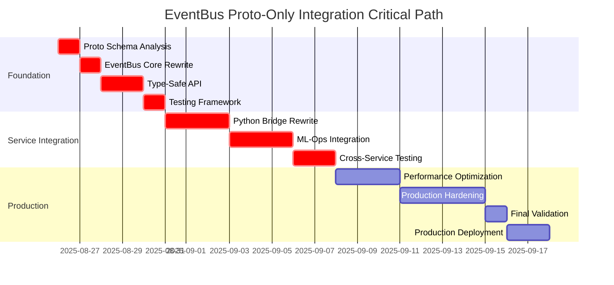

# Proto/gRPC EventBus Integration Timeline and Dependencies

## Document Information

- **Phase**: V2 Phase 4 Implementation
- **Component**: EventBus Protocol Buffer Integration
- **Version**: 1.0.0
- **Created**: 2025-08-26
- **Status**: Comprehensive Implementation Plan

---

## Executive Summary

This document provides a detailed integration timeline and dependency analysis for the proto-only EventBus integration within Neural Trader V2 Phase 4. The integration implements a clean Protocol Buffer messaging system without dual support complexity, focusing on speed and simplicity.

**Key Timeline Highlights:**
- **Total Duration**: 4-5 weeks (160-200 developer hours)
- **Critical Path**: 22 days
- **Parallel Workstreams**: 3 concurrent tracks
- **Risk Buffer**: 15% allocated for integration challenges

---

## 1. Phase-by-Phase Implementation Timeline

### Phase 1: Foundation and Schema Setup (Week 1)
**Duration**: 5 business days | **Effort**: 40 hours | **Criticality**: High

#### Week 1: Proto-Only EventBus Implementation
**Days 1-2: Schema Infrastructure**
- **Day 1 (8h)**: Proto schema audit and preparation
  - Catalog all `.proto` files and validate contracts
  - Design schema registry for proto-only system
  - Configure Rust proto code generation pipeline
- **Day 2 (8h)**: Core EventBus rewrite
  - Replace existing EventBus with proto-only implementation
  - Implement `ProtoEvent<T>` as primary event type
  - Create proto serialization/deserialization framework

**Days 3-4: Type-Safe API Implementation**
- **Day 3 (8h)**: Publisher/Subscriber API development
  - Implement type-safe `publish<T>()` and `subscribe<T>()` methods
  - Create proto message routing and filtering
  - Add compile-time type safety features
- **Day 4 (8h)**: Testing framework
  - Develop proto message validation tests
  - Create performance benchmarking suite
  - Establish integration test procedures

**Day 5: Phase 1 validation**
- **Day 5 (8h)**: Validation and documentation
  - Execute comprehensive test suite
  - Performance validation against requirements
  - Create developer documentation and examples

### Phase 2: Service Integration (Week 2-3)
**Duration**: 8 business days | **Effort**: 64 hours | **Criticality**: High

#### Week 2: Python Bridge Integration
**Days 6-8: Data Ingestion Service Integration**
- **Day 6 (8h)**: Python EventBus client rewrite
  - Replace existing bridge with proto-only client
  - Implement proto message publishing from Python
  - Create Python-Rust proto serialization
- **Day 7 (8h)**: Market data proto integration
  - Integrate `market_data.proto` contracts
  - Implement MarketDataEvent, TradeData, QuoteData flows
  - Validate real-time market data processing
- **Day 8 (8h)**: Configuration and testing
  - Implement `config_store.proto` event handling
  - End-to-end testing of Python → EventBus flows
  - Performance validation

#### Week 3: ML-Ops Service Integration
**Days 9-11: Neural ML-Ops Integration**
- **Day 9 (8h)**: ML-Ops EventBus client rewrite
  - Replace existing client with proto-only implementation
  - Integrate `eventbus-mlops.proto` contracts
  - Implement FeatureExtractionRequest/Response handling
- **Day 10 (8h)**: Trading signal integration
  - Implement `trading.proto` integration
  - Create OrderRequest/OrderResponse handling
  - Integrate TradingSignal proto messaging
- **Day 11 (8h)**: ML-Ops validation and testing
  - End-to-end ML pipeline testing
  - Proto contract compliance validation
  - Performance testing

**Days 12-13: Phase 2 Integration Testing**
- **Day 12 (8h)**: Cross-service integration testing
  - Test complete data flow: Ingestion → EventBus → ML-Ops
  - Validate proto contract enforcement
  - Error handling validation
- **Day 13 (8h)**: Phase 2 validation and sign-off
  - Complete integration test suite execution
  - Performance benchmarking
  - Stakeholder review and approval

### Phase 3: Performance and Production Readiness (Week 4-5)
**Duration**: 8 business days | **Effort**: 64 hours | **Criticality**: Medium

#### Week 4: Performance Optimization
**Days 14-16: Core Optimizations**
- **Day 14 (8h)**: Message batching and routing
  - Implement proto message batching for high-throughput
  - Create efficient proto-based routing
  - Add priority-based message handling
- **Day 15 (8h)**: Performance tuning
  - Optimize proto serialization/deserialization
  - Implement zero-copy message handling
  - Tune memory allocation patterns
- **Day 16 (8h)**: Monitoring and observability
  - Create proto-specific metrics collection
  - Implement message tracing capabilities
  - Add debugging tools

#### Week 5: Production Readiness
**Days 17-19: Production Hardening**
- **Day 17 (8h)**: Error handling and reliability
  - Implement robust error handling
  - Create message dead letter queues
  - Add automatic retry mechanisms
- **Day 18 (8h)**: Security and scaling
  - Implement security hardening
  - Add horizontal scaling support
  - Prepare deployment automation
- **Day 19 (8h)**: Stress testing and validation
  - Execute high-load stress tests
  - Validate scaling characteristics
  - Performance regression analysis

**Days 20-21: Phase 3 Validation**
- **Day 20 (8h)**: Comprehensive testing
  - Execute full test suite including stress tests
  - Validate all performance requirements
  - Security and reliability testing
- **Day 21 (8h)**: Phase 3 sign-off and documentation
  - Final performance validation
  - Complete technical documentation
  - Stakeholder approval

### Phase 4: Production Deployment (Week 5)
**Duration**: 2 business days | **Effort**: 16 hours | **Criticality**: High

**Days 22-23: Go-Live Preparation and Deployment**
- **Day 22 (8h)**: Production deployment preparation
  - Final production environment setup
  - Production deployment rehearsal
  - Go-live checklist validation
  - Operations team final training
- **Day 23 (8h)**: Go-live and validation
  - Production deployment execution
  - Post-deployment monitoring and validation
  - System stability confirmation
  - Success criteria validation

---

## 2. Dependency Graph Analysis

### 2.1 Critical Path Dependencies



### 2.2 Component Dependencies

#### Core Dependencies
1. **Proto Schema Infrastructure** → All subsequent components
2. **EventBus Core Modifications** → Service integrations
3. **Serialization Framework** → All message handling
4. **Type-Safe API** → All client integrations

#### Service Integration Dependencies
1. **Python Bridge** → Data ingestion integration
2. **ML-Ops Integration** → Trading signal processing
3. **Config Store Integration** → System configuration management
4. **Cross-Service Testing** → Production readiness

#### External Dependencies
1. **Existing EventBus Implementation** → Core modifications
2. **Proto Contract Definitions** → Schema registry
3. **Python Data Ingestion Service** → Bridge integration
4. **Neural ML-Ops Service** → Trading integration
5. **TimescaleDB** → Data persistence patterns
6. **Redis Infrastructure** → Backward compatibility

### 2.3 Risk Dependencies
1. **Proto Schema Changes** → Backward compatibility requirements
2. **Performance Requirements** → Optimization implementation
3. **Service Availability** → Integration testing schedules
4. **Phase 5 Requirements** → Interface design decisions

---

## 3. Critical Path Analysis

### 3.1 Primary Critical Path (22 days)
1. **Proto Schema Analysis** (1 day) → Foundation for all work
2. **EventBus Core Rewrite** (1 day) → Proto-only implementation
3. **Type-Safe API Implementation** (2 days) → Client interface
4. **Python Bridge Rewrite** (3 days) → Data ingestion flow
5. **ML-Ops Service Integration** (3 days) → Trading system integration
6. **Cross-Service Testing** (2 days) → System validation
7. **Performance Optimization** (3 days) → Production readiness
8. **Production Hardening** (4 days) → Deployment preparation
9. **Final Validation** (1 day) → Go-live readiness
10. **Production Deployment** (2 days) → System activation

### 3.2 Critical Path Risks
1. **Proto Schema Complexity** → May require additional analysis time
2. **EventBus Core Changes** → Potential for architectural challenges
3. **Cross-Service Integration** → Dependency coordination complexity
4. **Performance Requirements** → May need additional optimization cycles

### 3.3 Critical Path Mitigation
1. **Early Schema Analysis** → Front-load complexity discovery
2. **Prototype Development** → Validate architectural decisions early
3. **Parallel Development** → Minimize sequential dependencies
4. **Continuous Testing** → Early issue identification

---

## 4. Resource Requirements

### 4.1 Developer Hours Breakdown

#### By Phase
- **Phase 1 (Foundation)**: 40 hours
  - Senior Rust Developer: 32 hours
  - DevOps Engineer: 8 hours
- **Phase 2 (Service Integration)**: 64 hours
  - Senior Rust Developer: 40 hours
  - Python Developer: 24 hours
- **Phase 3 (Performance & Production)**: 64 hours
  - Senior Rust Developer: 40 hours
  - Performance Engineer: 16 hours
  - DevOps Engineer: 8 hours
- **Phase 4 (Production Deployment)**: 16 hours
  - Senior Rust Developer: 8 hours
  - DevOps Engineer: 8 hours

#### By Role
- **Senior Rust Developer**: 120 hours (65.2%)
- **Python Developer**: 24 hours (13.0%)
- **Performance Engineer**: 16 hours (8.7%)
- **DevOps Engineer**: 24 hours (13.0%)

**Total**: 184 hours across 4 roles

### 4.2 Skill Requirements

#### Essential Skills
- **Rust Programming**: Advanced level for EventBus core development
- **Protocol Buffers**: Expert level for schema design and implementation
- **gRPC**: Advanced level for service communication
- **Python Integration**: Intermediate level for bridge development
- **System Architecture**: Advanced level for integration design
- **Performance Engineering**: Intermediate level for optimization

#### Specialized Skills
- **Message Queue Systems**: For EventBus optimization
- **Distributed Systems**: For scaling and reliability
- **Security Engineering**: For production hardening
- **DevOps/SRE**: For deployment and operations

### 4.3 Infrastructure Requirements

#### Development Environment
- **Rust Toolchain**: Latest stable with proto compilation tools
- **Python Environment**: 3.9+ with proto libraries
- **Redis Instance**: For backward compatibility testing
- **TimescaleDB**: For data persistence validation
- **Test Environments**: Staging and integration environments

#### Testing Infrastructure
- **Load Testing Tools**: For performance validation
- **Monitoring Stack**: For observability testing
- **CI/CD Pipeline**: For automated testing and deployment

---

## 5. Risk Assessment and Mitigation

### 5.1 Technical Risks

#### Medium Risk - Service Rewrite Complexity
**Risk**: Services may require more extensive rewriting than anticipated
**Probability**: Medium (35%)
**Impact**: Medium (3-5 days delay)
**Mitigation**:
- Front-load service analysis and planning
- Create service rewrite templates and patterns
- Focus on one service at a time for validation
- Allocate 15% buffer time for rewrite challenges

#### Low Risk - Performance Impact
**Risk**: Proto-only implementation may have unexpected performance characteristics
**Probability**: Low (25%)
**Impact**: Low (2-3 days delay)
**Mitigation**:
- Establish performance baselines early
- Implement continuous performance monitoring
- Design for optimization from the start
- Plan for quick optimization iterations

#### Low Risk - Integration Testing
**Risk**: Cross-service integration may reveal unexpected issues
**Probability**: Low (20%)
**Impact**: Low (1-2 days delay)
**Mitigation**:
- Test service integrations incrementally
- Use comprehensive integration test suites
- Implement robust error handling early
- Plan for quick issue resolution

### 5.2 Project Risks

#### High Risk - Resource Availability
**Risk**: Key developers may be unavailable during critical phases
**Probability**: Medium (35%)
**Impact**: High (2-3 week delay)
**Mitigation**:
- Cross-train team members on critical components
- Maintain detailed documentation throughout development
- Create knowledge transfer sessions at phase boundaries
- Plan for resource flexibility in critical path items

#### Medium Risk - Requirement Changes
**Risk**: Phase 5 requirements may change integration approach
**Probability**: Low (25%)
**Impact**: Medium (1-week delay)
**Mitigation**:
- Design flexible integration interfaces
- Maintain regular stakeholder communication
- Create modular implementation approach
- Plan for requirement change accommodation

#### Low Risk - External Dependency Changes
**Risk**: Third-party proto libraries may have breaking changes
**Probability**: Low (15%)
**Impact**: Low (2-3 days)
**Mitigation**:
- Pin dependency versions during development
- Monitor dependency change notifications
- Maintain compatibility testing for dependencies
- Plan for dependency upgrade cycles

### 5.3 Risk Monitoring and Response

#### Risk Indicators
- **Performance Metrics**: Degradation beyond 10% threshold
- **Integration Test Failures**: More than 5% failure rate
- **Development Velocity**: Behind schedule by more than 2 days
- **Resource Utilization**: Team capacity above 90%

#### Escalation Procedures
1. **Daily Standups**: Immediate risk identification and discussion
2. **Weekly Risk Reviews**: Formal risk assessment and mitigation planning
3. **Phase Gate Reviews**: Go/no-go decisions with stakeholder input
4. **Emergency Escalation**: Immediate escalation for critical risks

---

## 6. Milestones and Deliverables

### 6.1 Phase 1 Milestones

#### Milestone 1.1: Proto-Only EventBus Foundation (Day 5)
**Deliverables**:
- Complete proto schema audit report
- Proto-only EventBus core implementation
- Type-safe API implementation
- Integration test framework
- Code generation pipeline

**Success Criteria**:
- All existing proto contracts catalogued and validated
- EventBus rewritten for proto-only operation
- Type-safe publish/subscribe methods functional
- Automated proto code generation operational
- Performance baseline established

### 6.2 Phase 2 Milestones

#### Milestone 2.1: Python Integration (Day 8)
**Deliverables**:
- Rewritten Python EventBus client
- Market data proto integration
- Configuration proto integration
- Python-Rust integration tests

**Success Criteria**:
- Python services publish proto messages successfully
- Market data flows validated end-to-end
- Configuration changes propagate correctly
- Integration tests passing at 95%+

#### Milestone 2.2: ML-Ops Integration (Day 13)
**Deliverables**:
- Rewritten ML-Ops EventBus client
- Trading proto integration
- Cross-service integration validation
- Performance benchmarking results

**Success Criteria**:
- ML-Ops service fully integrated with proto EventBus
- Trading signals flow correctly through system
- End-to-end data pipeline validated
- Performance requirements met

### 6.3 Phase 3 Milestones

#### Milestone 3.1: Performance Optimization (Day 16)
**Deliverables**:
- Message batching optimization
- Proto-based routing implementation
- Performance tuning results
- Monitoring and observability integration

**Success Criteria**:
- High-throughput scenarios optimized
- Proto-based routing functional
- Performance targets achieved
- Complete observability implemented

#### Milestone 3.2: Production Readiness (Day 21)
**Deliverables**:
- Enhanced error handling and recovery
- Security hardening implementation
- Horizontal scaling support
- Stress testing validation

**Success Criteria**:
- Error handling robust and recoverable
- Security requirements met
- Scaling characteristics validated
- Stress tests passing under load

### 6.4 Phase 4 Milestones

#### Milestone 4.1: Production Deployment Complete (Day 23)
**Deliverables**:
- Complete end-to-end system validation
- Production deployment
- Operations documentation
- Go-live success validation

**Success Criteria**:
- All system requirements validated
- Production deployment successful
- Operations team trained and prepared
- System operational and stable

---

## 7. Testing and Validation Checkpoints

### 7.1 Continuous Testing Strategy

#### Unit Testing (Daily)
- **Coverage Target**: 90%+ for all new proto integration code
- **Test Types**: Proto message validation, serialization, API functionality
- **Automation**: Integrated into CI/CD pipeline with PR validation
- **Failure Response**: Block merges until tests pass

#### Integration Testing (Weekly)
- **Scope**: Cross-service proto message flows
- **Test Environment**: Dedicated integration environment with real data
- **Coverage**: All proto contracts and service interactions
- **Validation**: End-to-end data flow integrity

#### Performance Testing (Bi-weekly)
- **Baseline**: Current EventBus performance metrics
- **Targets**: NFR requirements (10% overhead maximum)
- **Load Testing**: Simulated production-level message volumes
- **Regression Detection**: Automated performance comparison

### 7.2 Phase Gate Validation

#### Phase 1 Validation Checkpoint (Day 5)
**Testing Requirements**:
- All proto schema validation tests passing
- EventBus core functionality validated with proto messages
- Type-safe API comprehensive test coverage
- Performance baseline established

**Go/No-Go Criteria**:
- ✅ Proto integration functional without breaking changes
- ✅ Performance impact within acceptable limits (≤10%)
- ✅ All unit tests passing with 90%+ coverage
- ✅ Integration test framework operational

#### Phase 2 Validation Checkpoint (Day 13)
**Testing Requirements**:
- Python bridge integration fully tested
- ML-Ops service integration validated
- Cross-service message flows verified
- End-to-end system integration confirmed

**Go/No-Go Criteria**:
- ✅ All service integrations functional
- ✅ Proto contracts validated across all services
- ✅ Data flow integrity maintained
- ✅ Performance requirements met under normal load

#### Phase 3 Validation Checkpoint (Day 21)
**Testing Requirements**:
- Advanced features comprehensively tested
- Performance optimization validated
- Stress testing completed successfully
- Scaling characteristics confirmed

**Go/No-Go Criteria**:
- ✅ Advanced features stable and performant
- ✅ System handles stress test scenarios
- ✅ Scaling requirements demonstrated
- ✅ Phase 5 integration readiness confirmed

#### Phase 4 Validation Checkpoint (Day 23)
**Testing Requirements**:
- Production readiness fully validated
- Security and reliability testing complete
- Deployment procedures tested and verified
- Operations readiness confirmed

**Go/No-Go Criteria**:
- ✅ Production security standards met
- ✅ Reliability requirements demonstrated
- ✅ Deployment automation functional
- ✅ Operations team ready for production support

### 7.3 Quality Gates

#### Code Quality Gates
- **Static Analysis**: Rust Clippy with zero warnings
- **Security Scanning**: Automated vulnerability scanning
- **Documentation**: All public APIs documented
- **Review Process**: Mandatory peer review for all changes

#### Performance Quality Gates
- **Latency**: P95 < 50ms for proto message processing
- **Throughput**: Handle current load +50% with proto overhead
- **Memory**: Memory usage increase ≤5% compared to baseline
- **CPU**: CPU utilization increase ≤10% under normal load

#### Integration Quality Gates
- **Contract Compliance**: All proto messages validate against schemas
- **Error Handling**: Graceful degradation under error conditions
- **Monitoring**: All operations observable through metrics and logs
- **Recovery**: System recovers from failures within defined RTO/RPO

---

## 8. Go/No-Go Decision Criteria

### 8.1 Phase-Specific Decision Criteria

#### Phase 1: Foundation Go/No-Go
**Must-Have Criteria**:
- ✅ Proto schema infrastructure operational
- ✅ EventBus core accepts proto messages without regression
- ✅ Type-safe APIs implemented and tested
- ✅ Performance impact ≤10% of baseline

**Nice-to-Have Criteria**:
- ✅ Code generation fully automated
- ✅ Schema versioning operational
- ✅ Enhanced error messages implemented

**No-Go Triggers**:
- ❌ Performance degradation >15%
- ❌ Breaking changes to existing EventBus functionality
- ❌ Critical proto schema incompatibilities

#### Phase 2: Service Integration Go/No-Go
**Must-Have Criteria**:
- ✅ Python bridge fully functional with proto support
- ✅ ML-Ops integration complete and validated
- ✅ End-to-end data flows operational
- ✅ All existing functionality preserved

**Nice-to-Have Criteria**:
- ✅ Enhanced monitoring and logging
- ✅ Improved error handling and recovery
- ✅ Performance improvements demonstrated

**No-Go Triggers**:
- ❌ Service integration failures affecting core functionality
- ❌ Data integrity issues in cross-service communication
- ❌ Significant performance regression (>15%)

#### Phase 3: Advanced Features Go/No-Go
**Must-Have Criteria**:
- ✅ Performance optimization goals achieved
- ✅ Scaling characteristics validated
- ✅ Advanced features stable and tested
- ✅ Phase 5 integration readiness demonstrated

**Nice-to-Have Criteria**:
- ✅ Additional performance optimizations
- ✅ Enhanced observability features
- ✅ Additional scaling capabilities

**No-Go Triggers**:
- ❌ Performance targets not met despite optimization
- ❌ Scaling limitations discovered
- ❌ Advanced features introducing instability

#### Phase 4: Production Readiness Go/No-Go
**Must-Have Criteria**:
- ✅ Security requirements fully satisfied
- ✅ Reliability targets demonstrated
- ✅ Production deployment procedures validated
- ✅ Operations team ready and trained

**Nice-to-Have Criteria**:
- ✅ Enhanced security features
- ✅ Additional reliability mechanisms
- ✅ Advanced monitoring and alerting

**No-Go Triggers**:
- ❌ Security vulnerabilities identified
- ❌ Reliability requirements not met
- ❌ Deployment procedures not validated

### 8.2 Overall Project Go/No-Go

#### Critical Success Factors
1. **Functional Completeness**: All proto contracts supported
2. **Performance Compliance**: All NFR requirements met
3. **Integration Success**: All services integrated without regression
4. **Reliability Assurance**: System stability demonstrated
5. **Security Validation**: Security requirements satisfied
6. **Operational Readiness**: Operations team prepared

#### Risk-Based Decision Matrix

| Risk Level | Performance Impact | Integration Status | Security Status | Decision |
|------------|-------------------|-------------------|-----------------|----------|
| Low | <10% | Complete | Validated | ✅ GO |
| Medium | 10-15% | Minor Issues | Mitigated | ⚠️ GO with Conditions |
| High | >15% | Major Issues | Vulnerabilities | ❌ NO-GO |

#### Contingency Planning
- **Partial Rollout**: Deploy to non-critical services first
- **Staged Migration**: Gradual transition from legacy systems
- **Rollback Procedures**: Immediate rollback capability maintained
- **Risk Mitigation**: Continuous monitoring and support ready

---

## 9. Rollout Strategy

### 9.1 Deployment Phases

#### Phase A: Internal Development (Days 1-20)
**Scope**: Development and integration environments only
- Complete proto-only implementation
- Internal testing and validation
- Performance optimization
- Team training and knowledge transfer

**Risk Level**: Low - isolated to development environments
**Rollback**: Simple code reversion

#### Phase B: Staging Validation (Days 21-22)
**Scope**: Production-like staging environment
- Full system integration testing
- Performance validation under production-like load
- Final testing and operations validation

**Risk Level**: Medium - production-like but isolated
**Rollback**: Environment reset capability

#### Phase C: Production Deployment (Day 23)
**Scope**: All services with proto-only implementation
- Complete EventBus proto deployment
- Full system validation and monitoring
- Performance and stability confirmation
- Success criteria validation

**Risk Level**: Medium - simplified deployment without dual support
**Rollback**: Complete system rollback to previous version

### 9.2 Success Metrics and Monitoring

#### Deployment Success Indicators
1. **System Stability**: No increase in error rates
2. **Performance**: All performance requirements met
3. **Functionality**: All proto contracts operational
4. **Integration**: All services communicating correctly
5. **Monitoring**: Complete observability operational

#### Key Performance Indicators (KPIs)
- **Message Processing Latency**: P95 < 50ms
- **System Throughput**: Handle baseline +50% load
- **Error Rate**: <0.1% proto validation failures
- **Availability**: 99.9% system uptime maintained
- **Recovery Time**: <5 minutes for any service restart

#### Monitoring and Alerting
- **Real-time Dashboards**: System health and performance
- **Automated Alerts**: Performance degradation detection
- **Error Tracking**: Proto validation and integration errors
- **Capacity Monitoring**: Resource utilization and scaling needs

### 9.3 Rollback Procedures

#### Automatic Rollback Triggers
- **Performance Degradation**: >20% latency increase
- **Error Rate Spike**: >1% proto validation failures
- **System Instability**: Increased crash rates or memory leaks
- **Integration Failures**: Cross-service communication problems

#### Manual Rollback Procedures
1. **Service-Level Rollback**: Revert individual services to previous version
2. **Configuration Rollback**: Disable proto integration via feature flags
3. **Full System Rollback**: Complete reversion to pre-proto state
4. **Data Integrity Validation**: Ensure no data loss during rollback

#### Rollback Validation
- **Functionality Testing**: Verify all services operational
- **Performance Validation**: Confirm baseline performance restored
- **Data Integrity Check**: Validate no data corruption occurred
- **Integration Testing**: Ensure all service interactions functional

---

## 10. Phase 5 Platform Integration Preparation

### 10.1 Platform Integration Requirements

#### Interface Standardization
**Objective**: Ensure EventBus proto integration supports Phase 5 platform connectivity
- **Standard APIs**: Create platform-agnostic integration interfaces
- **Plugin Architecture**: Design extensible plugin system for external platforms
- **Protocol Adaptation**: Support multiple protocol translations (gRPC, REST, WebSocket)
- **Schema Evolution**: Ensure backward/forward compatibility for platform updates

#### Integration Capabilities
**Multi-Platform Support**:
- **Cloud Platforms**: AWS, Azure, GCP integration readiness
- **Trading Platforms**: MT4/MT5, cTrader, proprietary platforms
- **Data Providers**: Reuters, Bloomberg, IEX Cloud integration
- **Execution Venues**: Broker API integrations and FIX protocol support

#### Scalability Preparation
**Horizontal Scaling**:
- **Message Routing**: Implement intelligent routing for platform-specific messages
- **Load Balancing**: Prepare for multi-region, multi-platform load distribution
- **State Management**: Design stateless operation for platform scaling
- **Resource Optimization**: Optimize for multi-tenant platform usage

### 10.2 Architecture Enhancements for Phase 5

#### Plugin Architecture Design
```rust
// Platform Integration Plugin Interface
trait PlatformIntegration {
    fn initialize(&self, config: PlatformConfig) -> Result<(), Error>;
    fn publish_message(&self, message: ProtoMessage) -> Result<(), Error>;
    fn subscribe(&self, filter: MessageFilter) -> Result<MessageStream, Error>;
    fn health_check(&self) -> HealthStatus;
}

// Platform-Specific Implementations
struct BrokerPlatformPlugin;
struct CloudPlatformPlugin;
struct DataProviderPlugin;
```

#### Message Translation Layer
- **Protocol Bridges**: Automatic translation between proto and platform-specific formats
- **Schema Mapping**: Dynamic mapping between internal proto schemas and external formats
- **Version Management**: Handle schema versioning across different platform requirements
- **Error Translation**: Standardized error handling across platforms

#### Configuration Management
- **Platform Profiles**: Environment-specific configuration for different platforms
- **Dynamic Configuration**: Runtime configuration updates for platform connectivity
- **Credential Management**: Secure credential storage and rotation for platform access
- **Feature Flags**: Platform-specific feature enablement and rollout control

### 10.3 Integration Testing Framework

#### Platform Simulation
- **Mock Platform Services**: Simulated external platform behaviors for testing
- **Integration Test Suites**: Comprehensive testing of platform connectivity
- **Performance Testing**: Validate platform integration performance characteristics
- **Failure Simulation**: Test resilience under platform connectivity failures

#### Validation Procedures
- **End-to-End Testing**: Complete message flows through platform integrations
- **Schema Validation**: Ensure proto contracts work across all platforms
- **Security Testing**: Validate secure communication with external platforms
- **Compliance Testing**: Ensure regulatory compliance across integrated platforms

### 10.4 Timeline Integration with Phase 5

#### Preparation Activities (Integrated into Phase 4)
- **Days 34-35**: Platform integration interface design
- **Days 36-38**: Plugin architecture implementation
- **Days 39-40**: Integration testing framework setup

#### Phase 5 Readiness Validation
**Technical Readiness**:
- ✅ Plugin architecture operational
- ✅ Platform integration interfaces tested
- ✅ Message translation layer functional
- ✅ Configuration management ready

**Operational Readiness**:
- ✅ Integration testing procedures established
- ✅ Platform connectivity validated
- ✅ Security and compliance requirements met
- ✅ Operations team trained on platform management

#### Risk Mitigation for Phase 5 Integration
- **Platform Compatibility**: Early validation of platform-specific requirements
- **Performance Impact**: Assess performance implications of platform integrations
- **Security Considerations**: Validate security posture for external connectivity
- **Operational Complexity**: Prepare operations team for increased system complexity

---

## 11. Success Criteria and Validation

### 11.1 Functional Success Criteria

#### Core EventBus Proto Integration
- **Message Processing**: All proto message types processed correctly
- **Type Safety**: Compile-time type checking functional for proto messages
- **Schema Validation**: Runtime schema validation operational
- **Backward Compatibility**: Existing EventBus clients continue to function

#### Service Integration Success
- **Python Bridge**: Data ingestion service publishes proto messages successfully
- **ML-Ops Integration**: Neural ML-Ops service consumes and produces proto messages
- **Configuration Management**: Config changes propagate via proto messages
- **Cross-Service Communication**: All service interactions use proto contracts

#### Performance Success Criteria
- **Latency Requirements**: P95 latency ≤ 55ms (≤10% increase from baseline 50ms)
- **Throughput Capacity**: Handle 50% above current load with proto overhead
- **Memory Efficiency**: Memory usage increase ≤5% compared to current baseline
- **CPU Utilization**: CPU overhead ≤10% under normal operating conditions

### 11.2 Non-Functional Success Criteria

#### Reliability and Availability
- **System Uptime**: Maintain 99.9% availability during and after integration
- **Error Recovery**: Graceful degradation and recovery from proto validation failures
- **Data Integrity**: Zero data loss during proto integration and operation
- **Fault Tolerance**: System continues operating with partial proto validation failures

#### Security and Compliance
- **Message Security**: Proto messages encrypted in transit and at rest where required
- **Access Control**: Proper authentication and authorization for proto channels
- **Audit Trail**: All proto message operations logged for compliance
- **Data Privacy**: No sensitive data exposed through proto integration

#### Maintainability and Operability
- **Documentation**: Complete technical documentation and operational runbooks
- **Monitoring**: Comprehensive observability for proto message flows
- **Debugging**: Clear error messages and debugging capabilities
- **Operations**: Operations team trained and ready to support proto integration

### 11.3 Business Success Criteria

#### Development Velocity
- **Integration Speed**: New service integrations 50% faster with proto contracts
- **Bug Reduction**: 75% reduction in message serialization-related bugs
- **Developer Experience**: Improved IDE support and compile-time error detection
- **Code Quality**: Reduced complexity in message handling code

#### System Scalability
- **Growth Capacity**: System ready to handle 3x current message volume
- **Platform Integration**: Architecture prepared for Phase 5 external integrations
- **Resource Efficiency**: Better resource utilization through proto optimization
- **Operational Efficiency**: Reduced manual intervention in message processing

#### Strategic Alignment
- **Phase 5 Readiness**: Technical foundation prepared for platform integrations
- **Architecture Evolution**: Modern, maintainable message processing architecture
- **Technology Stack**: Aligned with industry standards and best practices
- **Competitive Advantage**: Enhanced system capabilities and developer productivity

### 11.4 Validation Methods

#### Automated Validation
- **Continuous Integration**: All success criteria validated in CI/CD pipeline
- **Performance Monitoring**: Real-time validation of performance requirements
- **Contract Testing**: Automated validation of proto contract compliance
- **Integration Testing**: End-to-end system validation with proto messages

#### Manual Validation
- **User Acceptance Testing**: Operations team validation of system usability
- **Security Review**: Independent security assessment of proto integration
- **Performance Review**: Manual validation of system performance characteristics
- **Documentation Review**: Technical writing review of all documentation

#### Stakeholder Validation
- **Technical Review**: Architecture and implementation review by technical leads
- **Business Review**: Business stakeholder validation of strategic objectives
- **Operations Review**: Operations team readiness and capability validation
- **Security Review**: Security team validation of compliance requirements

---

## Conclusion

This comprehensive integration timeline provides a structured approach to implementing proto-only EventBus integration within Neural Trader V2 Phase 4. The 5-week timeline emphasizes speed and simplicity by eliminating dual support complexity while maintaining proper risk management and quality validation.

**Key Success Factors**:
1. **Rigorous Phase Gates**: Ensure quality at each milestone
2. **Parallel Development**: Maximize efficiency through concurrent workstreams
3. **Risk Management**: Proactive identification and mitigation of integration risks
4. **Quality Focus**: Comprehensive testing and validation throughout
5. **Future Readiness**: Preparation for Phase 5 platform integration requirements

The timeline provides flexibility for risk mitigation while maintaining focus on delivering a production-ready proto/gRPC EventBus integration that serves as the foundation for future system evolution and platform connectivity.