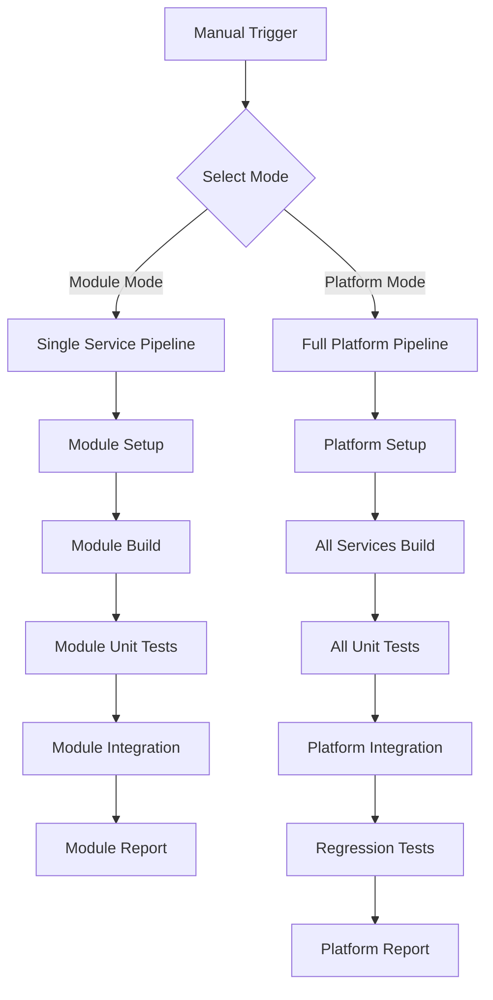

# CICD Pipeline Specification for Neural Data Platform

## Executive Summary

This document specifies the CICD pipeline for the Neural Data Platform's microservice architecture, supporting both **module-specific testing** for rapid development and **full platform testing** for comprehensive validation. The pipeline enables focused, fast feedback cycles while maintaining the ability to validate the complete system.

## Pipeline Overview

### Execution Modes



### Module Selection

```bash
# Test single module
make pipeline MODULE=neural-trading

# Test multiple modules
make pipeline MODULES="data-staging neural-ml-ops"

# Test full platform (default)
make pipeline
```

## Module-Specific Pipeline

### Module Pipeline Stages

#### M1: Module Environment Setup
**Purpose**: Prepare environment for specific module testing

```bash
# Actions
- Detect module type (Rust/Python)
- Load module-specific dependencies only
- Set up minimal required services
- Load module configuration from config-store
```

**Required Services by Module**:
| Module | Required Services |
|--------|------------------|
| config-store | Redis, TimescaleDB |
| data-ingestion | Redis, TimescaleDB, config-store |
| data-staging | Redis, config-store |
| neural-ml-ops | Redis, TimescaleDB, config-store |
| neural-trading | Redis, config-store |

#### M2: Module Build
**Purpose**: Build only the specified module

```bash
# Rust modules
cargo build --release -p ${MODULE}

# Python modules
cd ${MODULE} && pip install -r requirements.txt
```

#### M3: Module Unit Tests
**Purpose**: Run unit tests for specified module only

```bash
# Rust modules
cargo test -p ${MODULE} --lib --bins

# Python modules
cd ${MODULE} && pytest tests/unit/
```

#### M4: Module Integration Tests
**Purpose**: Test module with minimal dependencies

```bash
# Start only required services
docker-compose up -d ${REQUIRED_SERVICES}

# Run module-specific integration tests
docker-compose run --rm ${MODULE}-test
```

#### M5: Module Report
**Purpose**: Generate module-specific reports

```bash
# Generate coverage for module
cargo tarpaulin -p ${MODULE} --out Html

# Generate test report
./scripts/module-report.sh ${MODULE}
```

## Full Platform Pipeline

### Platform Pipeline Stages

#### P1: Platform Environment Setup
**Purpose**: Prepare complete platform environment

```bash
# Actions
- Validate all prerequisites
- Check all language toolchains
- Load environment variables from .env.${CONFIG_ENV}
- Clone/update GitOps config repository
- Prepare all service dependencies
```

**Exit Criteria**: All prerequisites met, configs loaded

### Stage 2: Code Quality
**Purpose**: Ensure code meets quality standards

```bash
# Rust Services
- cargo fmt --check --all
- cargo clippy --all-targets --all-features
- cargo audit

# Python Services  
- black --check data_ingestion/
- flake8 data_ingestion/
- mypy data_ingestion/
```

**Exit Criteria**: No formatting issues, no critical lints, no security vulnerabilities

### Stage 3: Build Services
**Purpose**: Compile all services without containerization

```bash
# Build Order (respecting dependencies)
1. neural-core (shared library)
2. config-store
3. data-staging  
4. neural-ml-ops
5. neural-trading
6. data_ingestion (Python - dependencies only)

# Commands
cargo build --release --workspace
cd data_ingestion && pip install -r requirements.txt
```

**Exit Criteria**: All services built successfully

### Stage 4: Unit Tests
**Purpose**: Run isolated unit tests without containers

```bash
# Rust Services
cargo test --workspace --lib --bins

# Python Services
cd data_ingestion && pytest tests/unit/

# Coverage Reports
cargo tarpaulin --workspace --out Html
cd data_ingestion && pytest --cov=. --cov-report=html
```

**Exit Criteria**: All unit tests pass, coverage meets thresholds (>70%)

### Stage 5: Container Build
**Purpose**: Build Docker images for integration testing

```bash
# Build with caching
docker-compose -f docker-compose.v2.yml build --parallel

# Image tagging
docker tag neural-trader/config-store:latest neural-trader/config-store:${BUILD_ID}
docker tag neural-trader/data-staging:latest neural-trader/data-staging:${BUILD_ID}
# ... etc for all services
```

**Exit Criteria**: All images built and tagged

### Stage 6: Integration Setup
**Purpose**: Start dependencies and seed configuration

```bash
# Start infrastructure dependencies
docker-compose -f docker-compose.v2.yml up -d \
  redis timescaledb prometheus grafana

# Wait for health checks
./scripts/wait-for-dependencies.sh

# Start config-store and seed from Git
docker-compose -f docker-compose.v2.yml up -d config-store
./scripts/wait-for-config-store.sh
./scripts/seed-config-store.sh --env ${CONFIG_ENV}

# Run database migrations
docker-compose -f docker-compose.v2.yml run --rm \
  migration-runner ./migrate.sh
```

**Exit Criteria**: All dependencies healthy, config loaded, migrations complete

### Stage 7: Integration Tests
**Purpose**: Test service interactions with full stack

```bash
# Start all services
docker-compose -f docker-compose.v2.yml up -d

# Run integration test suites
docker-compose -f docker-compose.v2.yml run --rm \
  test-runner ./run-integration-tests.sh

# Test categories:
- Service communication tests
- EventBus proto message flow
- Config-store integration
- Data pipeline end-to-end
- Trading workflow simulation
```

**Exit Criteria**: All integration tests pass

### Stage 8: Regression Tests
**Purpose**: Detect drift and validate system behavior

```bash
# Regression test suites
- API contract tests
- Performance baseline tests
- Data quality validation
- Configuration consistency
- EventBus message schemas

# Alert on failures but continue
./scripts/regression-tests.sh --alert-only

# Generate drift report
./scripts/generate-drift-report.sh > drift-report.json
```

**Exit Criteria**: Tests complete, drift report generated

### Stage 9: Teardown
**Purpose**: Clean up test environment

```bash
# Capture logs before teardown
docker-compose -f docker-compose.v2.yml logs > pipeline-logs.txt

# Stop all services
docker-compose -f docker-compose.v2.yml down

# Cleanup volumes (optional based on CONFIG_ENV)
if [ "$CONFIG_ENV" = "test" ]; then
  docker-compose -f docker-compose.v2.yml down -v
fi
```

**Exit Criteria**: Environment cleaned up

### Stage 10: Report Generation
**Purpose**: Compile and publish results

```bash
# Generate reports
- Test results summary (JUnit XML)
- Coverage reports (HTML + Cobertura)
- Performance metrics
- Drift detection results
- Build artifacts manifest

# Archive artifacts
tar -czf artifacts-${BUILD_ID}.tar.gz \
  target/release/ \
  coverage/ \
  test-results/ \
  drift-report.json
```

**Exit Criteria**: Reports generated and archived

## Pipeline Configuration

### Makefile Targets

#### Module-Specific Targets
```makefile
# Module pipeline - fast focused testing
.PHONY: pipeline
pipeline:
ifdef MODULE
	@echo "Running module pipeline for: $(MODULE)"
	$(MAKE) module-pipeline MODULE=$(MODULE)
else ifdef MODULES
	@echo "Running pipeline for modules: $(MODULES)"
	@for module in $(MODULES); do \
		$(MAKE) module-pipeline MODULE=$$module || exit 1; \
	done
else
	@echo "Running full platform pipeline"
	$(MAKE) platform-pipeline
endif

# Single module pipeline
.PHONY: module-pipeline
module-pipeline: module-setup module-build module-test module-integration module-report

.PHONY: module-setup
module-setup:
	@echo "Setting up module $(MODULE)..."
	./scripts/module-setup.sh $(MODULE)

.PHONY: module-build
module-build:
	@echo "Building module $(MODULE)..."
	./scripts/module-build.sh $(MODULE)

.PHONY: module-test
module-test:
	@echo "Testing module $(MODULE)..."
	./scripts/module-test.sh $(MODULE)

.PHONY: module-integration
module-integration:
	@echo "Integration testing module $(MODULE)..."
	./scripts/module-integration.sh $(MODULE)

.PHONY: module-report
module-report:
	@echo "Generating report for module $(MODULE)..."
	./scripts/module-report.sh $(MODULE)

# Full platform pipeline
.PHONY: platform-pipeline
platform-pipeline: platform-setup platform-build platform-test platform-integration platform-regression platform-report

.PHONY: platform-setup
platform-setup:
	@echo "Setting up full platform..."
	./scripts/setup-environment.sh

.PHONY: platform-build
platform-build:
	@echo "Building all services..."
	cargo build --release --workspace
	cd data_ingestion && pip install -r requirements.txt

.PHONY: platform-test
platform-test:
	@echo "Running all unit tests..."
	cargo test --workspace
	cd data_ingestion && pytest tests/unit/

.PHONY: platform-integration
platform-integration:
	@echo "Running platform integration tests..."
	docker-compose -f docker-compose.v2.yml up -d
	./scripts/run-integration.sh
	docker-compose -f docker-compose.v2.yml down

.PHONY: platform-regression
platform-regression:
	@echo "Running regression tests..."
	./scripts/run-regression.sh --alert-only

.PHONY: platform-report
platform-report:
	@echo "Generating platform report..."
	./scripts/generate-reports.sh

# Utility targets for specific modules
.PHONY: test-config-store
test-config-store:
	$(MAKE) pipeline MODULE=config-store

.PHONY: test-data-staging
test-data-staging:
	$(MAKE) pipeline MODULE=data-staging

.PHONY: test-neural-trading
test-neural-trading:
	$(MAKE) pipeline MODULE=neural-trading

.PHONY: test-neural-ml-ops
test-neural-ml-ops:
	$(MAKE) pipeline MODULE=neural-ml-ops

.PHONY: test-data-ingestion
test-data-ingestion:
	$(MAKE) pipeline MODULE=data-ingestion
```

## Docker Compose Structure

### docker-compose.v2.yml
```yaml
version: '3.8'

services:
  # Infrastructure
  redis:
    image: redis:7-alpine
    ports:
      - "6379:6379"
    healthcheck:
      test: ["CMD", "redis-cli", "ping"]

  timescaledb:
    image: timescale/timescaledb:latest-pg15
    environment:
      POSTGRES_DB: neural_trader
      POSTGRES_USER: postgres
    env_file:
      - .env.${CONFIG_ENV:-dev}
    healthcheck:
      test: ["CMD", "pg_isready", "-U", "postgres"]

  # Config Store (starts first)
  config-store:
    build:
      context: .
      dockerfile: docker/Dockerfile.config-store
    depends_on:
      - redis
    environment:
      CONFIG_REPO_URL: ${CONFIG_REPO_URL}
      CONFIG_ENV: ${CONFIG_ENV:-dev}
    env_file:
      - .env.${CONFIG_ENV:-dev}
    healthcheck:
      test: ["CMD", "grpc_health_probe", "-addr=:50051"]

  # Data Pipeline
  data-ingestion:
    build:
      context: .
      dockerfile: docker/Dockerfile.data-ingestion
    depends_on:
      config-store:
        condition: service_healthy
    env_file:
      - .env.${CONFIG_ENV:-dev}

  data-staging:
    build:
      context: .
      dockerfile: docker/Dockerfile.data-staging
    depends_on:
      config-store:
        condition: service_healthy
      redis:
        condition: service_healthy

  # ML and Trading
  neural-ml-ops:
    build:
      context: .
      dockerfile: docker/Dockerfile.neural-ml-ops
    depends_on:
      config-store:
        condition: service_healthy
      timescaledb:
        condition: service_healthy

  neural-trading:
    build:
      context: .
      dockerfile: docker/Dockerfile.neural-trading
    depends_on:
      config-store:
        condition: service_healthy
      neural-ml-ops:
        condition: service_started
```

## Test Data Generation

### Synthetic Data Strategy
```python
# data_generator.py
class SyntheticDataGenerator:
    def generate_market_data(self, symbols, duration):
        """Generate realistic market data"""
        
    def generate_events(self, event_types, rate):
        """Generate EventBus test events"""
        
    def generate_config(self, service_name):
        """Generate test configurations"""
```

## Caching Strategy

### Docker Layer Caching
- Base images cached locally
- Dependency layers separated from code
- Multi-stage builds for optimization

### Cargo Build Caching
```dockerfile
# Cache Cargo dependencies
COPY Cargo.toml Cargo.lock ./
RUN cargo build --release --workspace
COPY . .
RUN cargo build --release --workspace
```

### Test Result Caching
- Cache unit test results by hash
- Skip unchanged test suites
- Invalidate on dependency changes

## Failure Handling

### Stage Failures
- **Code Quality**: Fix and re-run
- **Build**: Investigate compilation errors
- **Unit Tests**: Fix failing tests
- **Integration**: Check service logs
- **Regression**: Alert but continue

### Rollback Strategy
```bash
# On critical failure
docker-compose -f docker-compose.v2.yml down
git checkout HEAD~1
make pipeline
```

## Performance Optimization

### Parallel Execution
- Build services in parallel where possible
- Run independent test suites concurrently
- Parallel container builds

### Resource Limits
```yaml
services:
  neural-ml-ops:
    mem_limit: 2g
    cpus: '2.0'
```

## Monitoring & Metrics

### Pipeline Metrics
- Total execution time
- Stage durations
- Test pass rates
- Coverage trends
- Build size changes

### Alerts
- Pipeline failures
- Regression test failures
- Performance degradation
- Configuration drift

## Security Considerations

### Secret Management
- Secrets only in .env files (git-ignored)
- Docker secrets for sensitive data
- No secrets in logs or artifacts

### Image Scanning
```bash
# Scan for vulnerabilities
docker scan neural-trader/config-store:${BUILD_ID}
```

## Module-Specific Benefits

### Speed Improvements

| Test Type | Full Platform | Single Module | Speed Gain |
|-----------|--------------|---------------|------------|
| Build | ~5 min | ~30 sec | 10x |
| Unit Tests | ~3 min | ~20 sec | 9x |
| Integration | ~8 min | ~2 min | 4x |
| **Total** | **~16 min** | **~3 min** | **5x** |

### Resource Usage

| Resource | Full Platform | Single Module | Reduction |
|----------|--------------|---------------|-----------|
| CPU | 8 cores | 2 cores | 75% |
| Memory | 8 GB | 2 GB | 75% |
| Containers | 10 | 3-4 | 60-70% |

## Local Development Usage

### Module-Focused Development
```bash
# Working on neural-trading? Test just that module
make pipeline MODULE=neural-trading

# Working on data pipeline? Test those modules
make pipeline MODULES="data-ingestion data-staging"

# Quick module test without integration
make module-test MODULE=neural-trading

# Module with dependencies
make module-integration MODULE=neural-ml-ops
```

### Full Platform Testing
```bash
# Complete platform validation
make pipeline

# Platform without regression (faster)
make platform-pipeline SKIP_REGRESSION=true

# Platform with verbose output
VERBOSE=true make platform-pipeline
```

### Development Workflow Examples
```bash
# 1. Feature development in neural-trading
vim neural-trading/src/main.rs
make test-neural-trading  # ~3 min

# 2. Fix bug in data-staging
vim data-staging/src/lib.rs
make pipeline MODULE=data-staging  # ~2 min

# 3. Cross-service change
vim neural-core/src/eventbus/mod.rs
make pipeline MODULES="data-staging neural-trading"  # ~5 min

# 4. Pre-commit validation
make platform-pipeline  # ~16 min (full validation)
```

### Debugging Failed Modules
```bash
# Debug specific module failure
KEEP_ALIVE=true make module-integration MODULE=neural-trading

# Verbose module output
VERBOSE=true make pipeline MODULE=config-store

# Module with custom env
CONFIG_ENV=test make pipeline MODULE=data-staging
```

## Next Steps

1. Create Dockerfile for each service
2. Implement wait-for scripts
3. Create synthetic data generators
4. Write integration test suites
5. Set up regression baselines