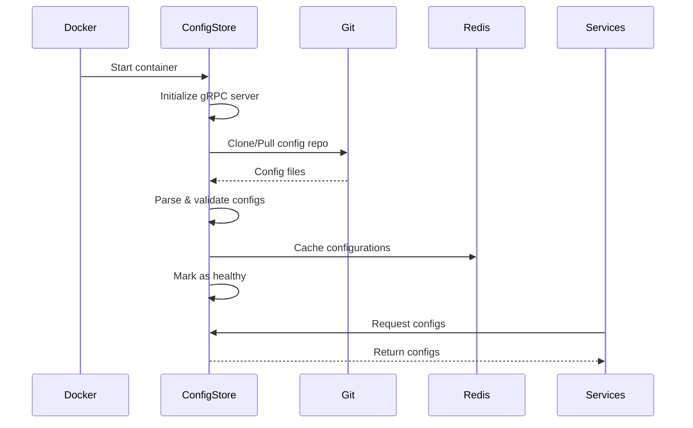

# Config-Store Seeding Strategy

## Overview

This document defines how the config-store service is seeded with configuration data from Git on startup, ensuring all microservices have access to their required non-secret configuration.

## Seeding Architecture

```
Git Repository → Config-Store → Microservices
     ↓              ↓              ↓
  (Source)     (Distribution)  (Consumers)
```

## Startup Sequence

### 1. Config-Store Initialization



## Implementation Details

### Config-Store Entrypoint Script

```bash
#!/bin/bash
# /docker-entrypoint.sh

set -e

# Environment variables
CONFIG_REPO_URL=${CONFIG_REPO_URL}
CONFIG_BRANCH=${CONFIG_BRANCH:-main}
CONFIG_ENV=${CONFIG_ENV:-dev}
CONFIG_PATH="/config-repo"

echo "Starting config-store seeding process..."

# 1. Clone or update repository
if [ ! -d "$CONFIG_PATH/.git" ]; then
    echo "Cloning config repository..."
    git clone --depth 1 --branch "$CONFIG_BRANCH" "$CONFIG_REPO_URL" "$CONFIG_PATH"
else
    echo "Updating config repository..."
    cd "$CONFIG_PATH"
    git fetch --depth 1
    git checkout "$CONFIG_BRANCH"
    git pull
fi

# 2. Validate configuration structure
echo "Validating configuration..."
config-store validate --path "$CONFIG_PATH/config/$CONFIG_ENV"

# 3. Load configurations into store
echo "Loading configurations..."
config-store seed \
    --env "$CONFIG_ENV" \
    --path "$CONFIG_PATH/config/$CONFIG_ENV" \
    --redis-url "$REDIS_URL"

# 4. Start gRPC server
echo "Starting config-store server..."
exec config-store serve \
    --port 50051 \
    --health-port 8090
```

### Rust Implementation

```rust
// src/seeder.rs
use std::path::Path;
use walkdir::WalkDir;
use serde_yaml;

pub struct ConfigSeeder {
    redis_client: redis::Client,
    environment: String,
}

impl ConfigSeeder {
    pub async fn seed_from_directory(&self, path: &Path) -> Result<SeedReport> {
        let mut report = SeedReport::new();
        
        // Walk through config directory
        for entry in WalkDir::new(path) {
            let entry = entry?;
            if entry.path().extension() == Some("yaml") {
                self.load_config_file(entry.path(), &mut report).await?;
            }
        }
        
        Ok(report)
    }
    
    async fn load_config_file(&self, path: &Path, report: &mut SeedReport) -> Result<()> {
        // Parse YAML file
        let content = std::fs::read_to_string(path)?;
        let config: serde_yaml::Value = serde_yaml::from_str(&content)?;
        
        // Extract service name from path
        let service_name = self.extract_service_name(path)?;
        
        // Store in Redis with structured key
        let key = format!("config:{}:{}", self.environment, service_name);
        
        let mut conn = self.redis_client.get_async_connection().await?;
        redis::cmd("SET")
            .arg(&key)
            .arg(serde_json::to_string(&config)?)
            .arg("EX")
            .arg(3600) // 1 hour TTL
            .query_async(&mut conn)
            .await?;
        
        report.configs_loaded.push(service_name);
        Ok(())
    }
}
```

## Configuration Structure

### Directory Layout
```
config/
├── dev/
│   ├── common/
│   │   ├── database.yaml
│   │   ├── redis.yaml
│   │   └── monitoring.yaml
│   ├── services/
│   │   ├── config-store.yaml
│   │   ├── data-ingestion.yaml
│   │   ├── data-staging.yaml
│   │   ├── neural-ml-ops.yaml
│   │   └── neural-trading.yaml
│   └── environment.yaml
├── test/
│   └── ... (same structure)
└── prod/
    └── ... (same structure)
```

### Config File Format

```yaml
# config/dev/services/neural-trading.yaml
version: "1.0.0"
service: neural-trading
environment: dev
updated_at: "2024-01-15T10:00:00Z"

configuration:
  trading:
    capital: 100000
    mode: paper
    risk_limits:
      position_size_pct: 5.0
      daily_loss_pct: 2.0
      stop_loss_pct: 5.0
  
  eventbus:
    channels:
      subscribe:
        - "ml:features:*"
        - "trading:signals:*"
      publish:
        - "trading:orders:*"
        - "trading:positions:*"
    batch_size: 100
    timeout_ms: 5000
  
  inference:
    cache_size: 1000
    model_timeout_ms: 50
    model_path: "/models/latest"
```

## Seeding Strategies

### 1. Full Seed (Default)
Load all configurations for the environment:
```bash
config-store seed --env dev --path /config/dev --full
```

### 2. Incremental Seed
Only update changed configurations:
```bash
config-store seed --env dev --path /config/dev --incremental
```

### 3. Service-Specific Seed
Load config for specific service:
```bash
config-store seed --env dev --service neural-trading
```

## Validation Rules

### Schema Validation
```json
{
  "$schema": "http://json-schema.org/draft-07/schema#",
  "type": "object",
  "required": ["version", "service", "environment", "configuration"],
  "properties": {
    "version": {
      "type": "string",
      "pattern": "^\\d+\\.\\d+\\.\\d+$"
    },
    "service": {
      "type": "string",
      "enum": ["config-store", "data-ingestion", "data-staging", "neural-ml-ops", "neural-trading"]
    },
    "environment": {
      "type": "string",
      "enum": ["dev", "test", "prod"]
    },
    "configuration": {
      "type": "object"
    }
  }
}
```

### Validation Process
1. **Structure Check**: Verify required fields exist
2. **Schema Validation**: Validate against JSON schema
3. **Reference Check**: Ensure cross-references are valid
4. **Value Bounds**: Check numeric values are within limits

## Service Registration

### Service Startup Flow
```rust
// Service initialization
pub async fn initialize_from_config_store() -> Result<ServiceConfig> {
    // Connect to config-store
    let client = ConfigStoreClient::connect("http://config-store:50051").await?;
    
    // Request configuration
    let request = GetServiceConfigRequest {
        service_name: env::var("SERVICE_NAME")?,
        environment: env::var("CONFIG_ENV")?,
    };
    
    let response = client.get_service_config(request).await?;
    let config: ServiceConfig = serde_json::from_str(&response.configuration)?;
    
    Ok(config)
}
```

### Health Check Integration
```rust
impl HealthCheck for ConfigStore {
    async fn check(&self) -> HealthStatus {
        // Check if configs are loaded
        if self.configs_loaded() {
            HealthStatus::Healthy
        } else {
            HealthStatus::Unhealthy("Configs not loaded".into())
        }
    }
}
```

## Error Handling

### Startup Failures
```bash
# Retry logic in entrypoint
MAX_RETRIES=5
RETRY_DELAY=5

for i in $(seq 1 $MAX_RETRIES); do
    if config-store seed --env "$CONFIG_ENV" --path "$CONFIG_PATH"; then
        echo "Config seeding successful"
        break
    else
        echo "Seeding failed, attempt $i/$MAX_RETRIES"
        sleep $RETRY_DELAY
    fi
done
```

### Validation Failures
- Log detailed error messages
- Exit with non-zero code
- Prevent service startup
- Alert monitoring system

## Caching Strategy

### Redis Cache Structure
```
config:dev:neural-trading     → Full service config (JSON)
config:dev:common:database    → Common database config
config:dev:common:redis       → Common Redis config
config:metadata:dev           → Environment metadata
```

### Cache Invalidation
- TTL: 1 hour for all configs
- Manual invalidation on updates
- Automatic refresh on Git webhook (future)

## Monitoring & Metrics

### Seeding Metrics
```prometheus
# Config loading time
config_store_seed_duration_seconds{env="dev"} 2.3

# Number of configs loaded
config_store_configs_loaded{env="dev"} 8

# Validation errors
config_store_validation_errors{env="dev", service="neural-trading"} 0

# Last successful seed
config_store_last_seed_timestamp{env="dev"} 1705320000
```

### Health Endpoints
```bash
# gRPC health check
grpc_health_probe -addr=:50051

# HTTP health check
curl http://config-store:8090/health

# Readiness check
curl http://config-store:8090/ready
```

## Security Considerations

### Git Authentication
```bash
# Use SSH key for private repos
GIT_SSH_COMMAND="ssh -i /secrets/git-key" git clone ...

# Or use token for HTTPS
git clone https://${GIT_TOKEN}@github.com/org/repo.git
```

### Access Control
- Read-only Git access
- No secret storage in Git
- Service authentication via mTLS (future)
- Audit logging of config access

## Troubleshooting

### Common Issues

#### Git Clone Failures
```bash
# Check network connectivity
nc -zv github.com 443

# Verify credentials
git ls-remote $CONFIG_REPO_URL

# Check disk space
df -h /config-repo
```

#### Config Validation Failures
```bash
# Validate manually
config-store validate --path /config/dev --verbose

# Check specific file
yamllint config/dev/services/neural-trading.yaml
```

#### Service Can't Get Config
```bash
# Check config-store health
grpc_health_probe -addr=config-store:50051

# Verify config exists in Redis
redis-cli GET "config:dev:neural-trading"

# Check service logs
docker logs neural-trading
```

## Future Enhancements

### Phase 1 (Current)
- Basic Git clone and seed
- Manual trigger only
- Simple validation

### Phase 2
- Git webhooks for auto-update
- Hot reload support
- Advanced validation

### Phase 3
- Multi-version support
- A/B configuration testing
- Configuration history/rollback

## Scripts

### seed-config-store.sh
```bash
#!/bin/bash
# Scripts to manually seed config-store

set -e

CONFIG_ENV=${1:-dev}

echo "Seeding config-store for environment: $CONFIG_ENV"

# Execute seed command in container
docker-compose -f docker-compose.v2.yml exec config-store \
    config-store seed \
    --env "$CONFIG_ENV" \
    --path "/config-repo/config/$CONFIG_ENV" \
    --verbose

echo "Seeding complete"
```

### validate-configs.sh
```bash
#!/bin/bash
# Validate all configuration files

set -e

for env in dev test prod; do
    echo "Validating $env environment..."
    for file in config/$env/**/*.yaml; do
        echo "  Checking $file"
        yamllint "$file"
        # Additional validation
    done
done

echo "All configs valid"
```

## Next Steps

1. Implement seeding logic in config-store
2. Create initial configuration files
3. Set up validation schemas
4. Test seeding process
5. Document service-specific configs