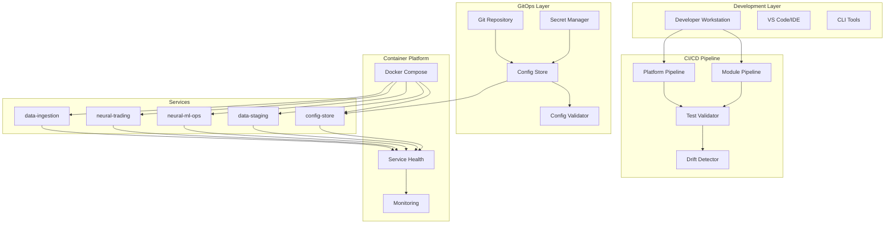

# SPARC Phase 3: Architecture
## Neural Trader V2 - CI/CD & GitOps System Design

### 1. System Architecture Overview



### 2. Component Architecture

#### 2.1 CI/CD Pipeline Components

```yaml
pipeline_architecture:
  module_pipeline:
    components:
      - build_engine:
          type: "Docker-based"
          language: "Rust/Python"
          caching: "Layer caching"
      - test_runner:
          unit: "cargo test / pytest"
          integration: "Docker Compose subset"
          coverage: "llvm-cov / coverage.py"
      - artifact_manager:
          storage: "Local filesystem"
          format: "Docker images"
          versioning: "Semantic versioning"
    
  platform_pipeline:
    components:
      - orchestrator:
          tool: "Make/Bash scripts"
          parallelization: "GNU Parallel"
          dependency_resolution: "Topological sort"
      - integration_tester:
          framework: "pytest + gRPC clients"
          data_generation: "Synthetic data"
          validation: "Schema + business rules"
      - deployment_manager:
          strategy: "Rolling updates"
          health_checks: "HTTP/gRPC probes"
          rollback: "Previous version restore"
```

#### 2.2 GitOps Architecture

```yaml
gitops_architecture:
  repository_structure:
    layout: "Service-first with environment overlay"
    paths:
      - /configs/base/{service}/
      - /configs/overlays/{environment}/{service}/
      - /schemas/{service}/
      - /secrets/{environment}/.gitignore
  
  config_store_integration:
    seeding:
      method: "Git pull on startup"
      frequency: "On-demand + periodic"
      validation: "Pre-seed schema check"
    
    distribution:
      protocol: "gRPC"
      caching: "In-memory with TTL"
      hot_reload: "File watch + signal"
  
  secret_management:
    storage: "Environment variables"
    injection: "Runtime substitution"
    rotation: "Manual with notification"
```

### 3. Data Flow Architecture

#### 3.1 Configuration Flow

```
Git Repository → Config Store → Service Configuration
     ↓              ↓                    ↓
  Validation    Schema Check       Health Check
     ↓              ↓                    ↓
   Commit      Store in Redis      Service Ready
```

#### 3.2 Pipeline Execution Flow

```
Code Change → Module Build → Unit Tests → Integration Tests → Platform Tests
      ↓            ↓             ↓              ↓                  ↓
   Trigger    Docker Build   Coverage      Service Start      Full Stack
      ↓            ↓             ↓              ↓                  ↓
   Validate    Layer Cache    Report       Health Check        E2E Tests
```

### 4. Service Interaction Architecture

```yaml
service_dependencies:
  config-store:
    provides: ["configuration", "feature_flags"]
    depends_on: ["redis", "git"]
    protocol: "gRPC"
    port: 50051
  
  data-ingestion:
    provides: ["raw_market_data"]
    depends_on: ["config-store", "redis"]
    protocol: "REST + Redis Pub/Sub"
    port: 8081
  
  data-staging:
    provides: ["processed_data", "features"]
    depends_on: ["config-store", "timescaledb", "redis"]
    protocol: "gRPC + Redis Streams"
    port: 50052
  
  neural-ml-ops:
    provides: ["models", "predictions"]
    depends_on: ["config-store", "data-staging"]
    protocol: "gRPC"
    port: 50053
  
  neural-trading:
    provides: ["trading_signals", "execution"]
    depends_on: ["config-store", "neural-ml-ops"]
    protocol: "gRPC + WebSocket"
    port: 50054
```

### 5. Testing Architecture

#### 5.1 Test Hierarchy

```yaml
test_architecture:
  levels:
    L1_unit:
      scope: "Single function/module"
      duration: "< 1 second"
      coverage_target: "80%"
      tools: ["cargo test", "pytest"]
    
    L2_service:
      scope: "Single service"
      duration: "< 30 seconds"
      coverage_target: "75%"
      tools: ["Docker", "test containers"]
    
    L3_integration:
      scope: "Service interactions"
      duration: "< 2 minutes"
      coverage_target: "70%"
      tools: ["Docker Compose", "gRPC clients"]
    
    L4_e2e:
      scope: "Full system"
      duration: "< 5 minutes"
      coverage_target: "60%"
      tools: ["Full stack", "synthetic data"]
```

#### 5.2 Drift Detection Architecture

```yaml
drift_detection:
  monitors:
    schema_drift:
      frequency: "On deployment"
      method: "JSON Schema validation"
      action: "Block deployment"
    
    performance_drift:
      frequency: "Continuous"
      method: "Baseline comparison"
      action: "Alert + log"
    
    configuration_drift:
      frequency: "Hourly"
      method: "Git diff"
      action: "Auto-remediate or alert"
    
    data_quality_drift:
      frequency: "Per batch"
      method: "Statistical analysis"
      action: "Alert + quarantine"
```

### 6. Container Architecture

#### 6.1 Docker Compose Structure

```yaml
docker_architecture:
  services:
    infrastructure:
      - redis:
          image: "redis:7-alpine"
          volumes: ["redis-data:/data"]
          healthcheck: "redis-cli ping"
      
      - timescaledb:
          image: "timescale/timescaledb:latest-pg15"
          volumes: ["postgres-data:/var/lib/postgresql/data"]
          healthcheck: "pg_isready"
    
    microservices:
      - config-store:
          build: "./services/config-store"
          depends_on: ["redis"]
          volumes: ["./configs:/configs:ro"]
          healthcheck: "/health/ready"
      
      - data-staging:
          build: "./services/data-staging"
          depends_on: ["config-store", "redis", "timescaledb"]
          healthcheck: "/health/ready"
    
    utilities:
      - test-runner:
          profiles: ["test"]
          build: "./docker/test-runner"
          volumes: ["./tests:/tests", "./reports:/reports"]
      
      - monitoring:
          profiles: ["monitoring"]
          image: "prom/prometheus"
          volumes: ["./monitoring:/etc/prometheus"]
```

### 7. Security Architecture

#### 7.1 Security Layers

```yaml
security_architecture:
  build_time:
    - dependency_scanning: "cargo audit, safety"
    - static_analysis: "clippy, bandit"
    - dockerfile_scanning: "hadolint"
    - secret_scanning: "gitleaks"
  
  configuration:
    - secret_separation: "Never in Git"
    - access_control: "RBAC for configs"
    - encryption: "At rest and in transit"
    - audit_logging: "All config changes"
  
  runtime:
    - network_isolation: "Service-specific networks"
    - resource_limits: "CPU/Memory constraints"
    - health_monitoring: "Liveness/Readiness probes"
    - log_aggregation: "Centralized logging"
```

### 8. Scalability Architecture

#### 8.1 Horizontal Scaling Design

```yaml
scalability_design:
  current_phase5:
    model: "Single instance per service"
    orchestration: "Docker Compose"
    state_management: "Shared Redis/DB"
    limitations: "Manual scaling only"
  
  future_phases:
    phase6:
      model: "Service replicas"
      orchestration: "Docker Swarm"
      state_management: "Distributed cache"
      features: ["Auto-scaling", "Load balancing"]
    
    phase7:
      model: "Kubernetes deployment"
      orchestration: "K8s + Helm"
      state_management: "Distributed state"
      features: ["HPA", "Service mesh", "Multi-region"]
```

### 9. Monitoring Architecture

#### 9.1 Observability Stack

```yaml
monitoring_architecture:
  metrics:
    collection: "Prometheus"
    storage: "Local time-series"
    visualization: "Grafana"
    alerts: "AlertManager"
  
  logging:
    aggregation: "File-based"
    format: "JSON structured"
    rotation: "Daily with compression"
    analysis: "grep/jq locally"
  
  tracing:
    current: "Basic logging correlation"
    future: "OpenTelemetry integration"
  
  health:
    probes: "HTTP/gRPC endpoints"
    dashboard: "Simple web UI"
    alerts: "Email/Slack webhooks"
```

### 10. Deployment Architecture

#### 10.1 Environment Architecture

```yaml
environment_architecture:
  development:
    infrastructure: "Docker Desktop"
    data: "Synthetic/minimal"
    configs: "Development overrides"
    secrets: ".env.dev files"
  
  testing:
    infrastructure: "Docker Compose"
    data: "Representative samples"
    configs: "Testing configurations"
    secrets: ".env.test files"
  
  production:
    infrastructure: "Docker Compose (Phase 5)"
    data: "Live data feeds"
    configs: "Production validated"
    secrets: "Secure secret manager"
```

### 11. API Architecture

#### 11.1 Service APIs

```yaml
api_architecture:
  protocols:
    internal: "gRPC with Proto3"
    external: "REST with OpenAPI"
    streaming: "WebSocket/SSE"
    messaging: "Redis Pub/Sub/Streams"
  
  versioning:
    strategy: "URL path versioning"
    deprecation: "3-month notice"
    compatibility: "Backward compatible"
  
  documentation:
    format: "OpenAPI 3.0"
    generation: "Code annotations"
    hosting: "Static site"
```

### 12. Architecture Decisions Record (ADR)

#### ADR-001: Module-First Testing
**Decision**: Implement module-specific testing with minimal dependencies
**Rationale**: Reduces test execution time from 16 to 3 minutes
**Consequences**: More complex test orchestration but faster feedback

#### ADR-002: GitOps with Config-Store
**Decision**: Use Git as configuration source with config-store distribution
**Rationale**: Provides audit trail and version control for all configs
**Consequences**: Additional complexity but better operational control

#### ADR-003: Docker Compose for Phase 5
**Decision**: Use Docker Compose instead of Kubernetes for initial deployment
**Rationale**: Simpler local development and faster initial delivery
**Consequences**: Limited scalability but appropriate for current scale

#### ADR-004: Local-First CI/CD
**Decision**: Run CI/CD pipelines locally without cloud dependencies
**Rationale**: Maintains full control and reduces external dependencies
**Consequences**: Manual triggering but complete local autonomy

---

*Architecture Version: 1.0.0*
*Status: Ready for Refinement Phase*
*Next: Implement core components with TDD approach*