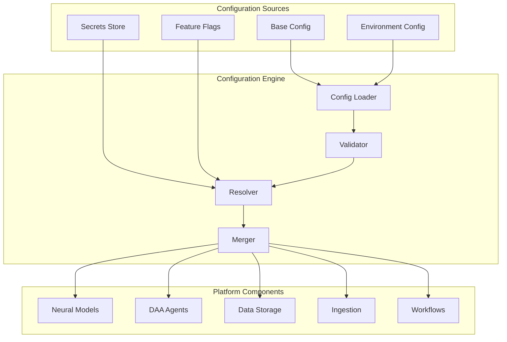

# YAML-Driven Deployment Flow

## Overview

This document describes how the YAML configuration engine enables seamless deployment across different environments, from development to production, without code changes. The deployment flow leverages configuration inheritance, environment-specific overrides, and runtime reconfiguration capabilities.

## Deployment Architecture



## Environment-Specific Configuration

### 1. Development Environment

```yaml
# config/environments/development.yaml
extends: base.yaml

platform:
  environment: development
  debug: true
  log_level: debug
  
components:
  neural_engine:
    model_loading:
      cache_models: false  # Always reload for testing
      validation_mode: strict
      
  storage:
    database:
      host: localhost
      migrations:
        auto_run: true
        seed_data: true
        
  monitoring:
    profiling: enabled
    trace_sampling: 1.0  # Trace everything
    
security:
  auth:
    bypass: true  # Skip auth in dev
  ssl:
    enabled: false
    
limits:
  rate_limiting: disabled
  resource_quotas: disabled
```

### 2. Staging Environment

```yaml
# config/environments/staging.yaml
extends: base.yaml

platform:
  environment: staging
  debug: false
  log_level: info
  
components:
  neural_engine:
    model_loading:
      cache_models: true
      validation_mode: strict
      model_source: "s3://staging-models/"
      
  storage:
    database:
      host: staging-db.internal
      replicas: 1
      backup:
        enabled: true
        schedule: "0 2 * * *"
        
  monitoring:
    profiling: sampling
    trace_sampling: 0.1
    alerts:
      enabled: true
      channels: ["slack"]
      
security:
  auth:
    provider: oauth2
    issuer: "https://auth-staging.company.com"
  ssl:
    enabled: true
    cert_source: letsencrypt
    
limits:
  rate_limiting:
    enabled: true
    requests_per_minute: 1000
  resource_quotas:
    enabled: true
    cpu_limit: "4"
    memory_limit: "8Gi"
```

### 3. Production Environment

```yaml
# config/environments/production.yaml
extends: base.yaml

platform:
  environment: production
  debug: false
  log_level: warning
  
components:
  neural_engine:
    model_loading:
      cache_models: true
      validation_mode: strict
      model_source: "s3://prod-models/"
      fallback_models: "s3://prod-models-backup/"
      
  storage:
    database:
      host: prod-db.internal
      replicas: 3
      connection_pool:
        min: 10
        max: 100
      backup:
        enabled: true
        schedule: "0 */6 * * *"
        retention: "30d"
        
  monitoring:
    profiling: disabled
    trace_sampling: 0.001
    alerts:
      enabled: true
      channels: ["pagerduty", "slack", "email"]
      escalation:
        - level: warning
          after: "5m"
          to: ["slack"]
        - level: critical
          after: "1m"
          to: ["pagerduty", "email"]
          
security:
  auth:
    provider: oauth2
    issuer: "https://auth.company.com"
    require_mfa: true
  ssl:
    enabled: true
    cert_source: "aws_acm"
    min_tls_version: "1.2"
    
limits:
  rate_limiting:
    enabled: true
    requests_per_minute: 10000
    burst: 1000
  resource_quotas:
    enabled: true
    cpu_limit: "16"
    memory_limit: "32Gi"
    
high_availability:
  enabled: true
  min_replicas: 3
  max_replicas: 10
  auto_scaling:
    metrics:
      - type: cpu
        target: 70
      - type: memory
        target: 80
      - type: custom
        metric: "request_latency_p99"
        target: "100ms"
```

## Deployment Process

### 1. Pre-Deployment Validation

```yaml
# deployment-validation.yaml
validation:
  pre_deployment:
    - name: "schema_validation"
      run: "config-validator --schema-dir ./schemas"
      
    - name: "dependency_check"
      run: "dependency-analyzer --config ${CONFIG_FILE}"
      
    - name: "security_scan"
      run: "security-scanner --config ${CONFIG_FILE}"
      
    - name: "resource_estimation"
      run: "resource-estimator --config ${CONFIG_FILE}"
      
  smoke_tests:
    - name: "config_load_test"
      timeout: "30s"
      
    - name: "component_init_test"
      timeout: "60s"
      
    - name: "health_check_test"
      timeout: "30s"
```

### 2. Deployment Strategies

#### Blue-Green Deployment

```yaml
# blue-green-deployment.yaml
deployment:
  strategy: blue_green
  
  stages:
    - name: "prepare_green"
      actions:
        - create_environment:
            config: "${NEW_CONFIG}"
            
    - name: "validate_green"
      actions:
        - run_tests:
            suite: "smoke"
        - health_check:
            timeout: "5m"
            
    - name: "switch_traffic"
      actions:
        - update_load_balancer:
            target: "green"
            traffic_percentage: 10
        - monitor:
            duration: "5m"
            rollback_on_error: true
            
    - name: "complete_switch"
      actions:
        - update_load_balancer:
            target: "green"
            traffic_percentage: 100
            
    - name: "cleanup"
      actions:
        - remove_environment:
            target: "blue"
          after: "24h"
```

#### Canary Deployment

```yaml
# canary-deployment.yaml
deployment:
  strategy: canary
  
  stages:
    - name: "deploy_canary"
      actions:
        - deploy:
            config: "${NEW_CONFIG}"
            replicas: 1
            
    - name: "route_canary_traffic"
      traffic_stages:
        - percentage: 1
          duration: "10m"
          metrics:
            error_rate: "< 0.1%"
            latency_p99: "< 200ms"
            
        - percentage: 5
          duration: "30m"
          metrics:
            error_rate: "< 0.1%"
            latency_p99: "< 200ms"
            
        - percentage: 25
          duration: "1h"
          
        - percentage: 50
          duration: "2h"
          
        - percentage: 100
          duration: "permanent"
```

#### Rolling Update

```yaml
# rolling-update.yaml
deployment:
  strategy: rolling_update
  
  parameters:
    max_surge: 2
    max_unavailable: 1
    
  update_strategy:
    pause_between_batches: "30s"
    health_check_interval: "10s"
    rollback_on_failure: true
    
  phases:
    - name: "update_workers"
      target: "worker_nodes"
      batch_size: 2
      
    - name: "update_api"
      target: "api_nodes"
      batch_size: 1
      
    - name: "update_coordinators"
      target: "coordinator_nodes"
      batch_size: 1
```

### 3. Configuration Deployment

```bash
#!/bin/bash
# deploy-config.sh

# Load environment
ENVIRONMENT=$1
CONFIG_VERSION=$2

# Validate configuration
echo "Validating configuration..."
config-engine validate \
  --config config/base.yaml \
  --config config/environments/${ENVIRONMENT}.yaml \
  --schema schemas/

# Dry run
echo "Running dry run..."
config-engine deploy \
  --dry-run \
  --config config/environments/${ENVIRONMENT}.yaml \
  --version ${CONFIG_VERSION}

# Deploy
echo "Deploying configuration..."
config-engine deploy \
  --config config/environments/${ENVIRONMENT}.yaml \
  --version ${CONFIG_VERSION} \
  --strategy ${DEPLOYMENT_STRATEGY:-rolling} \
  --monitor

# Verify deployment
echo "Verifying deployment..."
config-engine verify \
  --environment ${ENVIRONMENT} \
  --version ${CONFIG_VERSION}
```

## Runtime Configuration Updates

### 1. Hot Reload Capabilities

```yaml
# hot-reload-config.yaml
hot_reload:
  enabled: true
  
  reloadable_components:
    - type: "feature_flags"
      reload_strategy: "immediate"
      
    - type: "rate_limits"
      reload_strategy: "immediate"
      
    - type: "circuit_breakers"
      reload_strategy: "immediate"
      
    - type: "log_levels"
      reload_strategy: "immediate"
      
    - type: "neural_model_params"
      reload_strategy: "graceful"
      drain_timeout: "30s"
      
    - type: "agent_configuration"
      reload_strategy: "rolling"
      batch_size: 2
      
  non_reloadable:
    - "database_connections"
    - "security_certificates"
    - "network_bindings"
```

### 2. Configuration API

```yaml
# config-api-deployment.yaml
config_api:
  endpoints:
    health:
      path: "/health"
      public: true
      
    config:
      path: "/api/v1/config"
      auth_required: true
      methods:
        GET:
          description: "Get current configuration"
          filter: true  # Can filter sensitive data
          
        POST:
          description: "Update configuration"
          roles: ["admin"]
          validation: strict
          
        PATCH:
          description: "Partial update"
          roles: ["admin"]
          validation: strict
          
    reload:
      path: "/api/v1/config/reload"
      method: POST
      roles: ["admin"]
      
    rollback:
      path: "/api/v1/config/rollback"
      method: POST
      roles: ["admin"]
      parameters:
        - name: version
          required: true
```

## Monitoring and Observability

### 1. Configuration Metrics

```yaml
# config-metrics.yaml
metrics:
  configuration:
    - name: "config_load_duration"
      type: histogram
      labels: ["environment", "version"]
      
    - name: "config_reload_count"
      type: counter
      labels: ["component", "status"]
      
    - name: "config_validation_errors"
      type: counter
      labels: ["validation_type", "component"]
      
    - name: "active_config_version"
      type: gauge
      labels: ["environment"]
      
    - name: "config_drift_detected"
      type: counter
      labels: ["component", "drift_type"]
```

### 2. Deployment Dashboards

```yaml
# deployment-dashboard.yaml
dashboards:
  deployment_overview:
    widgets:
      - type: "deployment_timeline"
        data:
          - deployments
          - rollbacks
          - config_changes
          
      - type: "environment_status"
        environments: ["dev", "staging", "prod"]
        
      - type: "config_drift"
        compare_with: "git"
        
      - type: "deployment_metrics"
        metrics:
          - success_rate
          - deployment_duration
          - rollback_rate
```

## Security Considerations

### 1. Secret Rotation

```yaml
# secret-rotation.yaml
secret_rotation:
  automatic: true
  
  policies:
    - secret_type: "database_passwords"
      rotation_period: "90d"
      notification_before: "7d"
      
    - secret_type: "api_keys"
      rotation_period: "180d"
      notification_before: "14d"
      
    - secret_type: "certificates"
      rotation_period: "365d"
      notification_before: "30d"
      
  rotation_strategy:
    create_new: true
    overlap_period: "24h"
    verify_before_delete: true
```

### 2. Configuration Audit

```yaml
# config-audit.yaml
audit:
  enabled: true
  
  events:
    - configuration_loaded
    - configuration_changed
    - configuration_validated
    - secret_accessed
    - deployment_initiated
    - rollback_performed
    
  storage:
    type: "append_only_log"
    retention: "7y"
    encryption: true
    
  alerts:
    - event: "unauthorized_config_access"
      severity: "critical"
      notify: ["security-team"]
      
    - event: "config_validation_failed"
      severity: "warning"
      notify: ["ops-team"]
```

## Disaster Recovery

### 1. Configuration Backup

```yaml
# config-backup.yaml
backup:
  automatic: true
  
  schedule:
    - name: "hourly_snapshot"
      frequency: "0 * * * *"
      retention: "24h"
      
    - name: "daily_backup"
      frequency: "0 2 * * *"
      retention: "30d"
      
    - name: "weekly_backup"
      frequency: "0 2 * * 0"
      retention: "90d"
      
  storage:
    primary: "s3://config-backups/${ENVIRONMENT}/"
    secondary: "gs://config-backups-dr/${ENVIRONMENT}/"
    
  encryption:
    enabled: true
    key_management: "kms"
```

### 2. Recovery Procedures

```yaml
# recovery-procedures.yaml
recovery:
  procedures:
    - name: "config_rollback"
      steps:
        - verify_backup:
            version: "${TARGET_VERSION}"
        - create_restore_point
        - apply_configuration:
            source: "backup"
            version: "${TARGET_VERSION}"
        - verify_health
        - update_deployment_record
        
    - name: "emergency_override"
      requires_approval: 2
      steps:
        - load_emergency_config
        - bypass_validation
        - force_apply
        - notify_all_teams
```

## CI/CD Integration

### 1. GitOps Workflow

```yaml
# gitops-config.yaml
gitops:
  enabled: true
  
  repository:
    url: "git@github.com:company/platform-config.git"
    branch: "${ENVIRONMENT}"
    
  sync:
    interval: "1m"
    prune: true
    self_heal: true
    
  validation:
    pre_commit:
      - schema_validation
      - dependency_check
      - security_scan
      
    pre_merge:
      - integration_tests
      - performance_tests
      
  notifications:
    slack:
      channel: "#platform-config"
      events:
        - sync_failed
        - validation_failed
        - drift_detected
```

### 2. Pipeline Integration

```yaml
# pipeline-integration.yaml
pipeline:
  stages:
    - name: "validate"
      steps:
        - lint_yaml
        - validate_schema
        - check_secrets
        
    - name: "test"
      steps:
        - unit_tests
        - integration_tests
        - load_tests
        
    - name: "build"
      steps:
        - bundle_configs
        - generate_checksums
        - create_artifact
        
    - name: "deploy"
      steps:
        - deploy_to_environment
        - run_smoke_tests
        - update_monitoring
        
    - name: "verify"
      steps:
        - health_checks
        - performance_baseline
        - security_scan
```

## Conclusion

The YAML-driven deployment flow enables:

1. **Zero-Code Deployments**: All environment differences handled through configuration
2. **Safe Rollouts**: Multiple deployment strategies with automatic rollback
3. **Runtime Flexibility**: Hot reload for immediate changes
4. **Complete Auditability**: Every configuration change tracked and versioned
5. **Disaster Recovery**: Automatic backups and quick recovery procedures

This approach ensures that the platform can be deployed and managed across any environment without modifying the underlying code, making it truly generic and reusable.