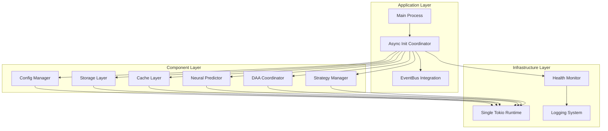
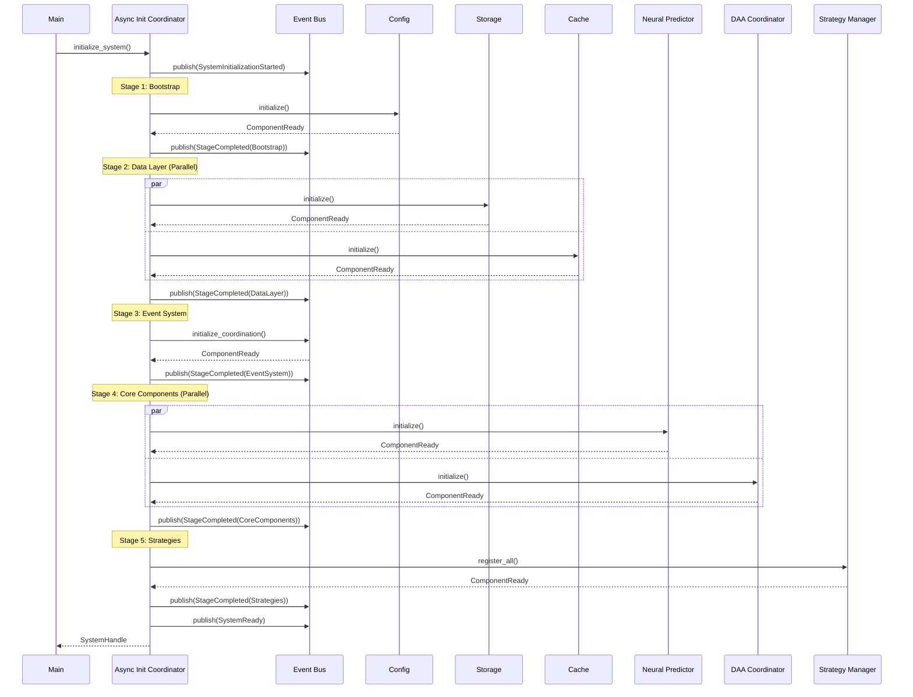

# AsyncFix - System Architecture

## Document Information
- **Version**: 1.0.0
- **Date**: 2025-07-31
- **Phase**: SPARC Architecture
- **Status**: Design Complete
- **Specification Reference**: 1_SPECIFICATION.md

## 1. Architecture Overview

### 1.1 System Context
The AsyncFix architecture addresses critical async/sync boundary violations in the neural-trader system by implementing an event-driven initialization coordinator that manages component lifecycle and dependencies.



### 1.2 Architecture Principles
1. **Single Runtime**: One Tokio runtime for the entire application lifecycle
2. **Event-Driven**: Components communicate through well-defined events
3. **Async-First**: All components use async patterns consistently
4. **Parallel Initialization**: Independent components initialize concurrently
5. **Graceful Degradation**: System remains operational during component failures

## 2. Component Architecture

### 2.1 Async Initialization Coordinator (AIC)

The central orchestrator managing component lifecycle and dependencies.

```rust
pub struct AsyncInitCoordinator {
    event_bus: Arc<EventBusIntegration>,
    component_registry: ComponentRegistry,
    initialization_state: Arc<RwLock<InitializationState>>,
    health_monitor: Arc<HealthMonitor>,
    timeout_config: TimeoutConfig,
}

impl AsyncInitCoordinator {
    pub async fn new(config: Config) -> Result<Self, InitError>;
    pub async fn initialize_system(&self) -> Result<SystemHandle, InitError>;
    pub async fn shutdown_gracefully(&self) -> Result<(), ShutdownError>;
    pub fn get_component_status(&self, id: ComponentId) -> ComponentStatus;
}
```

**Responsibilities:**
- Coordinate component initialization phases
- Track component states and dependencies
- Handle initialization failures and recovery
- Provide system health monitoring
- Manage graceful shutdown sequences

### 2.2 Component Registry

Maintains component metadata and dependency information.

```rust
pub struct ComponentRegistry {
    components: HashMap<ComponentId, ComponentInfo>,
    dependency_graph: DependencyGraph,
    initialization_order: Vec<InitializationStage>,
}

#[derive(Debug, Clone)]
pub struct ComponentInfo {
    pub id: ComponentId,
    pub name: String,
    pub component_type: ComponentType,
    pub dependencies: Vec<ComponentId>,
    pub optional_dependencies: Vec<ComponentId>,
    pub initialization_timeout: Duration,
    pub health_check: Option<HealthCheckFn>,
}

pub enum ComponentType {
    Config,
    Storage,
    Cache,
    EventBus,
    NeuralPredictor,
    DaaCoordinator,
    Strategy,
    Monitor,
}
```

### 2.3 Initialization State Manager

Tracks the current state of system initialization.

```rust
#[derive(Debug, Clone)]
pub struct InitializationState {
    pub stage: InitializationStage,
    pub component_states: HashMap<ComponentId, ComponentState>,
    pub failed_components: Vec<(ComponentId, InitError)>,
    pub start_time: Instant,
    pub stage_timings: HashMap<InitializationStage, Duration>,
}

#[derive(Debug, Clone, PartialEq)]
pub enum ComponentState {
    Pending,
    Initializing,
    Ready,
    Failed(String),
    Degraded,
}

#[derive(Debug, Clone, PartialEq, Eq, Hash)]
pub enum InitializationStage {
    Bootstrap,      // Config, logging, runtime setup
    DataLayer,      // Storage and cache (parallel)
    EventSystem,    // Event bus and coordination
    CoreComponents, // Neural predictor, DAA coordinator (parallel)
    Strategies,     // Strategy registration (parallel)
    Operational,    // System ready for operations
}
```

## 3. Event System Architecture

### 3.1 Event Schema Definitions

```rust
#[derive(Debug, Clone, Serialize, Deserialize)]
#[serde(tag = "type")]
pub enum InitializationEvent {
    // Stage Events
    StageStarted { 
        stage: InitializationStage, 
        timestamp: SystemTime 
    },
    StageCompleted { 
        stage: InitializationStage, 
        duration: Duration,
        timestamp: SystemTime 
    },
    StageFailed { 
        stage: InitializationStage, 
        error: String,
        timestamp: SystemTime 
    },
    
    // Component Events
    ComponentInitializing { 
        component_id: ComponentId, 
        timestamp: SystemTime 
    },
    ComponentReady { 
        component_id: ComponentId, 
        metadata: ComponentMetadata,
        timestamp: SystemTime 
    },
    ComponentFailed { 
        component_id: ComponentId, 
        error: String,
        retry_possible: bool,
        timestamp: SystemTime 
    },
    ComponentDegraded { 
        component_id: ComponentId, 
        reason: String,
        timestamp: SystemTime 
    },
    
    // System Events
    SystemInitializationStarted { 
        timestamp: SystemTime 
    },
    SystemReady { 
        total_duration: Duration, 
        timestamp: SystemTime 
    },
    SystemShutdownInitiated { 
        reason: String, 
        timestamp: SystemTime 
    },
    
    // Health Events
    HealthCheckPassed { 
        component_id: ComponentId, 
        timestamp: SystemTime 
    },
    HealthCheckFailed { 
        component_id: ComponentId, 
        error: String,
        timestamp: SystemTime 
    },
}

#[derive(Debug, Clone, Serialize, Deserialize)]
pub struct ComponentMetadata {
    pub version: String,
    pub capabilities: Vec<String>,
    pub resource_usage: ResourceUsage,
    pub endpoints: Vec<EndpointInfo>,
}
```

### 3.2 Event Bus Integration

Enhanced EventBusIntegration to support initialization coordination.

```rust
pub struct InitializationEventBus {
    inner: Arc<EventBusIntegration>,
    initialization_channel: broadcast::Sender<InitializationEvent>,
    subscribers: Arc<RwLock<HashMap<ComponentId, Vec<EventSubscription>>>>,
}

impl InitializationEventBus {
    pub async fn new(config: EventBusConfig) -> Result<Self, EventBusError>;
    
    pub async fn publish_event(&self, event: InitializationEvent) -> Result<(), PublishError>;
    
    pub async fn subscribe_to_component_events(
        &self, 
        component_id: ComponentId,
        callback: EventCallback
    ) -> Result<SubscriptionHandle, SubscribeError>;
    
    pub async fn wait_for_component_ready(
        &self, 
        component_id: ComponentId,
        timeout: Duration
    ) -> Result<ComponentMetadata, WaitError>;
    
    pub async fn wait_for_stage_completion(
        &self, 
        stage: InitializationStage,
        timeout: Duration
    ) -> Result<(), WaitError>;
}
```

## 4. Sequence Diagrams

### 4.1 System Initialization Sequence



### 4.2 Component Failure Recovery Sequence

```mermaid
sequenceDiagram
    participant AIC as Async Init Coordinator
    participant EB as Event Bus
    participant Comp as Failed Component
    participant Monitor as Health Monitor
    participant Alt as Alternative Component
    
    AIC->>Comp: initialize()
    Comp-->>AIC: ComponentFailed(error, retry=true)
    AIC->>EB: publish(ComponentFailed)
    AIC->>Monitor: assess_impact(component_id)
    
    alt Retry Possible
        AIC->>Comp: retry_initialize()
        Comp-->>AIC: ComponentReady
        AIC->>EB: publish(ComponentReady)
    else Critical Component
        AIC->>Alt: initialize_fallback()
        Alt-->>AIC: ComponentReady
        AIC->>EB: publish(ComponentDegraded)
    else Non-Critical
        AIC->>Monitor: mark_degraded(component_id)
        AIC->>EB: publish(SystemReady(degraded_mode))
    end
```

## 5. Interface Specifications

### 5.1 Async Component Interface

All components must implement the AsyncComponent trait for consistent initialization.

```rust
#[async_trait]
pub trait AsyncComponent: Send + Sync {
    type Config: Send + Sync;
    type Error: std::error::Error + Send + Sync + 'static;
    
    /// Component identifier for registry
    fn component_id() -> ComponentId;
    
    /// List of required dependencies
    fn dependencies() -> Vec<ComponentId>;
    
    /// List of optional dependencies
    fn optional_dependencies() -> Vec<ComponentId>;
    
    /// Initialize the component asynchronously
    async fn initialize(config: Self::Config) -> Result<Self, Self::Error> 
    where 
        Self: Sized;
    
    /// Health check for monitoring
    async fn health_check(&self) -> Result<HealthStatus, Self::Error>;
    
    /// Graceful shutdown
    async fn shutdown(&self) -> Result<(), Self::Error>;
    
    /// Component metadata
    fn metadata(&self) -> ComponentMetadata;
}
```

### 5.2 Component Builder Pattern

For complex components requiring staged initialization:

```rust
pub struct ComponentBuilder<T> {
    config: Option<T::Config>,
    dependencies: HashMap<ComponentId, Arc<dyn Any + Send + Sync>>,
    optional_dependencies: HashMap<ComponentId, Arc<dyn Any + Send + Sync>>,
    timeout: Option<Duration>,
}

impl<T: AsyncComponent> ComponentBuilder<T> {
    pub fn new() -> Self;
    pub fn with_config(mut self, config: T::Config) -> Self;
    pub fn with_dependency<D>(mut self, dep: Arc<D>) -> Self 
    where D: 'static + Send + Sync;
    pub fn with_timeout(mut self, timeout: Duration) -> Self;
    pub async fn build(self) -> Result<T, T::Error>;
}
```

### 5.3 Health Monitor Interface

```rust
#[async_trait]
pub trait HealthMonitor: Send + Sync {
    async fn register_component(&self, component: Arc<dyn AsyncComponent>) -> Result<(), MonitorError>;
    async fn check_component_health(&self, id: ComponentId) -> Result<HealthStatus, MonitorError>;
    async fn get_system_health(&self) -> SystemHealth;
    async fn start_periodic_checks(&self, interval: Duration);
    
    fn subscribe_to_health_events(&self) -> broadcast::Receiver<HealthEvent>;
}

#[derive(Debug, Clone)]
pub struct SystemHealth {
    pub overall_status: HealthStatus,
    pub component_statuses: HashMap<ComponentId, ComponentHealth>,
    pub degraded_components: Vec<ComponentId>,
    pub failed_components: Vec<ComponentId>,
    pub last_check: SystemTime,
}

#[derive(Debug, Clone)]
pub enum HealthStatus {
    Healthy,
    Degraded { reason: String },
    Unhealthy { reason: String },
    Unknown,
}
```

## 6. Integration Strategy

### 6.1 Migration Approach

**Phase 1: Foundation (Week 1-2)**
- Implement AsyncInitCoordinator core structure
- Create event schema and bus enhancements
- Add health monitoring infrastructure
- Create component registry

**Phase 2: Component Adaptation (Week 3-4)**
- Convert critical components to AsyncComponent trait
- Implement builder patterns for complex components
- Add initialization event publishing
- Create integration tests

**Phase 3: Main.rs Integration (Week 5)**
- Replace sequential initialization with coordinator
- Remove all tokio::runtime::Runtime::new() instances
- Implement graceful shutdown handling
- Add comprehensive error handling

**Phase 4: Optimization (Week 6)**
- Enable parallel initialization for independent components
- Add performance monitoring and metrics
- Implement retry logic and fallback mechanisms
- Complete integration testing

### 6.2 Backward Compatibility Strategy

```rust
// Legacy compatibility wrapper
pub struct LegacyComponentWrapper<T> {
    inner: T,
    initialized: AtomicBool,
}

impl<T> LegacyComponentWrapper<T> {
    pub fn new(component: T) -> Self {
        Self {
            inner: component,
            initialized: AtomicBool::new(true),
        }
    }
    
    // Provide sync access for existing code
    pub fn sync_access(&self) -> &T {
        &self.inner
    }
}

#[async_trait]
impl<T: Send + Sync> AsyncComponent for LegacyComponentWrapper<T> {
    // Implementation that wraps existing sync components
}
```

### 6.3 Dependency Management

```rust
pub struct DependencyGraph {
    nodes: HashMap<ComponentId, DependencyNode>,
    edges: HashMap<ComponentId, Vec<ComponentId>>,
}

impl DependencyGraph {
    pub fn new() -> Self;
    pub fn add_component(&mut self, info: ComponentInfo);
    pub fn validate_dependencies(&self) -> Result<(), DependencyError>;
    pub fn get_initialization_order(&self) -> Vec<InitializationStage>;
    pub fn get_parallel_groups(&self) -> Vec<Vec<ComponentId>>;
    
    // Detect circular dependencies
    pub fn detect_cycles(&self) -> Vec<Vec<ComponentId>>;
}
```

## 7. Testing Architecture

### 7.1 Unit Testing Strategy

```rust
#[cfg(test)]
mod tests {
    use super::*;
    use tokio_test;
    
    #[tokio::test]
    async fn test_async_init_coordinator_basic_flow() {
        let config = test_config();
        let coordinator = AsyncInitCoordinator::new(config).await.unwrap();
        
        let system_handle = coordinator.initialize_system().await.unwrap();
        assert!(system_handle.is_ready());
        
        coordinator.shutdown_gracefully().await.unwrap();
    }
    
    #[tokio::test]
    async fn test_component_failure_recovery() {
        let mut mock_component = MockComponent::new();
        mock_component.expect_initialize()
            .times(1)
            .returning(|| Err(ComponentError::InitializationFailed));
            
        // Test failure handling
    }
    
    #[tokio::test]
    async fn test_parallel_initialization_timing() {
        // Verify parallel components initialize concurrently
        let start = Instant::now();
        // ... initialization logic
        let duration = start.elapsed();
        assert!(duration < Duration::from_millis(500)); // Should be much faster than sequential
    }
}
```

### 7.2 Integration Testing

```rust
#[cfg(test)]
mod integration_tests {
    use super::*;
    
    #[tokio::test]
    async fn test_full_system_initialization() {
        let config = integration_test_config();
        let coordinator = AsyncInitCoordinator::new(config).await.unwrap();
        
        // Test event flow
        let mut event_receiver = coordinator.event_bus.subscribe().await.unwrap();
        
        let system_handle = coordinator.initialize_system().await.unwrap();
        
        // Verify all expected events were published
        verify_initialization_events(&mut event_receiver).await;
        
        // Test system functionality
        verify_system_operations(&system_handle).await;
        
        coordinator.shutdown_gracefully().await.unwrap();
    }
    
    #[tokio::test]
    async fn test_component_dependency_resolution() {
        // Test complex dependency scenarios
    }
    
    #[tokio::test]
    async fn test_graceful_degradation() {
        // Test system behavior when optional components fail
    }
}
```

### 7.3 Performance Testing

```rust
#[cfg(test)]
mod performance_tests {
    use super::*;
    use criterion::{criterion_group, criterion_main, Criterion};
    
    fn benchmark_initialization_time(c: &mut Criterion) {
        let rt = tokio::runtime::Runtime::new().unwrap();
        
        c.bench_function("system_initialization", |b| {
            b.to_async(&rt).iter(|| async {
                let config = benchmark_config();
                let coordinator = AsyncInitCoordinator::new(config).await.unwrap();
                let _system = coordinator.initialize_system().await.unwrap();
                coordinator.shutdown_gracefully().await.unwrap();
            });
        });
    }
    
    criterion_group!(benches, benchmark_initialization_time);
    criterion_main!(benches);
}
```

## 8. Error Handling Architecture

### 8.1 Error Types

```rust
#[derive(Debug, thiserror::Error)]
pub enum InitError {
    #[error("Configuration error: {0}")]
    Configuration(#[from] ConfigError),
    
    #[error("Component {component_id} failed to initialize: {source}")]
    ComponentInitialization {
        component_id: ComponentId,
        #[source]
        source: Box<dyn std::error::Error + Send + Sync>,
    },
    
    #[error("Dependency resolution failed: {0}")]
    DependencyResolution(String),
    
    #[error("Circular dependency detected: {cycle:?}")]
    CircularDependency { cycle: Vec<ComponentId> },
    
    #[error("Initialization timeout after {timeout:?}")]
    Timeout { timeout: Duration },
    
    #[error("Event bus error: {0}")]
    EventBus(#[from] EventBusError),
    
    #[error("System already initialized")]
    AlreadyInitialized,
}

#[derive(Debug, thiserror::Error)]
pub enum ComponentError {
    #[error("Initialization failed: {reason}")]
    InitializationFailed { reason: String },
    
    #[error("Dependency not available: {dependency}")]
    DependencyNotAvailable { dependency: ComponentId },
    
    #[error("Health check failed: {reason}")]
    HealthCheckFailed { reason: String },
    
    #[error("Configuration invalid: {field}")]
    InvalidConfiguration { field: String },
}
```

### 8.2 Error Recovery Strategies

```rust
#[derive(Debug, Clone)]
pub enum RecoveryStrategy {
    Retry { max_attempts: u32, backoff: Duration },
    Fallback { alternative_component: ComponentId },
    Degrade { essential: bool },
    Fail { propagate: bool },
}

impl AsyncInitCoordinator {
    async fn handle_component_failure(
        &self,
        component_id: ComponentId,
        error: ComponentError,
    ) -> Result<RecoveryAction, InitError> {
        let strategy = self.get_recovery_strategy(component_id);
        
        match strategy {
            RecoveryStrategy::Retry { max_attempts, backoff } => {
                self.retry_component_initialization(component_id, max_attempts, backoff).await
            },
            RecoveryStrategy::Fallback { alternative_component } => {
                self.initialize_fallback_component(alternative_component).await
            },
            RecoveryStrategy::Degrade { essential } => {
                if essential {
                    Err(InitError::ComponentInitialization { 
                        component_id, 
                        source: Box::new(error) 
                    })
                } else {
                    Ok(RecoveryAction::ContinueWithDegradation)
                }
            },
            RecoveryStrategy::Fail { propagate } => {
                if propagate {
                    Err(InitError::ComponentInitialization { 
                        component_id, 
                        source: Box::new(error) 
                    })
                } else {
                    Ok(RecoveryAction::Continue)
                }
            }
        }
    }
}
```

## 9. Monitoring and Observability

### 9.1 Metrics Collection

```rust
pub struct InitializationMetrics {
    pub total_initialization_time: Duration,
    pub stage_timings: HashMap<InitializationStage, Duration>,
    pub component_timings: HashMap<ComponentId, Duration>,
    pub failure_count: u64,
    pub retry_count: u64,
    pub degraded_components: HashSet<ComponentId>,
}

impl InitializationMetrics {
    pub fn record_stage_start(&mut self, stage: InitializationStage);
    pub fn record_stage_completion(&mut self, stage: InitializationStage);
    pub fn record_component_timing(&mut self, id: ComponentId, duration: Duration);
    pub fn record_failure(&mut self, id: ComponentId);
    pub fn record_retry(&mut self, id: ComponentId);
    
    pub fn export_prometheus_metrics(&self) -> String;
    pub fn export_json_summary(&self) -> serde_json::Value;
}
```

### 9.2 Logging Strategy

```rust
impl AsyncInitCoordinator {
    async fn log_initialization_progress(&self) {
        tracing::info!(
            stage = ?self.current_stage(),
            completed_components = self.completed_component_count(),
            total_components = self.total_component_count(),
            elapsed = ?self.elapsed_time(),
            "Initialization progress"
        );
    }
    
    async fn log_component_event(&self, event: &InitializationEvent) {
        match event {
            InitializationEvent::ComponentReady { component_id, metadata, .. } => {
                tracing::info!(
                    component_id = ?component_id,
                    version = %metadata.version,
                    capabilities = ?metadata.capabilities,
                    "Component initialized successfully"
                );
            },
            InitializationEvent::ComponentFailed { component_id, error, .. } => {
                tracing::error!(
                    component_id = ?component_id,
                    error = %error,
                    "Component initialization failed"
                );
            },
            _ => {}
        }
    }
}
```

## 10. Configuration Schema

### 10.1 Initialization Configuration

```yaml
# async_init_config.yaml
initialization:
  # Global timeouts
  global_timeout: "120s"
  stage_timeout: "30s"
  component_timeout: "10s"
  
  # Retry configuration
  retry:
    max_attempts: 3
    initial_backoff: "1s"
    max_backoff: "10s"
    backoff_multiplier: 2.0
  
  # Parallel execution
  parallel:
    enabled: true
    max_concurrent_components: 4
    
  # Health monitoring
  health:
    check_interval: "30s"
    startup_grace_period: "60s"
    
  # Event bus
  event_bus:
    buffer_size: 1000
    persistence: false
    
  # Recovery strategies per component
  recovery_strategies:
    neural_predictor:
      type: "retry"
      max_attempts: 2
      fallback: "simple_predictor"
    
    storage:
      type: "fail"
      propagate: true
    
    cache:
      type: "degrade"
      essential: false

components:
  config:
    enabled: true
    timeout: "5s"
    
  storage:
    enabled: true
    timeout: "15s"
    dependencies: ["config"]
    
  cache:
    enabled: true
    timeout: "10s"
    dependencies: ["config"]
    optional: true
    
  neural_predictor:
    enabled: true
    timeout: "20s"
    dependencies: ["config", "storage"]
    optional_dependencies: ["cache"]
    
  daa_coordinator:
    enabled: true
    timeout: "15s"
    dependencies: ["config", "neural_predictor"]
    
  strategies:
    enabled: true
    timeout: "10s"
    dependencies: ["daa_coordinator"]
```

### 10.2 Runtime Configuration

```rust
#[derive(Debug, Clone, Serialize, Deserialize)]
pub struct AsyncInitConfig {
    pub initialization: InitializationConfig,
    pub components: HashMap<ComponentId, ComponentConfig>,
}

#[derive(Debug, Clone, Serialize, Deserialize)]
pub struct InitializationConfig {
    pub global_timeout: Duration,
    pub stage_timeout: Duration,
    pub component_timeout: Duration,
    pub retry: RetryConfig,
    pub parallel: ParallelConfig,
    pub health: HealthConfig,
    pub event_bus: EventBusConfig,
    pub recovery_strategies: HashMap<ComponentId, RecoveryStrategy>,
}

#[derive(Debug, Clone, Serialize, Deserialize)]
pub struct ComponentConfig {
    pub enabled: bool,
    pub timeout: Duration,
    pub dependencies: Vec<ComponentId>,
    pub optional_dependencies: Vec<ComponentId>,
    pub custom_config: Option<serde_json::Value>,
}
```

## 11. Security Considerations

### 11.1 Component Isolation

```rust
pub struct SecureComponentWrapper<T> {
    inner: T,
    security_context: SecurityContext,
    permissions: ComponentPermissions,
}

impl<T> SecureComponentWrapper<T> {
    pub fn new(component: T, context: SecurityContext) -> Self;
    
    pub async fn execute_with_permissions<F, R>(&self, operation: F) -> Result<R, SecurityError>
    where
        F: FnOnce(&T) -> R + Send,
    {
        // Validate permissions before execution
        self.security_context.validate_operation(&self.permissions)?;
        Ok(operation(&self.inner))
    }
}
```

### 11.2 Event Security

```rust
pub struct SecureEventBus {
    inner: InitializationEventBus,
    event_validator: EventValidator,
    access_control: EventAccessControl,
}

impl SecureEventBus {
    pub async fn publish_secure_event(
        &self,
        event: InitializationEvent,
        context: SecurityContext,
    ) -> Result<(), SecurityError> {
        // Validate event content
        self.event_validator.validate(&event)?;
        
        // Check publish permissions
        self.access_control.check_publish_permission(&context, &event)?;
        
        self.inner.publish_event(event).await?;
        Ok(())
    }
}
```

## 12. Performance Targets

### 12.1 Startup Performance

| Metric | Current | Target | Critical |
|--------|---------|---------|----------|
| Total Startup Time | 3-5s | <2s | ✅ |
| Config Load Time | ~200ms | <100ms | ⚠️ |
| Storage Init Time | ~1s | <500ms | ✅ |
| Neural Predictor Init | ~2s | <1s | ✅ |
| Event Bus Setup | ~100ms | <50ms | ⚠️ |
| Parallel Efficiency | 0% | >60% | ✅ |

### 12.2 Memory Efficiency

| Resource | Current | Target | Critical |
|----------|---------|---------|----------|
| Runtime Instances | 15+ | 1 | ✅ |
| Event Buffer Size | N/A | 1000 events | ⚠️ |
| Component Registry | N/A | <1MB | ⚠️ |
| Health Monitor Overhead | N/A | <100KB | ⚠️ |

### 12.3 Reliability Targets

| Metric | Target | Measurement |
|--------|---------|-------------|
| Initialization Success Rate | 99.9% | Over 1000 startups |
| Component Recovery Rate | 95% | After transient failures |
| Graceful Shutdown Success | 100% | Under normal conditions |
| Zero Data Loss | 100% | During shutdown |

## 13. Deployment Considerations

### 13.1 Rollout Strategy

**Phase 1: Internal Testing (Week 7)**
- Deploy to development environment
- Run extended burn-in tests
- Performance benchmarking
- Integration validation

**Phase 2: Staging Deployment (Week 8)**
- Deploy to staging environment
- Load testing with production-like data
- Monitoring and alerting validation
- Documentation review

**Phase 3: Production Rollout (Week 9-10)**
- Canary deployment (10% of traffic)
- Gradual rollout to 100%
- Performance monitoring
- Rollback preparation

### 13.2 Monitoring and Alerting

```yaml
# Monitoring configuration
alerts:
  initialization_failure:
    condition: "initialization_success_rate < 0.999"
    severity: "critical"
    notification: ["team-lead", "on-call"]
  
  slow_startup:
    condition: "startup_time > 3s"
    severity: "warning"
    notification: ["team-lead"]
  
  component_degradation:
    condition: "degraded_components > 0"
    severity: "warning"
    notification: ["team-lead"]
  
  memory_leak:
    condition: "memory_growth_rate > 1MB/hour"
    severity: "critical"
    notification: ["team-lead", "on-call"]

metrics:
  - initialization_duration_seconds
  - component_startup_duration_seconds
  - initialization_failures_total
  - component_health_status
  - runtime_instances_count
  - memory_usage_bytes
```

## 14. Future Enhancements

### 14.1 Dynamic Component Loading

```rust
pub trait DynamicComponent: AsyncComponent {
    async fn load_from_config(config: DynamicConfig) -> Result<Self, LoadError>;
    async fn unload(&self) -> Result<(), UnloadError>;
    fn supports_hot_reload() -> bool;
}

impl AsyncInitCoordinator {
    pub async fn load_component_dynamically<T: DynamicComponent>(
        &self,
        config: DynamicConfig,
    ) -> Result<ComponentHandle<T>, LoadError> {
        // Implementation for runtime component loading
    }
    
    pub async fn unload_component(&self, id: ComponentId) -> Result<(), UnloadError> {
        // Implementation for graceful component removal
    }
}
```

### 14.2 Distributed Initialization

```rust
pub struct DistributedInitCoordinator {
    local_coordinator: AsyncInitCoordinator,
    cluster_coordinator: ClusterCoordinator,
    consensus_engine: ConsensusEngine,
}

impl DistributedInitCoordinator {
    pub async fn coordinate_cluster_initialization(
        &self,
        nodes: Vec<NodeId>,
    ) -> Result<ClusterHandle, ClusterError> {
        // Implementation for multi-node coordination
    }
}
```

### 14.3 Configuration Hot Reload

```rust
impl AsyncInitCoordinator {
    pub async fn reload_configuration(
        &self,
        new_config: AsyncInitConfig,
    ) -> Result<(), ReloadError> {
        // Analyze configuration differences
        let diff = self.compute_config_diff(&new_config);
        
        // Apply changes that don't require restart
        self.apply_safe_changes(&diff.safe_changes).await?;
        
        // Schedule restart for changes requiring it
        if !diff.restart_required.is_empty() {
            self.schedule_graceful_restart(&diff.restart_required).await?;
        }
        
        Ok(())
    }
}
```

## 15. Documentation Requirements

### 15.1 Developer Documentation

- **Architecture Overview**: High-level system design and principles
- **Component Integration Guide**: How to make components async-compatible
- **Event System Guide**: Working with initialization events
- **Testing Guide**: Writing tests for async initialization
- **Performance Tuning**: Optimization techniques and monitoring
- **Troubleshooting**: Common issues and resolution steps

### 15.2 Operations Documentation

- **Deployment Guide**: Step-by-step deployment instructions
- **Monitoring Runbook**: Setting up and interpreting metrics
- **Incident Response**: Handling initialization failures
- **Configuration Reference**: Complete configuration options
- **Performance Baselines**: Expected performance characteristics

## 16. Success Criteria Validation

### 16.1 Functional Validation

- [ ] All 15 identified blocking patterns eliminated
- [ ] Single Tokio runtime confirmed via monitoring
- [ ] Event-driven initialization fully operational
- [ ] Parallel initialization reduces startup time by >50%
- [ ] Graceful degradation works for non-critical components
- [ ] Health monitoring provides accurate system status
- [ ] Error recovery mechanisms function correctly

### 16.2 Non-Functional Validation

- [ ] Startup time consistently under 2 seconds
- [ ] Memory usage reduced by at least 20%
- [ ] Initialization success rate >99.9%
- [ ] Zero performance regression in operational mode
- [ ] Complete test coverage for initialization paths
- [ ] Documentation completeness verified

### 16.3 Integration Validation

- [ ] All existing components work with new initialization
- [ ] Event bus integration maintains <1ms latency
- [ ] Configuration system remains backward compatible
- [ ] Logging and monitoring continue to function
- [ ] Deployment pipeline handles new architecture

---

**Architecture Status**: Complete and ready for Refinement phase
**Next Phase**: Detailed implementation planning and TDD approach
**Review Required**: Development team architecture review