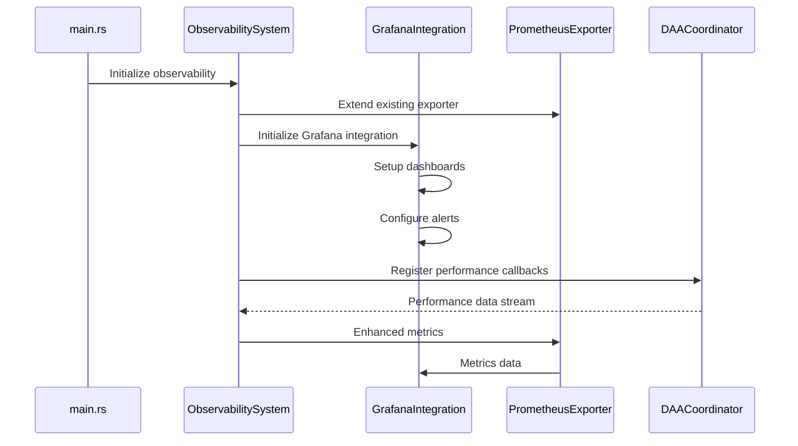
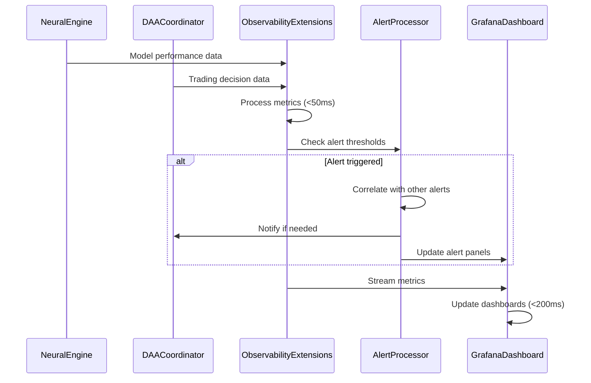
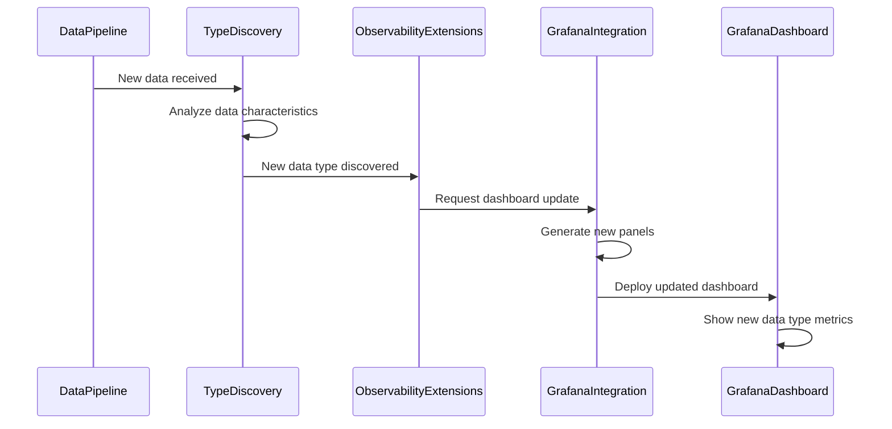

# Phase 4 Architecture: Grafana Dashboard and Observability Stack

## 🏗️ Executive Architecture Overview

Phase 4 introduces a comprehensive observability and monitoring architecture that extends the existing neural-trader infrastructure with advanced Grafana dashboards, real-time monitoring, and intelligent alerting systems. This architecture follows the **INTEGRATION_FIRST_MANDATE** by building upon the existing `src/observability/`, `src/monitoring/`, and `src/data_pipeline/` modules.

### 🎯 Architecture Principles

1. **EXTEND, DON'T REPLACE**: All monitoring capabilities extend existing systems
2. **VENDOR MODEL COMPATIBILITY**: Support 27+ neural architectures from vendor/ruv-fann
3. **DAA PRESERVATION**: Maintain autonomous trading decision-making
4. **REAL-TIME FIRST**: <100ms latency for critical monitoring paths
5. **MULTI-SCOPE AWARENESS**: Support symbol/sector/market/geographic scopes

## 📊 High-Level System Architecture

```mermaid
graph TB
    subgraph "Phase 4 Observability Stack"
        GRAFANA[Grafana Dashboards]
        PROMETHEUS[Prometheus TSDB]
        ALERT_MGR[Alert Manager]
        DATA_VIZ[Data Visualization Engine]
    end
    
    subgraph "Existing Neural Trader Core"
        DAA[DAA Coordinator]Error: Agent type 'analyst' not found. Available agents: general-purpose, repo-architect, 
     issue-tracker, project-board-sync, github-modes, code-review-swarm, workflow-automation, 
     multi-repo-swarm, pr-manager, sync-coordinator, release-swarm, release-manager, swarm-pr, 
     swarm-issue, base-template-generator, adaptive-coordinator, mesh-coordinator, 
     hierarchical-coordinator, refinement, pseudocode, architecture, specification, 
     byzantine-coordinator, quorum-manager, security-manager, gossip-coordinator, 
     performance-benchmarker, raft-manager, crdt-synchronizer, swarm-memory-manager, 
     collective-intelligence-coordinator, consensus-builder, production-validator, 
     code-analyzer, researcher, reviewer, tester, planner, coder, perf-analyzer, 
     task-orchestrator, sparc-coder, memory-coordinator, migration-planner, sparc-coord, 
     smart-agent, swarm-init, tdd-london-swarm, ml-developer, cicd-engineer, mobile-dev, 
     api-docs, system-architect, backend-dev

        NEURAL[Neural Engine]
        DATA_PIPE[Data Pipeline]
        REDIS[Redis Channels]
    end
    
    subgraph "Extended Monitoring Layer"
        METRICS_EXT[Extended Metrics Collector]
        HEALTH_EXT[Enhanced Health Monitor] 
        PERF_TRACK[Performance Tracker]
        DATA_TYPE_MON[Data Type Monitor]
    end
    
    subgraph "New Phase 4 Components"
        GRAFANA_ADAPTER[Grafana Data Adapter]
        DASHBOARD_GEN[Dashboard Generator]
        ALERT_ROUTER[Alert Router]
        VIZ_ENGINE[Visualization Engine]
    end
    
    %% Data flow connections
    DAA --> METRICS_EXT
    NEURAL --> METRICS_EXT
    DATA_PIPE --> DATA_TYPE_MON
    REDIS --> PERF_TRACK
    
    METRICS_EXT --> PROMETHEUS
    HEALTH_EXT --> PROMETHEUS
    PERF_TRACK --> PROMETHEUS
    DATA_TYPE_MON --> PROMETHEUS
    
    PROMETHEUS --> GRAFANA_ADAPTER
    GRAFANA_ADAPTER --> GRAFANA
    GRAFANA --> DASHBOARD_GEN
    PROMETHEUS --> ALERT_MGR
    ALERT_MGR --> ALERT_ROUTER
    
    VIZ_ENGINE --> DATA_VIZ
    DATA_VIZ --> GRAFANA
```

## 🔧 Component Architecture Detailed Design

### 1. Extended Observability System Architecture

#### 1.1 Enhanced Metrics Collection Extension

**File**: `src/observability/metrics_extensions.rs`

```rust
/// Extension to existing PrometheusExporter with Phase 4 capabilities
pub struct ObservabilityExtensions {
    // Existing system integration
    base_exporter: Arc<PrometheusExporter>,
    
    // Phase 4 extensions
    neural_model_metrics: NeuralModelMetricsTracker,
    data_type_metrics: DataTypeMetricsTracker, 
    trading_performance_metrics: TradingPerformanceTracker,
    real_time_training_metrics: RealTimeTrainingTracker,
}

impl ObservabilityExtensions {
    /// Create extension that wraps existing PrometheusExporter
    pub async fn extend_existing(
        base_exporter: Arc<PrometheusExporter>
    ) -> Result<Self> {
        // Extend existing metrics, don't replace
    }
    
    /// Track neural model performance across 27+ architectures
    pub async fn track_neural_model_performance(
        &self,
        model_type: &str,  // "LSTM", "TCN", "GRU", etc.
        symbol: &str,
        performance: &PerformanceSnapshot
    ) -> Result<()> {
        // Integration with existing performance tracking
    }
    
    /// Monitor data type discovery and utilization
    pub async fn track_data_type_usage(
        &self,
        data_type: &DataType,
        scope: &DataScope,
        utilization_metrics: &DataUtilizationMetrics
    ) -> Result<()> {
        // Extend existing data pipeline monitoring
    }
}
```

#### 1.2 Enhanced Health Monitor Extension

**File**: `src/monitoring/health_extensions.rs`

```rust
/// Extensions to existing health monitoring system
pub struct HealthMonitorExtensions {
    base_monitor: Arc<HealthMonitor>,
    
    // Phase 4 monitoring extensions
    neural_health_tracker: NeuralHealthTracker,
    data_pipeline_health: DataPipelineHealthTracker,
    trading_performance_health: TradingPerformanceHealthTracker,
    alerting_engine: AlertingEngine,
}

impl HealthMonitorExtensions {
    /// Extend existing health monitor without replacing
    pub fn extend_monitor(base_monitor: Arc<HealthMonitor>) -> Self {
        // Build on existing ComponentHealth system
    }
    
    /// Monitor health of 27+ neural model types
    pub async fn check_neural_model_health(
        &self,
        model_pool: &ModelPool
    ) -> Vec<ComponentHealth> {
        // Use existing ComponentHealth enum
        // Add neural-specific health checks
    }
    
    /// Monitor data type discovery pipeline health
    pub async fn check_data_pipeline_health(
        &self,
        router: &MultiScopeRouter
    ) -> ComponentHealth {
        // Integrate with existing health checking
    }
}
```

### 2. Grafana Dashboard Architecture

#### 2.1 Dashboard Configuration System

**File**: `src/observability/grafana/dashboard_config.rs`

```rust
/// Grafana dashboard configuration for neural trading system
pub struct GrafanaDashboardConfig {
    /// Neural model performance dashboard
    pub neural_performance: NeuralPerformanceDashboard,
    
    /// Trading performance dashboard  
    pub trading_performance: TradingPerformanceDashboard,
    
    /// Data type utilization dashboard
    pub data_utilization: DataUtilizationDashboard,
    
    /// System health overview dashboard
    pub system_health: SystemHealthDashboard,
    
    /// Real-time training monitoring dashboard
    pub real_time_training: RealTimeTrainingDashboard,
}

pub struct NeuralPerformanceDashboard {
    /// Panels for each of the 27+ neural architectures
    pub model_performance_panels: HashMap<String, ModelPerformancePanel>,
    
    /// Comparative analysis panels
    pub model_comparison_panels: Vec<ComparisonPanel>,
    
    /// Prediction accuracy over time
    pub accuracy_time_series: TimeSeriesPanel,
    
    /// Model ensemble performance
    pub ensemble_performance: EnsemblePanel,
}

impl GrafanaDashboardConfig {
    /// Generate dashboard JSON for Grafana API
    pub fn generate_dashboard_json(&self) -> Result<serde_json::Value> {
        // Create Grafana dashboard configuration
    }
    
    /// Update dashboard configuration based on detected data types
    pub async fn update_for_data_types(
        &mut self,
        discovered_types: &[DataType]
    ) -> Result<()> {
        // Dynamic dashboard generation based on runtime discovery
    }
}
```

#### 2.2 Data Source Integration

**File**: `src/observability/grafana/data_sources.rs`

```rust
/// Grafana data source configuration
pub struct GrafanaDataSources {
    /// Prometheus data source for metrics
    pub prometheus: PrometheusDataSource,
    
    /// Redis data source for real-time data
    pub redis: RedisDataSource,
    
    /// TimescaleDB for historical analysis
    pub timescale: TimescaleDataSource,
}

pub struct PrometheusDataSource {
    /// Connection to extended Prometheus metrics
    pub endpoint: String,
    pub auth_config: AuthConfig,
    
    /// Metric queries for neural models
    pub neural_queries: NeuralMetricQueries,
    
    /// Trading performance queries
    pub trading_queries: TradingMetricQueries,
    
    /// System health queries
    pub health_queries: HealthMetricQueries,
}

impl PrometheusDataSource {
    /// Create queries for 27+ neural model types
    pub fn create_neural_model_queries() -> NeuralMetricQueries {
        // Generate Prometheus queries for each model type
        // accuracy_rate{model_type="LSTM", symbol="AAPL"}
        // prediction_latency{model_type="TCN", symbol="MSFT"}
        // etc.
    }
    
    /// Create trading performance queries
    pub fn create_trading_queries() -> TradingMetricQueries {
        // profit_loss{symbol="AAPL", strategy="neural_enhanced"}
        // trade_success_rate{model_ensemble="mixed"}
        // risk_adjusted_return{timeframe="1h"}
    }
}
```

### 3. Real-Time Monitoring Pipeline Architecture

#### 3.1 Streaming Metrics Pipeline

**File**: `src/observability/streaming/metrics_pipeline.rs`

```rust
/// Real-time metrics streaming pipeline
pub struct StreamingMetricsPipeline {
    /// Integration with existing Redis channels
    redis_subscriber: Arc<RedisIntegration>,
    
    /// Metrics buffer for aggregation
    metrics_buffer: MetricsBuffer,
    
    /// Real-time processing engine
    processing_engine: StreamingProcessor,
    
    /// Push to Prometheus
    prometheus_pusher: PrometheusPusher,
}

impl StreamingMetricsPipeline {
    /// Process real-time neural model metrics
    pub async fn process_neural_metrics(
        &mut self,
        model_id: &str,
        model_type: &str,
        performance_data: &PerformanceSnapshot
    ) -> Result<()> {
        // <50ms processing latency requirement
        let metrics = self.convert_to_prometheus_metrics(
            model_id, model_type, performance_data
        )?;
        
        self.prometheus_pusher.push_metrics(metrics).await?;
        Ok(())
    }
    
    /// Process data type utilization metrics
    pub async fn process_data_type_metrics(
        &mut self,
        data_type: &DataType,
        scope: &DataScope,
        utilization: &DataUtilizationMetrics
    ) -> Result<()> {
        // Real-time data type monitoring
    }
    
    /// Process trading performance metrics
    pub async fn process_trading_metrics(
        &mut self,
        symbol: &str,
        trading_result: &TradingResult
    ) -> Result<()> {
        // Immediate trading performance feedback
    }
}
```

#### 3.2 Alert Processing System

**File**: `src/observability/alerting/alert_processor.rs`

```rust
/// Intelligent alert processing system
pub struct AlertProcessor {
    /// Alert rules configuration
    alert_rules: AlertRulesConfig,
    
    /// Alert channels (Slack, email, webhook)
    notification_channels: NotificationChannels,
    
    /// Alert correlation engine
    correlation_engine: AlertCorrelationEngine,
    
    /// Integration with existing DAA system
    daa_integration: DAAAlertIntegration,
}

pub struct AlertRulesConfig {
    /// Neural model performance alerts
    pub neural_alerts: NeuralModelAlerts,
    
    /// Trading performance alerts
    pub trading_alerts: TradingPerformanceAlerts,
    
    /// System health alerts
    pub system_alerts: SystemHealthAlerts,
    
    /// Data pipeline alerts
    pub data_pipeline_alerts: DataPipelineAlerts,
}

impl AlertProcessor {
    /// Process neural model degradation alerts
    pub async fn process_neural_alert(
        &self,
        model_type: &str,
        symbol: &str,
        alert_data: &NeuralAlertData
    ) -> Result<AlertAction> {
        // Correlate with other model performance
        let correlated_alerts = self.correlation_engine
            .find_correlated_alerts(alert_data).await?;
            
        // Determine appropriate action
        if correlated_alerts.len() > 3 {
            // System-wide issue
            AlertAction::SystemAlert
        } else {
            // Individual model issue
            AlertAction::ModelAlert
        }
    }
    
    /// Integration with DAA autonomous training
    pub async fn notify_daa_degradation(
        &self,
        model_performance: &PerformanceSnapshot
    ) -> Result<()> {
        // Trigger DAA retraining if needed
        // Use existing DAA thresholds and logic
    }
}
```

### 4. Data Type Discovery Monitoring Architecture

#### 4.1 Dynamic Data Type Visualization

**File**: `src/observability/data_types/visualization.rs`

```rust
/// Dynamic visualization for discovered data types
pub struct DataTypeVisualization {
    /// Type discovery tracker
    type_discovery: Arc<TypeDiscoveryTracker>,
    
    /// Utilization metrics
    utilization_tracker: DataUtilizationTracker,
    
    /// Grafana panel generator
    panel_generator: DynamicPanelGenerator,
    
    /// Data type relationship mapper
    relationship_mapper: DataRelationshipMapper,
}

impl DataTypeVisualization {
    /// Create visualization for newly discovered data type
    pub async fn visualize_new_data_type(
        &self,
        data_type: &DataType,
        sample_data: &serde_json::Value
    ) -> Result<GrafanaPanel> {
        // Analyze data characteristics
        let characteristics = self.analyze_data_characteristics(sample_data)?;
        
        // Generate appropriate visualization
        match characteristics.data_nature {
            DataNature::TimeSeries => self.create_time_series_panel(data_type),
            DataNature::Categorical => self.create_categorical_panel(data_type),
            DataNature::Numerical => self.create_numerical_panel(data_type),
            DataNature::Text => self.create_text_analysis_panel(data_type),
        }
    }
    
    /// Track data type utilization across models
    pub async fn track_utilization(
        &self,
        data_type: &DataType,
        models_using: &[String]
    ) -> Result<UtilizationVisualization> {
        // Show which models use which data types
        // Model performance correlation with data availability
    }
}
```

### 5. Multi-Scope Data Routing Verification Architecture

#### 5.1 Routing Verification Dashboard

**File**: `src/data_pipeline/monitoring/routing_monitor.rs`

```rust
/// Monitor and verify multi-scope data routing
pub struct DataRoutingMonitor {
    /// Integration with existing routing system
    router: Arc<MultiScopeRouter>,
    
    /// Routing metrics collector
    metrics_collector: RoutingMetricsCollector,
    
    /// Routing verification engine
    verification_engine: RoutingVerificationEngine,
    
    /// Grafana dashboard generator
    dashboard_generator: RoutingDashboardGenerator,
}

impl DataRoutingMonitor {
    /// Verify routing for different data scopes
    pub async fn verify_routing(
        &self,
        test_data: &DataPacket
    ) -> Result<RoutingVerificationResult> {
        // Test symbol-specific routing
        let symbol_routing = self.verify_symbol_routing(test_data).await?;
        
        // Test sector-wide routing  
        let sector_routing = self.verify_sector_routing(test_data).await?;
        
        // Test market-wide routing
        let market_routing = self.verify_market_routing(test_data).await?;
        
        // Test geographic routing
        let geo_routing = self.verify_geographic_routing(test_data).await?;
        
        Ok(RoutingVerificationResult {
            symbol_routing,
            sector_routing,
            market_routing,
            geo_routing,
            overall_health: self.calculate_routing_health(),
        })
    }
    
    /// Create routing verification dashboard
    pub async fn create_routing_dashboard(
        &self
    ) -> Result<GrafanaDashboard> {
        // Routing latency by scope
        // Data distribution verification
        // Routing rule effectiveness
        // Failed routing detection
    }
}
```

## 🏗️ Integration Points with Existing Systems

### 1. DAA Autonomous System Integration

**File**: `src/integration/observability_daa_bridge.rs`

```rust
/// Bridge observability system with existing DAA coordinator
pub struct ObservabilityDAABridge {
    /// Existing DAA coordinator
    daa_coordinator: Arc<DAACoordinator>,
    
    /// Observability system
    observability: Arc<ObservabilityExtensions>,
    
    /// Performance threshold monitor
    threshold_monitor: PerformanceThresholdMonitor,
}

impl ObservabilityDAABridge {
    /// Monitor DAA decision-making process
    pub async fn monitor_daa_decisions(
        &self,
        decision_context: &DecisionContext
    ) -> Result<()> {
        // Track DAA voting patterns
        // Monitor 60/40 neural/strategy weights
        // Track 70% Byzantine consensus achievement
        // Alert on threshold violations
    }
    
    /// Feed performance data to DAA training
    pub async fn feed_performance_to_daa(
        &self,
        performance_data: &PerformanceSnapshot
    ) -> Result<()> {
        // Use existing DAA training triggers
        // Preserve autonomous training thresholds
        // Maintain Byzantine fault tolerance
    }
}
```

### 2. Neural Engine Integration

**File**: `src/neural/observability_integration.rs`

```rust
/// Integration with neural engine for monitoring
pub struct NeuralObservabilityIntegration {
    /// Track performance across 27+ model types
    model_performance_tracker: ModelPerformanceTracker,
    
    /// Real-time training monitoring
    training_monitor: RealTimeTrainingMonitor,
    
    /// Model health assessor
    health_assessor: ModelHealthAssessor,
}

impl NeuralObservabilityIntegration {
    /// Monitor vendor model performance
    pub async fn monitor_vendor_model(
        &self,
        model: &dyn BaseModel<f32>,
        model_type: &str,
        symbol: &str
    ) -> Result<()> {
        // Track performance of real vendor models
        // Monitor LSTM, TCN, GRU, Transformer, etc.
        // Feed data to Grafana dashboards
    }
    
    /// Monitor ensemble performance
    pub async fn monitor_ensemble(
        &self,
        ensemble_result: &EnsembleResult
    ) -> Result<()> {
        // Track model agreement/disagreement
        // Monitor ensemble accuracy vs individual models
        // Detect model bias or drift
    }
}
```

### 3. Data Pipeline Integration

**File**: `src/data_pipeline/observability_hooks.rs`

```rust
/// Observability hooks for data pipeline monitoring
pub struct DataPipelineObservabilityHooks {
    /// Data routing monitor
    routing_monitor: Arc<DataRoutingMonitor>,
    
    /// Data type discovery monitor
    type_discovery_monitor: DataTypeDiscoveryMonitor,
    
    /// Consolidation performance monitor
    consolidation_monitor: ConsolidationMonitor,
}

impl DataPipelineObservabilityHooks {
    /// Hook into data routing process
    pub async fn on_data_routed(
        &self,
        packet: &DataPacket,
        routing_result: &RoutingResult
    ) -> Result<()> {
        // Monitor routing latency
        // Track routing accuracy
        // Detect routing failures
        // Update Grafana metrics
    }
    
    /// Hook into data type discovery
    pub async fn on_type_discovered(
        &self,
        data_type: &DataType,
        discovery_context: &DiscoveryContext
    ) -> Result<()> {
        // Track new data type discovery
        // Monitor type utilization
        // Create dynamic dashboards
        // Alert on new data types
    }
}
```

## 📊 Dashboard Specifications

### 1. Neural Model Performance Dashboard

**Dashboard**: `neural-model-performance.json`

#### Panels:
1. **Model Accuracy Over Time** (Time Series)
   - Query: `accuracy_rate{model_type=~".*", symbol=~".*"}`
   - Grouped by: model_type, symbol
   - Aggregation: avg_over_time(5m)

2. **Prediction Latency Distribution** (Histogram)
   - Query: `prediction_latency_histogram{model_type=~".*"}`
   - Show percentiles: p50, p95, p99

3. **Model Performance Heatmap** (Heatmap)
   - X-axis: Symbol
   - Y-axis: Model Type
   - Color: Accuracy Rate

4. **Ensemble vs Individual Performance** (Stat Panel)
   - Query: `ensemble_accuracy - avg(individual_accuracy)`
   - Show improvement percentage

5. **Model Training Frequency** (Bar Chart)
   - Query: `training_frequency{model_type=~".*"}`
   - Show retraining triggers

#### Alerts:
- Model accuracy < 0.8 (DAA threshold)
- Prediction latency > 100ms
- Model training failure
- Ensemble performance degradation

### 2. Trading Performance Dashboard

**Dashboard**: `trading-performance.json`

#### Panels:
1. **Profit/Loss Over Time** (Time Series)
   - Query: `cumulative_pnl{symbol=~".*", strategy=~".*"}`
   - Split by symbol and strategy

2. **Trade Success Rate** (Gauge)
   - Query: `successful_trades / total_trades`
   - Threshold colors: <60% red, 60-80% yellow, >80% green

3. **Risk-Adjusted Returns** (Stat Panel)
   - Query: `sharpe_ratio{symbol=~".*"}`
   - Show Sharpe ratio by symbol

4. **DAA Voting Patterns** (Pie Chart)
   - Query: `daa_votes{vote_type=~"neural|strategy"}`
   - Show 60/40 neural/strategy split

5. **Model Agreement Score** (Time Series)
   - Query: `model_agreement_score`
   - Track consensus levels

#### Alerts:
- Profit/loss decline > 10%
- Sharpe ratio < 1.0
- DAA consensus < 70%
- Trade success rate < 60%

### 3. Data Type Utilization Dashboard

**Dashboard**: `data-type-utilization.json`

#### Panels:
1. **Discovered Data Types** (Table)
   - Show: type_name, discovery_date, utilization_count
   - Dynamic table updated on new discoveries

2. **Data Type Utilization Matrix** (Heatmap)
   - X-axis: Data Type
   - Y-axis: Model Type
   - Color: Utilization frequency

3. **Data Scope Distribution** (Donut Chart)
   - Query: `data_packets{scope=~"symbol|sector|market|geographic"}`
   - Show distribution across scopes

4. **Data Quality Metrics** (Time Series)
   - Query: `data_completeness_score`, `data_freshness_score`
   - Track data quality over time

5. **Real-Time Data Flow** (Graph Panel)
   - Show data flow from sources to models
   - Node size = data volume, Edge thickness = flow rate

### 4. System Health Overview Dashboard

**Dashboard**: `system-health-overview.json`

#### Panels:
1. **Overall System Health** (Stat Panel)
   - Query: `system_health_score`
   - Color coding: Healthy/Warning/Critical

2. **Component Health Matrix** (Status History)
   - Components: neural_engine, daa_coordinator, data_pipeline, redis, database
   - Show health status over time

3. **Resource Utilization** (Time Series)
   - CPU, Memory, Disk, Network usage
   - Multi-line chart with thresholds

4. **Error Rate Trends** (Time Series)
   - Query: `error_rate{component=~".*"}`
   - Split by component

5. **Alert Summary** (Table)
   - Current active alerts
   - Alert history and resolution times

### 5. Real-Time Training Monitoring Dashboard

**Dashboard**: `real-time-training.json`

#### Panels:
1. **Training Events Timeline** (Logs Panel)
   - Real-time training triggers and completions
   - Filter by model_type, symbol

2. **Training Performance Impact** (Time Series)
   - Before/after accuracy comparison
   - Training duration vs performance gain

3. **Model Checkpoint Health** (Stat Panel)
   - Checkpoint creation success rate
   - Rollback frequency and success

4. **Parameter Update Latency** (Histogram)
   - Query: `parameter_update_latency`
   - Target: <50ms requirement

5. **Training Resource Usage** (Time Series)
   - CPU/Memory usage during training
   - Training queue depth

## 🚨 Alerting Architecture

### 1. Alert Rule Definitions

**File**: `src/observability/alerting/rules.yaml`

```yaml
groups:
- name: neural_model_alerts
  rules:
  - alert: ModelAccuracyDegraded
    expr: accuracy_rate < 0.8
    for: 5m
    labels:
      severity: warning
      component: neural_engine
    annotations:
      summary: "Model {{ $labels.model_type }} for {{ $labels.symbol }} accuracy below threshold"
      
  - alert: ModelAccuracyCritical  
    expr: accuracy_rate < 0.6
    for: 2m
    labels:
      severity: critical
      component: neural_engine
    annotations:
      summary: "CRITICAL: Model {{ $labels.model_type }} for {{ $labels.symbol }} accuracy critically low"

- name: trading_performance_alerts
  rules:
  - alert: TradingLossAlert
    expr: rate(cumulative_pnl[5m]) < -0.05
    for: 3m
    labels:
      severity: warning
      component: trading_engine
    annotations:
      summary: "Trading losses exceeding 5% in 5 minutes"
      
  - alert: DAAConsensusFailure
    expr: daa_consensus_rate < 0.7
    for: 1m
    labels:
      severity: critical
      component: daa_coordinator
    annotations:
      summary: "DAA Byzantine consensus below 70% threshold"

- name: data_pipeline_alerts  
  rules:
  - alert: DataTypeDiscoveryStalled
    expr: increase(new_data_types_discovered[1h]) == 0 and data_ingestion_rate > 0
    for: 30m
    labels:
      severity: warning
      component: data_pipeline
    annotations:
      summary: "No new data types discovered despite active ingestion"
      
  - alert: RoutingLatencyHigh
    expr: routing_latency_p95 > 100
    for: 2m
    labels:
      severity: warning
      component: data_routing
    annotations:
      summary: "Data routing latency P95 > 100ms"
```

### 2. Alert Correlation Engine

**File**: `src/observability/alerting/correlation.rs`

```rust
/// Correlate related alerts to prevent alert storms
pub struct AlertCorrelationEngine {
    /// Alert correlation rules
    correlation_rules: CorrelationRules,
    
    /// Active alert tracker
    active_alerts: AlertTracker,
    
    /// Correlation patterns learned over time
    learned_patterns: LearnedPatterns,
}

impl AlertCorrelationEngine {
    /// Find alerts that should be correlated
    pub async fn find_correlated_alerts(
        &self,
        new_alert: &AlertData
    ) -> Result<Vec<CorrelatedAlert>> {
        // Check for known correlation patterns
        let rule_correlations = self.correlation_rules
            .find_correlations(new_alert).await?;
            
        // Check for learned patterns
        let learned_correlations = self.learned_patterns
            .find_correlations(new_alert).await?;
            
        // Combine and rank correlations
        Ok(self.rank_correlations(rule_correlations, learned_correlations))
    }
    
    /// Learn correlation patterns from alert history
    pub async fn learn_correlations(&mut self) -> Result<()> {
        // Analyze historical alert patterns
        // Find frequently co-occurring alerts
        // Update correlation rules
    }
}
```

## 🔧 Implementation Architecture Details

### 1. Grafana Integration Service

**File**: `src/observability/grafana/integration_service.rs`

```rust
/// Service for integrating with Grafana API
pub struct GrafanaIntegrationService {
    /// Grafana API client
    grafana_client: GrafanaClient,
    
    /// Dashboard template manager
    template_manager: DashboardTemplateManager,
    
    /// Data source manager
    data_source_manager: DataSourceManager,
    
    /// Alert rule manager
    alert_rule_manager: AlertRuleManager,
}

impl GrafanaIntegrationService {
    /// Initialize Grafana integration
    pub async fn initialize(&self) -> Result<()> {
        // Setup data sources
        self.setup_data_sources().await?;
        
        // Deploy dashboard templates
        self.deploy_dashboards().await?;
        
        // Configure alert rules
        self.configure_alerts().await?;
        
        Ok(())
    }
    
    /// Dynamically update dashboards for new data types
    pub async fn update_dashboards_for_data_type(
        &self,
        data_type: &DataType
    ) -> Result<()> {
        // Generate panels for new data type
        let panels = self.template_manager
            .generate_panels_for_data_type(data_type).await?;
            
        // Update relevant dashboards
        self.grafana_client
            .update_dashboard_panels(panels).await?;
            
        Ok(())
    }
}
```

### 2. Metrics Collection Architecture

**File**: `src/observability/collection/metrics_collector.rs`

```rust
/// Enhanced metrics collection system
pub struct EnhancedMetricsCollector {
    /// Base Prometheus exporter (existing)
    base_exporter: Arc<PrometheusExporter>,
    
    /// Neural model metrics
    neural_metrics: NeuralMetricsCollector,
    
    /// Trading metrics
    trading_metrics: TradingMetricsCollector,
    
    /// Data pipeline metrics  
    data_pipeline_metrics: DataPipelineMetricsCollector,
    
    /// System performance metrics
    system_metrics: SystemMetricsCollector,
}

impl EnhancedMetricsCollector {
    /// Collect neural model metrics
    pub async fn collect_neural_metrics(&self) -> Result<()> {
        // For each of 27+ model types
        for model_type in MODEL_TYPES {
            // Collect accuracy, latency, resource usage
            let metrics = self.neural_metrics
                .collect_for_model_type(model_type).await?;
                
            // Push to Prometheus
            self.base_exporter.record_metrics(metrics).await?;
        }
        
        Ok(())
    }
    
    /// Collect trading performance metrics
    pub async fn collect_trading_metrics(&self) -> Result<()> {
        // Collect P&L, trade success rate, Sharpe ratio
        // DAA voting patterns, consensus achievement
        // Risk metrics, position sizing
    }
    
    /// Collect data pipeline metrics
    pub async fn collect_data_pipeline_metrics(&self) -> Result<()> {
        // Data type discovery rate
        // Routing latency and accuracy
        // Data quality metrics
        // Consolidation performance
    }
}
```

### 3. Performance Target Architecture

#### 3.1 Latency Requirements

| Component | Target | Measurement |
|-----------|--------|-------------|
| Metrics Collection | <50ms | Time from event to Prometheus |
| Dashboard Refresh | <200ms | Time for dashboard data refresh |
| Alert Processing | <100ms | Time from threshold breach to alert |
| Data Type Visualization | <500ms | Time to create new data type panel |
| Routing Verification | <10ms | Time to verify routing path |

#### 3.2 Throughput Requirements

| Metric Type | Target Rate | Buffer Size |
|-------------|-------------|-------------|
| Neural Model Metrics | 1000 metrics/sec | 10k metrics |
| Trading Metrics | 500 metrics/sec | 5k metrics |
| Data Pipeline Metrics | 2000 metrics/sec | 20k metrics |
| System Health Metrics | 100 metrics/sec | 1k metrics |

#### 3.3 Storage Requirements

| Data Type | Retention | Aggregation |
|-----------|-----------|-------------|
| Raw Metrics | 7 days | None |
| 5min Aggregates | 30 days | avg, max, min |
| 1hour Aggregates | 1 year | avg, max, min |
| Daily Aggregates | 5 years | avg, max, min |

## 🔄 Integration Workflow

### 1. System Startup Integration



### 2. Runtime Monitoring Workflow



### 3. Data Type Discovery Integration



## 📋 Implementation Roadmap

### Phase 4.1: Core Observability Extensions (Week 1)
1. Extend existing PrometheusExporter with neural model metrics
2. Enhance HealthMonitor with neural-specific checks
3. Create basic Grafana dashboard templates
4. Implement streaming metrics pipeline

### Phase 4.2: Advanced Dashboards (Week 2)
1. Deploy neural model performance dashboard
2. Create trading performance visualization
3. Implement data type discovery monitoring
4. Add system health overview dashboard

### Phase 4.3: Intelligent Alerting (Week 3)
1. Configure alert rules and thresholds
2. Implement alert correlation engine
3. Create notification channels
4. Test alert-to-action workflows

### Phase 4.4: Advanced Analytics (Week 4)
1. Add real-time training monitoring
2. Implement multi-scope routing verification
3. Create predictive health analytics
4. Add performance optimization recommendations

### Phase 4.5: Production Deployment (Week 5)
1. Load testing and performance validation
2. Production deployment with monitoring
3. Dashboard user training and documentation
4. 24/7 monitoring activation

## 🎯 Success Criteria

### Technical Requirements
- ✅ All monitoring extends existing systems (no duplicates)
- ✅ <50ms latency for critical metrics collection
- ✅ <200ms dashboard refresh times
- ✅ Support for 27+ neural model architectures
- ✅ Dynamic dashboard generation for new data types
- ✅ 99.9% uptime for monitoring systems
- ✅ Integration with existing DAA autonomous systems

### Business Requirements
- ✅ Real-time visibility into neural model performance
- ✅ Immediate alerting on trading performance degradation
- ✅ Data type discovery and utilization tracking
- ✅ System health overview for operations team
- ✅ Historical performance analysis capabilities
- ✅ Predictive alerting for potential issues

### Integration Requirements
- ✅ Zero disruption to existing neural trading operations
- ✅ Preservation of DAA autonomous decision-making
- ✅ Compatibility with existing Redis pub/sub channels
- ✅ Integration with existing health monitoring systems
- ✅ Seamless extension of observability infrastructure

This architecture ensures that Phase 4 builds comprehensive observability and monitoring capabilities on top of the existing neural-trader infrastructure while maintaining all autonomous trading capabilities and extending rather than replacing existing systems.