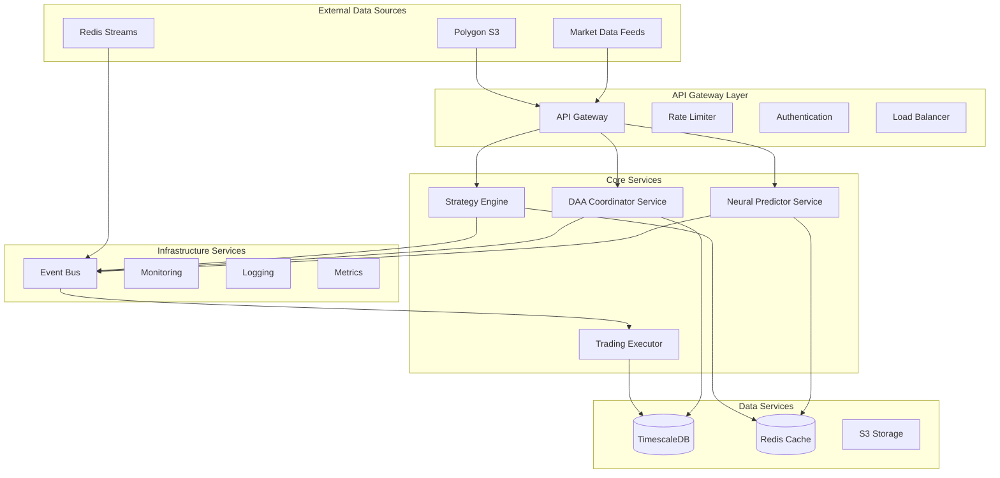
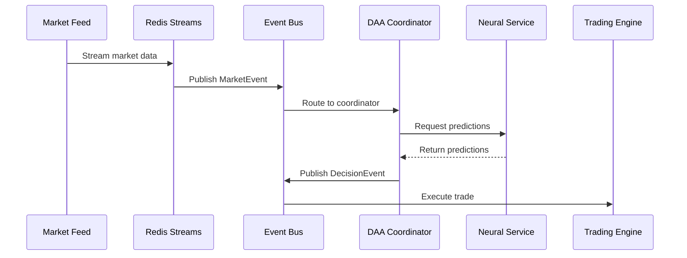

# SPARC Architecture Document: Neural Trading Platform

## Executive Summary

The Neural Trading Platform is a sophisticated autonomous trading system that leverages neural networks, distributed agents, and real-time market data processing to make intelligent trading decisions. This document defines the system architecture following the SPARC methodology.

## System Overview

### Core Purpose
An autonomous trading platform that combines:
- Neural network predictions using FANN (Fast Artificial Neural Network) library
- Decentralized Autonomous Agents (DAA) for distributed decision making
- Real-time market data streaming and processing
- Adaptive learning and performance optimization
- Multi-strategy trading with ensemble models

### Key Architectural Principles
1. **Microservices Architecture**: Loosely coupled, independently deployable services
2. **Event-Driven Design**: Asynchronous communication via event bus
3. **Fault Tolerance**: Circuit breakers, fallback mechanisms, and graceful degradation
4. **Performance First**: Optimized for low-latency trading decisions
5. **Security by Design**: End-to-end encryption and secure API design

## High-Level Architecture



## Component Architecture

### 1. Neural Predictor Service

**Purpose**: Provides neural network-based market predictions using FANN integration

**Key Components**:
- `NeuralPredictor`: Central routing interface for all neural predictions
- `FannPredictor`: Core FANN integration for real neural network predictions
- `EnhancedPredictor`: Advanced features including ensemble predictions
- `PerformanceOptimizer`: Real-time model performance optimization
- `OnlineLearningManager`: Adaptive learning during runtime

**Interfaces**:
```rust
trait NeuralPredictorTrait {
    async fn predict(
        &self,
        data: &[TimeSeriesData],
        horizon: usize,
        features: Option<HashMap<String, Value>>
    ) -> Result<Vec<PredictionResult>>;
    
    async fn predict_ensemble(
        &self,
        data: &[TimeSeriesData],
        horizon: usize,
        models: &[String],
        features: Option<HashMap<String, Value>>
    ) -> Result<Vec<PredictionResult>>;
}
```

**Technology Stack**:
- Language: Rust
- Neural Library: FANN (ruv-fann wrapper)
- Async Runtime: Tokio
- Data Processing: ndarray, polars

### 2. DAA Coordinator Service

**Purpose**: Orchestrates autonomous trading decisions using distributed agents

**Key Components**:
- `DaaCoordinator`: Main coordination engine
- `AutonomousTrainingEngine`: Self-improving model training
- `TrainingScheduler`: Manages retraining cycles
- `PerformanceAggregator`: Tracks agent performance

**Decision Flow**:
1. Receive market data from event bus
2. Get neural predictions from Neural Service
3. Aggregate strategy signals
4. Assess risk parameters
5. Synthesize trading decision
6. Adapt parameters based on performance

**Interfaces**:
```rust
struct AutonomousDecision {
    timestamp: DateTime<Utc>,
    action: TradingAction,
    confidence: f64,
    risk_assessment: RiskAssessment,
    reasoning: Vec<String>,
    neural_consensus: HashMap<String, f64>,
    adapted_parameters: Option<HashMap<String, f64>>,
}
```

### 3. Strategy Engine

**Purpose**: Implements multiple trading strategies that work with neural predictions

**Strategies**:
- `MomentumStrategy`: Trend-following based on price momentum
- `NeuralEnhancedStrategy`: Uses neural predictions for entry/exit
- `CrossAssetStrategy`: Multi-asset correlation trading
- `MarketMicrostructureStrategy`: Order book analysis

**Strategy Interface**:
```rust
trait TradingStrategy {
    async fn initialize(&mut self, config: StrategyConfig) -> Result<()>;
    
    async fn generate_signal(
        &self,
        market_context: &MarketContext,
        current_position: Option<&Position>
    ) -> Result<Signal>;
    
    async fn update_parameters(
        &mut self,
        parameters: HashMap<String, Value>
    ) -> Result<()>;
}
```

### 4. Event Bus Architecture

**Purpose**: Asynchronous communication backbone for all services

**Event Types**:
- `MarketEvent`: Real-time price updates
- `PredictionEvent`: Neural network predictions
- `DecisionEvent`: Trading decisions from DAA
- `ExecutionEvent`: Trade execution confirmations
- `PerformanceEvent`: System performance metrics

**Implementation**:
```rust
pub struct EventBusIntegration {
    data_access: Arc<DataAccessLayer>,
    event_buffer: Arc<Mutex<Vec<StoredEvent>>>,
    performance_monitor: Arc<Mutex<PerformanceMonitor>>,
    published_events: Arc<Mutex<HashMap<String, Vec<StoredEvent>>>>,
}
```

### 5. Data Architecture

**TimescaleDB Schema**:
```sql
-- Time-series market data
CREATE TABLE market_data (
    time TIMESTAMPTZ NOT NULL,
    symbol TEXT NOT NULL,
    open DOUBLE PRECISION,
    high DOUBLE PRECISION,
    low DOUBLE PRECISION,
    close DOUBLE PRECISION,
    volume DOUBLE PRECISION,
    PRIMARY KEY (time, symbol)
);
SELECT create_hypertable('market_data', 'time');

-- Trading decisions
CREATE TABLE trading_decisions (
    id UUID DEFAULT gen_random_uuid(),
    timestamp TIMESTAMPTZ NOT NULL,
    symbol TEXT NOT NULL,
    action TEXT NOT NULL,
    confidence DOUBLE PRECISION,
    neural_consensus JSONB,
    risk_assessment JSONB,
    reasoning TEXT[],
    PRIMARY KEY (id)
);

-- Performance metrics
CREATE TABLE performance_metrics (
    time TIMESTAMPTZ NOT NULL,
    metric_name TEXT NOT NULL,
    value DOUBLE PRECISION,
    metadata JSONB,
    PRIMARY KEY (time, metric_name)
);
```

**Redis Cache Structure**:
```
Keys:
- market:latest:{symbol} - Latest market data
- prediction:{symbol}:{horizon} - Cached predictions
- session:{user_id} - User sessions
- performance:{component} - Real-time metrics
```

## Integration Architecture

### 1. Adapter Pattern Implementation

The system uses adapters to integrate various components:

```rust
pub trait DataAdapter: Send + Sync {
    async fn connect(&mut self) -> Result<()>;
    async fn disconnect(&mut self) -> Result<()>;
    async fn store_market_data(&self, data: &MarketData) -> Result<()>;
    async fn get_market_data(&self, symbol: &str, start: DateTime<Utc>, end: DateTime<Utc>) -> Result<Vec<MarketData>>;
}
```

**Key Adapters**:
- `NeuralAdapter`: Bridges neural networks with vendor implementations
- `RedisAdapter`: Redis integration for caching and pub/sub
- `TimescaleAdapter`: Time-series database operations
- `IntegrationBridge`: Cross-system communication

### 2. Neural Network Integration

**FANN Integration Architecture**:
```
NeuralPredictor (Public API)
    └── FannPredictor (Internal)
         ├── FannModelAdapter
         ├── VendorConversion
         └── ruv-fann (Vendor Library)
```

**Feature Flags for Neural Control**:
- `block_mock_adapters`: Ensures real neural models are used
- `enforce_fann_routing`: Forces all predictions through FANN
- `enable_daa_orchestration`: Activates autonomous coordination

### 3. Market Data Pipeline



## Scalability Architecture

### 1. Horizontal Scaling Strategy

**Service Scaling**:
- Neural Service: 2-10 instances (CPU-bound)
- DAA Coordinator: 2-5 instances (stateless)
- Strategy Engine: 1-3 instances per strategy
- Event Bus: 3-5 instances (high throughput)

**Load Balancing**:
```yaml
upstream neural_service {
    least_conn;
    server neural-1:8080 weight=5;
    server neural-2:8080 weight=5;
    server neural-3:8080 weight=5;
    keepalive 32;
}
```

### 2. Caching Strategy

**Multi-Layer Cache**:
1. **L1 - Application Cache**: In-memory predictions (5min TTL)
2. **L2 - Redis Cache**: Shared predictions (15min TTL)
3. **L3 - Database Cache**: Historical data (1hr TTL)

### 3. Performance Optimization

**Key Optimizations**:
- Batch prediction processing
- Connection pooling (min: 10, max: 100)
- Async I/O throughout
- Zero-copy data transfers
- SIMD operations for neural computations

## Security Architecture

### 1. Authentication & Authorization

**JWT-Based Auth**:
```rust
pub struct AuthMiddleware {
    jwt_secret: String,
    allowed_roles: Vec<String>,
}

impl AuthMiddleware {
    pub async fn verify_token(&self, token: &str) -> Result<Claims> {
        // RS256 verification
    }
}
```

### 2. Encryption

**Data Protection**:
- At Rest: AES-256 for database/storage
- In Transit: TLS 1.3 for all communications
- Internal: mTLS between services

### 3. API Security

**Rate Limiting**:
```rust
pub struct RateLimiter {
    max_requests_per_minute: u32,
    max_requests_per_hour: u32,
    max_burst: u32,
}
```

## Monitoring & Observability

### 1. Metrics Collection

**Prometheus Metrics**:
```rust
// Custom metrics
counter!("trading_decisions_total", 1, "action" => "buy");
histogram!("prediction_latency_seconds", duration.as_secs_f64());
gauge!("active_positions", positions.len() as f64);
```

### 2. Distributed Tracing

**OpenTelemetry Integration**:
```rust
#[instrument(skip(self, data))]
pub async fn predict(&self, data: &[TimeSeriesData]) -> Result<Vec<PredictionResult>> {
    // Traced execution
}
```

### 3. Logging Architecture

**Structured Logging**:
```rust
info!(
    symbol = %market_context.symbol,
    price = %market_context.current_price,
    confidence = %decision.confidence,
    "DAA trading decision made"
);
```

## Deployment Architecture

### 1. Container Strategy

**Docker Composition**:
```dockerfile
FROM rust:1.75 as builder
WORKDIR /app
COPY Cargo.toml Cargo.lock ./
RUN cargo build --release

FROM debian:bookworm-slim
COPY --from=builder /app/target/release/neural-trader /usr/local/bin/
CMD ["neural-trader"]
```

### 2. Kubernetes Deployment

```yaml
apiVersion: apps/v1
kind: Deployment
metadata:
  name: neural-predictor
spec:
  replicas: 3
  strategy:
    type: RollingUpdate
    rollingUpdate:
      maxUnavailable: 1
      maxSurge: 1
  template:
    spec:
      containers:
      - name: neural-predictor
        image: neural-trader:latest
        resources:
          requests:
            memory: "512Mi"
            cpu: "500m"
          limits:
            memory: "2Gi"
            cpu: "2000m"
```

### 3. Service Mesh

**Istio Configuration**:
```yaml
apiVersion: networking.istio.io/v1beta1
kind: VirtualService
metadata:
  name: neural-predictor
spec:
  http:
  - timeout: 30s
    retries:
      attempts: 3
      perTryTimeout: 10s
      retryOn: 5xx,reset,connect-failure
```

## Disaster Recovery

### 1. Backup Strategy

**Data Backup**:
- TimescaleDB: Continuous archiving to S3
- Redis: AOF persistence + snapshots
- Model State: Versioned S3 storage

### 2. Failover Mechanism

**Multi-Region Setup**:
```
Primary Region (us-east-1)
├── Active Services
├── Primary Database
└── Real-time Trading

Secondary Region (us-west-2)
├── Standby Services
├── Replica Database
└── Ready for Failover
```

## Performance Requirements

### 1. Latency Targets

- Market Data Ingestion: < 10ms
- Neural Prediction: < 100ms
- Trading Decision: < 50ms
- Order Execution: < 20ms
- End-to-End: < 200ms

### 2. Throughput Targets

- Market Events: 10,000/second
- Predictions: 1,000/second
- Trading Decisions: 100/second
- Concurrent Users: 1,000

### 3. Availability Targets

- System Uptime: 99.99%
- Data Durability: 99.999999%
- RPO: < 1 minute
- RTO: < 5 minutes

## Technology Stack Summary

### Core Technologies
- **Language**: Rust 1.75+
- **Runtime**: Tokio async runtime
- **Neural Network**: FANN via ruv-fann
- **Databases**: TimescaleDB, Redis
- **Message Queue**: Redis Streams
- **Container**: Docker, Kubernetes
- **Service Mesh**: Istio
- **Monitoring**: Prometheus, Grafana
- **Tracing**: Jaeger, OpenTelemetry

### Key Libraries
- `tokio`: Async runtime
- `sqlx`: Database access
- `redis`: Cache and streams
- `ruv-fann`: Neural networks
- `prometheus`: Metrics
- `tracing`: Structured logging
- `serde`: Serialization

## Architecture Decisions Record (ADR)

### ADR-001: Microservices over Monolith
**Decision**: Use microservices architecture
**Rationale**: 
- Independent scaling of neural and trading components
- Fault isolation between services
- Technology flexibility per service
- Easier team collaboration

### ADR-002: FANN for Neural Networks
**Decision**: Use FANN library for neural predictions
**Rationale**:
- Proven performance in production
- Low latency predictions
- C++ performance with Rust safety
- Extensive algorithm support

### ADR-003: Event-Driven Communication
**Decision**: Use event bus for service communication
**Rationale**:
- Loose coupling between services
- Natural fit for market data streams
- Enables real-time processing
- Supports audit trail

### ADR-004: TimescaleDB for Time-Series
**Decision**: Use TimescaleDB for market data
**Rationale**:
- Optimized for time-series workloads
- Automatic data partitioning
- Familiar PostgreSQL interface
- Built-in data retention policies

## Conclusion

This architecture provides a robust, scalable, and maintainable foundation for the Neural Trading Platform. The microservices design enables independent scaling and deployment, while the event-driven architecture ensures low-latency processing of market data. The integration of FANN provides proven neural network capabilities, and the comprehensive monitoring and security measures ensure production readiness.

Key architectural benefits:
1. **Scalability**: Horizontal scaling of individual components
2. **Reliability**: Fault tolerance and graceful degradation
3. **Performance**: Sub-200ms end-to-end latency
4. **Maintainability**: Clear separation of concerns
5. **Security**: Defense in depth approach

The architecture is designed to evolve with changing requirements while maintaining system stability and performance.