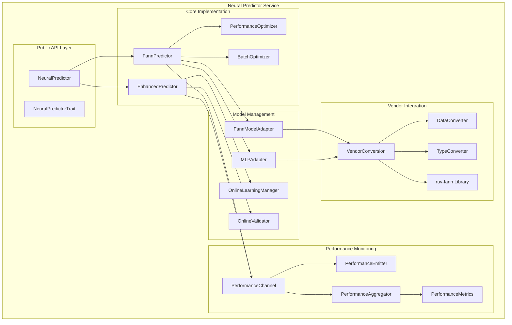
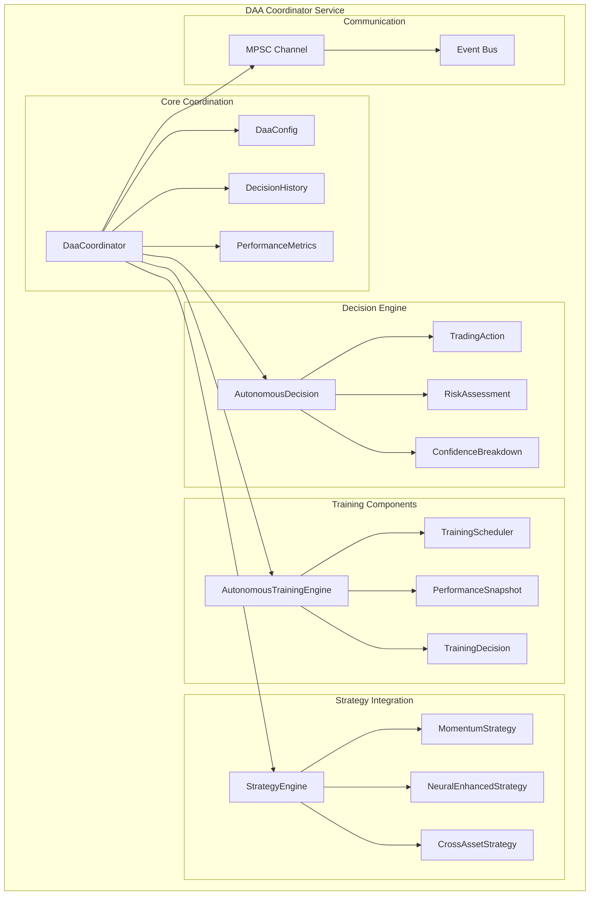
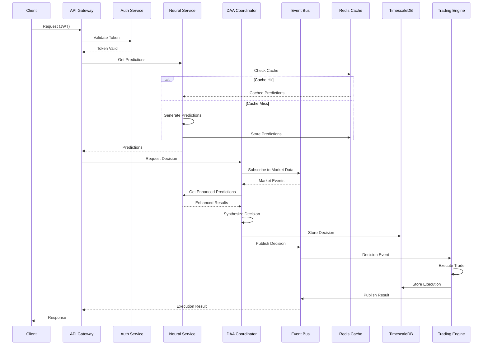
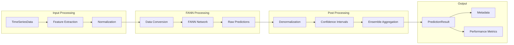
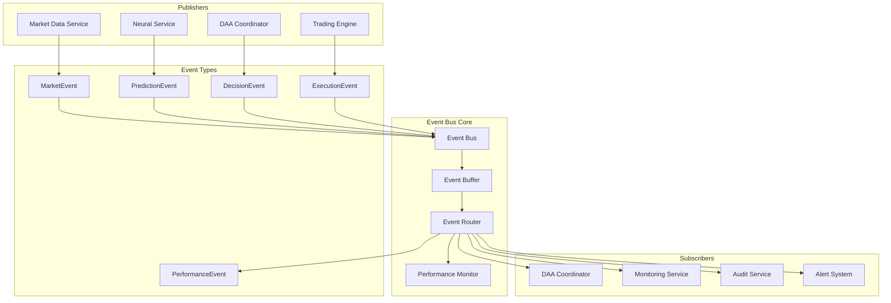
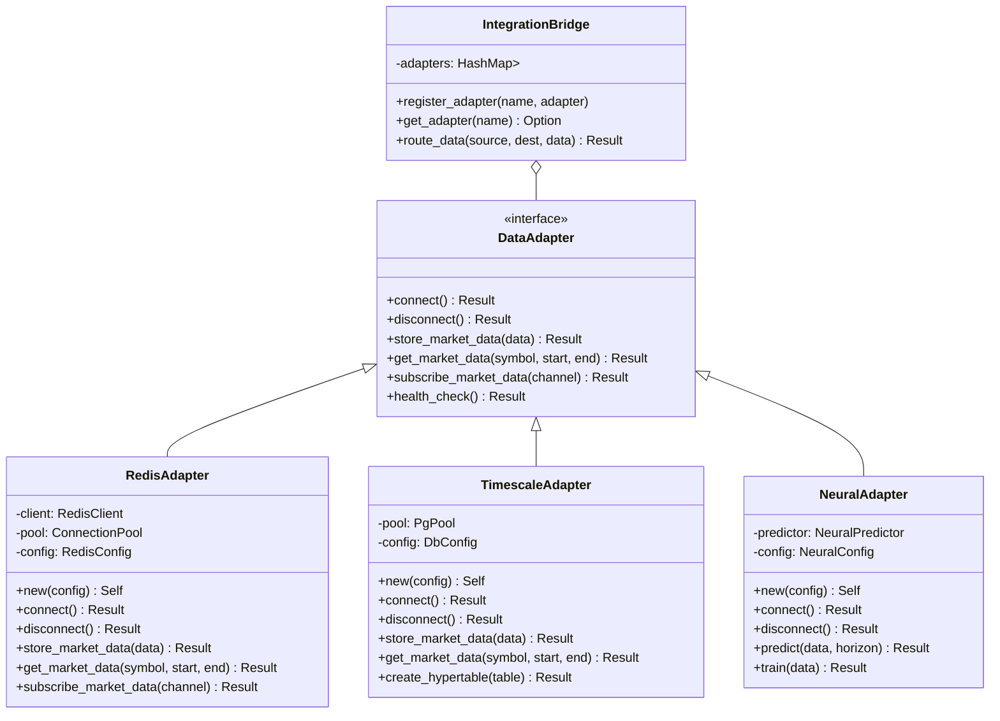
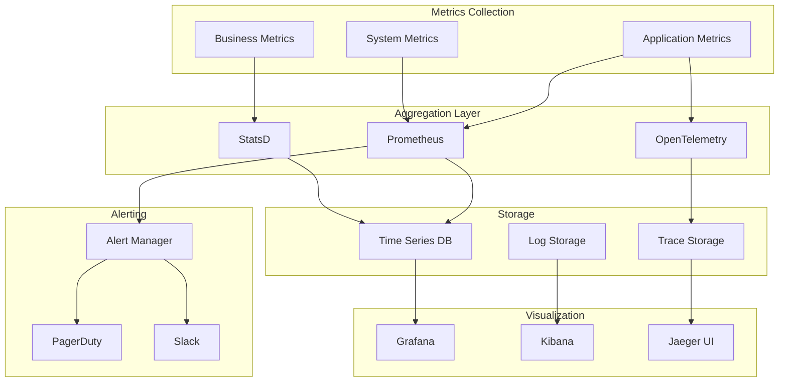
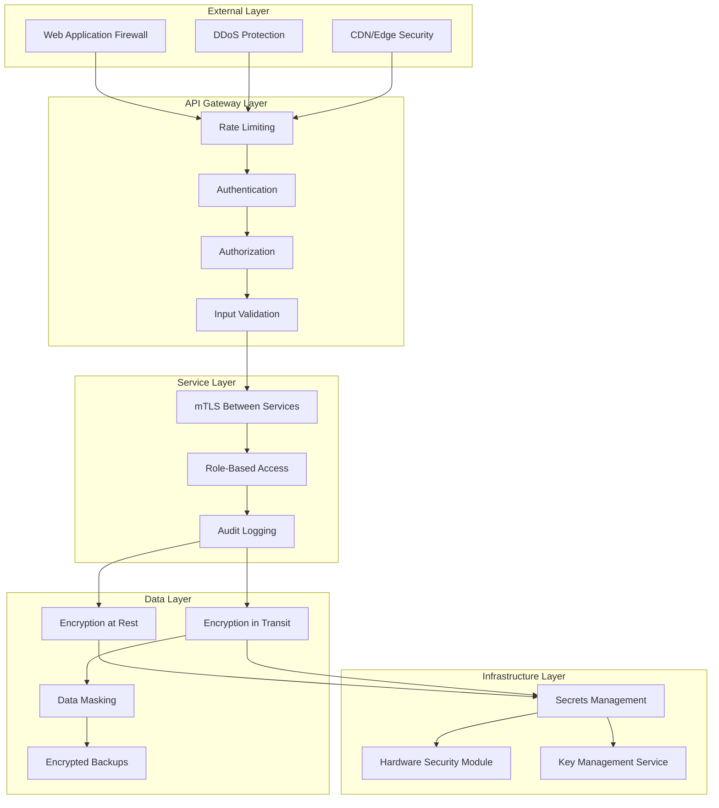
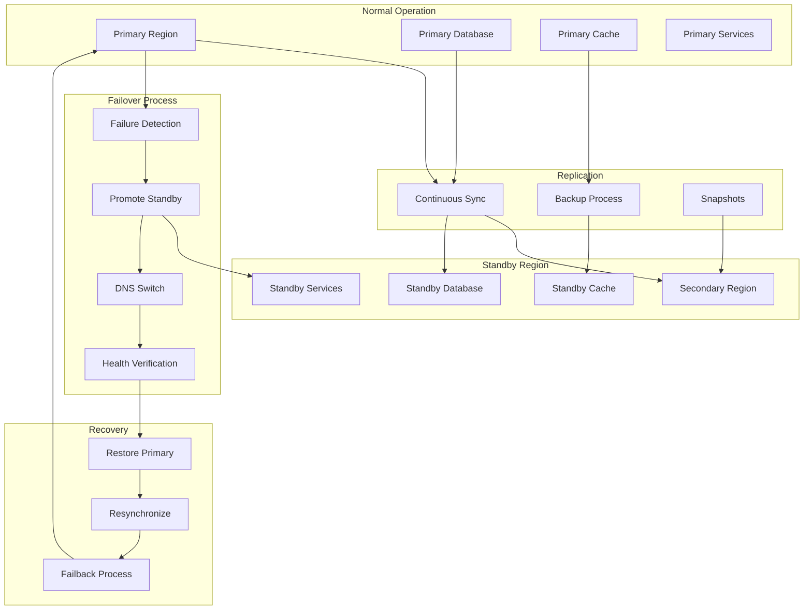

# SPARC Component Diagrams: Neural Trading Platform

## 1. Neural Predictor Service - Detailed Component Diagram

## 2. DAA Coordinator Service - Detailed Component Diagram

## 3. Data Flow Architecture

## 4. Neural Network Processing Pipeline

## 5. Event Bus Message Flow

## 6. Adapter Pattern Implementation

## 7. Performance Monitoring Architecture

## 8. Security Architecture Layers

## 9. Deployment Pipeline

```mermaid
graph LR
    subgraph "Development"
        DEV[Developer]
        IDE[VS Code]
        LOCAL[Local Testing]
    end
    
    subgraph "CI/CD Pipeline"
        GIT[Git Push]
        CI[GitHub Actions]
        TEST[Test Suite]
        BUILD[Docker Build]
        SCAN[Security Scan]
        REG[Container Registry]
    end
    
    subgraph "Staging"
        STAGE_K8S[Staging Kubernetes]
        STAGE_TEST[Integration Tests]
        STAGE_PERF[Performance Tests]
    end
    
    subgraph "Production"
        PROD_K8S[Production Kubernetes]
        CANARY[Canary Deployment]
        BLUE_GREEN[Blue/Green Switch]
        MONITOR[Monitoring]
    end
    
    DEV --> IDE
    IDE --> LOCAL
    LOCAL --> GIT
    
    GIT --> CI
    CI --> TEST
    TEST --> BUILD
    BUILD --> SCAN
    SCAN --> REG
    
    REG --> STAGE_K8S
    STAGE_K8S --> STAGE_TEST
    STAGE_TEST --> STAGE_PERF
    
    STAGE_PERF --> PROD_K8S
    PROD_K8S --> CANARY
    CANARY --> BLUE_GREEN
    BLUE_GREEN --> MONITOR
```

## 10. Disaster Recovery Flow

These component diagrams provide detailed visualization of:
1. Internal service architectures
2. Data flow patterns
3. Integration mechanisms
4. Security layers
5. Deployment processes
6. Disaster recovery procedures

Each diagram focuses on a specific aspect of the system architecture to aid in understanding and implementation.