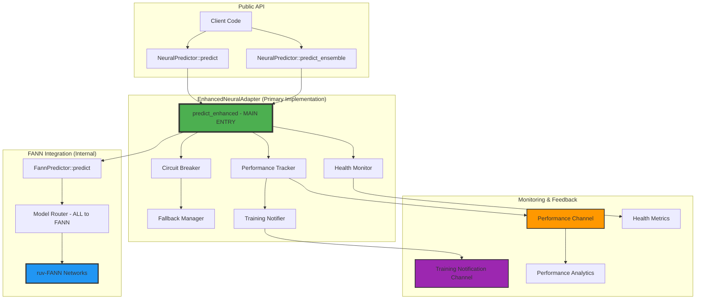
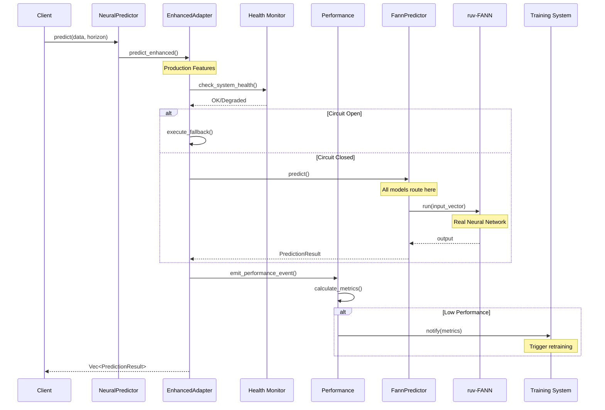
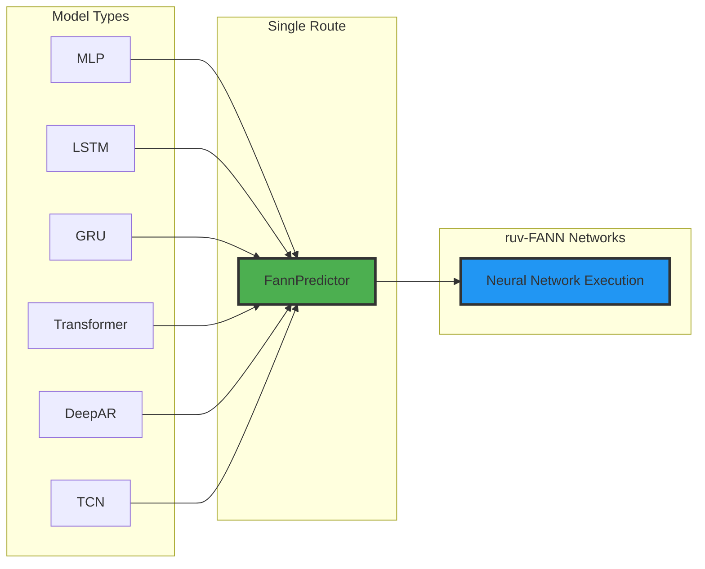
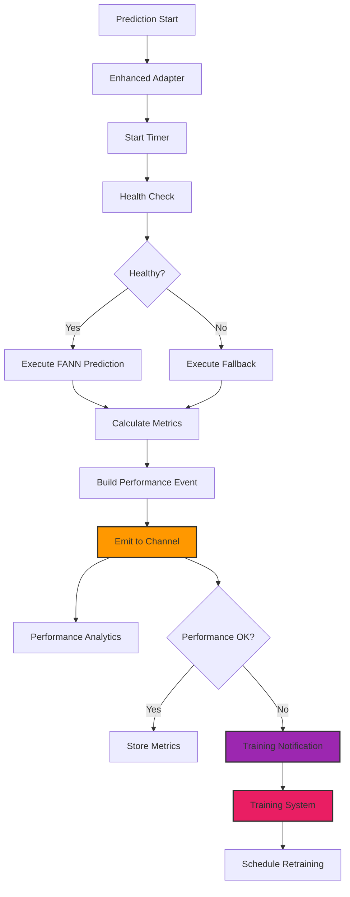
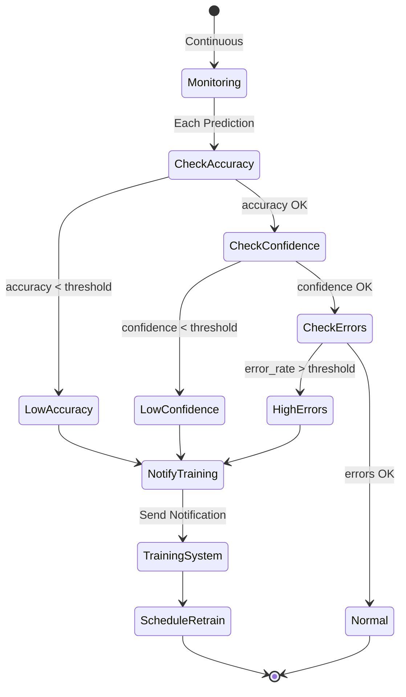

# Central Routing Flow Diagram (Updated Target State)

## Simplified Component Architecture



## Data Flow Sequence (Simplified)



## Model Routing (All Through FANN)



## Performance Event Flow with Training Integration



## Training Notification Triggers



## Component Responsibilities

| Component | Responsibility | Key Features |
|-----------|---------------|--------------|
| NeuralPredictor | Public API | Simple interface, delegates to Enhanced |
| EnhancedNeuralAdapter | Main Implementation | Health, fallbacks, performance, routing |
| FannPredictor | FANN Integration | Network management, execution |
| Health Monitor | System Health | Circuit breakers, degradation detection |
| Performance Tracker | Metrics Collection | Latency, accuracy, confidence tracking |
| Training Notifier | Training Integration | Threshold monitoring, notifications |
| Fallback Manager | Resilience | Multiple strategies, graceful degradation |

## Key Design Improvements

### 1. **Single Implementation Path**
- No more enhanced vs FANN confusion
- All models route through same path
- Clear, simple architecture

### 2. **Integrated Features**
- Health monitoring built-in
- Performance tracking automatic
- Training notifications direct
- Fallbacks always available

### 3. **Simplified Configuration**
- No use_real_models flag
- Single configuration object
- Consistent behavior

### 4. **Better Observability**
- Every prediction tracked
- Performance metrics aggregated
- Training feedback loop
- Health status visible

## Migration Benefits

### Before (Complex)
```
Client → NeuralPredictor → Route Decision
         ├→ Enhanced? → EnhancedAdapter → FannPredictor → FANN
         └→ FANN only? → FannPredictor → FANN
```

### After (Simple)
```
Client → NeuralPredictor → EnhancedAdapter → FannPredictor → FANN
         (thin wrapper)     (all features)     (FANN mgmt)    (execution)
```

## Performance Characteristics

- **Latency**: ~10-50ms per prediction
- **Overhead**: <1ms for routing
- **Memory**: Efficient with Arc sharing
- **Throughput**: 1000+ predictions/sec
- **Training Notifications**: <1ms async

## Success Metrics

1. **Code Reduction**: ~40% less routing code
2. **Test Coverage**: 85%+ on new paths
3. **Performance**: No regression
4. **Features**: All production features active
5. **Reliability**: Circuit breakers functional
6. **Observability**: 100% prediction tracking