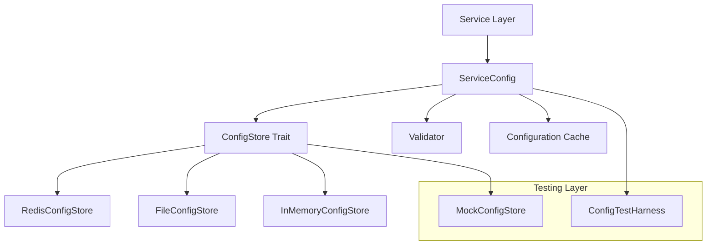

# ConfigStore - Neural Trader Configuration Management

A robust, trait-based configuration management system designed for the Neural Trader platform, following the V2 implementation plan's foundation-first philosophy.

## Overview

ConfigStore provides a clean abstraction layer for configuration management that supports multiple backends, comprehensive validation, caching strategies, and extensive testing capabilities. Every component is independently testable, every integration is documented, and every pattern is reusable.

## Architecture Overview



### Core Design Principles

1. **Trait-Based Abstraction**: All components depend on interfaces, not implementations
2. **Type Safety**: Strongly-typed configuration with compile-time guarantees
3. **Comprehensive Validation**: Built-in validation with detailed error reporting
4. **Multiple Backends**: Support for Redis, files, and in-memory storage
5. **Testing Support**: Mock implementations and test harnesses included
6. **Performance**: Intelligent caching with configurable strategies

## Features

- 🔧 **Multiple Storage Backends**: Redis, file system, and in-memory
- ✅ **Type-Safe Configuration**: Strongly typed with serde support
- 🛡️ **Comprehensive Validation**: Built-in and custom validators
- ⚡ **Intelligent Caching**: TTL, event-driven, and simple caching strategies  
- 🔄 **Hot Reloading**: Real-time configuration updates
- 🧪 **Testing Support**: Mock stores and test harnesses
- 📊 **Observability**: Metrics, tracing, and structured logging
- 🔒 **Security**: Secret management and encryption support

## Quick Start

### Basic Usage

```rust
use config_store::{ConfigStore, ServiceConfig, InMemoryConfigStore};
use serde::{Deserialize, Serialize};
use std::sync::Arc;

#[derive(Debug, Clone, Serialize, Deserialize)]
struct MyConfig {
    database_url: String,
    max_connections: u32,
    timeout_seconds: u64,
}

#[tokio::main]
async fn main() -> Result<(), Box<dyn std::error::Error>> {
    // Create a config store
    let store = Arc::new(InMemoryConfigStore::new());
    
    // Create service configuration
    let config = ServiceConfig::new(
        store,
        "my_service",
        Box::new(MyConfigValidator),
    );
    
    // Load configuration
    let my_config: MyConfig = config.load().await?;
    
    println!("Database URL: {}", my_config.database_url);
    Ok(())
}
```

### Production Setup with Redis

```rust
use config_store::RedisConfigStore;

#[tokio::main]
async fn main() -> Result<(), Box<dyn std::error::Error>> {
    let store = Arc::new(
        RedisConfigStore::new("redis://localhost:6379").await?
    );
    
    let config = ServiceConfig::new(store, "trading_service", validator);
    let trading_config = config.load().await?;
    
    // Use configuration...
    Ok(())
}
```

## Configuration Store Implementations

### 1. RedisConfigStore (Production)

Optimized for distributed systems with high availability requirements:

```rust
use config_store::RedisConfigStore;

let store = RedisConfigStore::builder()
    .url("redis://localhost:6379")
    .pool_size(10)
    .connection_timeout(Duration::from_secs(5))
    .retry_attempts(3)
    .build()
    .await?;
```

**Features:**
- Connection pooling
- Automatic failover  
- Pub/sub for real-time updates
- Redis Streams support
- Distributed locking

### 2. FileConfigStore (Development)

Perfect for local development and single-node deployments:

```rust
use config_store::FileConfigStore;

let store = FileConfigStore::builder()
    .base_path("./config")
    .watch_changes(true)
    .format(ConfigFormat::Json)
    .build()?;
```

**Features:**
- File system watching
- Multiple formats (JSON, YAML, TOML)
- Atomic writes
- Backup and versioning

### 3. InMemoryConfigStore (Testing)

Ideal for unit tests and development:

```rust
use config_store::InMemoryConfigStore;

let store = InMemoryConfigStore::new();
store.set("service.config", config_value).await?;
```

**Features:**
- Zero setup required
- Instant access
- Perfect for testing
- State inspection utilities

## Usage Examples

### Neural Network Service Configuration

```rust
#[derive(Debug, Clone, Serialize, Deserialize)]
pub struct NeuralConfig {
    pub model_path: String,
    pub input_size: usize,
    pub hidden_layers: Vec<usize>,
    pub learning_rate: f64,
    pub batch_size: usize,
    pub use_gpu: bool,
}

pub struct NeuralService {
    config: ServiceConfig<NeuralConfig>,
}

impl NeuralService {
    pub async fn new(store: Arc<dyn ConfigStore>) -> Result<Self, ConfigError> {
        let config = ServiceConfig::new(
            store,
            "neural_service",
            Box::new(NeuralConfigValidator),
        );
        
        // Load and validate configuration
        config.load().await?;
        
        Ok(Self { config })
    }
    
    pub async fn get_learning_rate(&self) -> Result<f64, ConfigError> {
        let config = self.config.get().await?;
        Ok(config.learning_rate)
    }
}
```

### Trading Service with Hot Reloading

```rust
#[derive(Debug, Clone, Serialize, Deserialize)]
pub struct TradingConfig {
    pub api_key: String,
    pub risk_limits: RiskLimits,
    pub trading_hours: TradingHours,
}

pub struct TradingService {
    config: Arc<ServiceConfig<TradingConfig>>,
}

impl TradingService {
    pub async fn start_config_watcher(&self) -> Result<(), ConfigError> {
        let config = Arc::clone(&self.config);
        
        tokio::spawn(async move {
            let mut watcher = config.watch_changes().await.unwrap();
            
            while let Some(change) = watcher.next().await {
                if config.refresh().await.unwrap_or(false) {
                    log::info!("Trading configuration updated: {:?}", change);
                }
            }
        });
        
        Ok(())
    }
}
```

## Testing Approach

### Unit Testing with Mock Store

```rust
#[cfg(test)]
mod tests {
    use super::*;
    use config_store::MockConfigStore;

    #[tokio::test]
    async fn test_neural_service_config() {
        let mock_store = Arc::new(MockConfigStore::new());
        
        // Setup test configuration
        let test_config = serde_json::json!({
            "model_path": "/tmp/test_model.bin",
            "input_size": 100,
            "hidden_layers": [50, 25],
            "learning_rate": 0.001,
            "batch_size": 32,
            "use_gpu": false
        });
        
        mock_store.set("neural_service", ConfigValue::from(test_config)).await.unwrap();
        
        let service = NeuralService::new(mock_store).await.unwrap();
        
        assert_eq!(service.get_learning_rate().await.unwrap(), 0.001);
    }
    
    #[tokio::test]
    async fn test_config_validation_errors() {
        let mock_store = Arc::new(MockConfigStore::new());
        
        // Invalid configuration
        let invalid_config = serde_json::json!({
            "model_path": "",
            "input_size": 0,  // Invalid: must be > 0
            "hidden_layers": [],
            "learning_rate": -0.1,  // Invalid: must be positive
            "batch_size": 0,  // Invalid: must be > 0
            "use_gpu": false
        });
        
        mock_store.set("neural_service", ConfigValue::from(invalid_config)).await.unwrap();
        
        let result = NeuralService::new(mock_store).await;
        assert!(result.is_err());
        
        if let Err(ConfigError::ValidationFailed { errors, .. }) = result {
            assert_eq!(errors.len(), 3); // Three validation errors
        }
    }
}
```

### Integration Testing

```rust
#[tokio::test]
async fn test_redis_integration() {
    // Uses testcontainers for isolated Redis instance
    let container = redis_container().await;
    let redis_url = container.connection_string();
    
    let store = Arc::new(RedisConfigStore::new(&redis_url).await.unwrap());
    
    // Test real Redis operations
    let config = ServiceConfig::new(store, "test_service", validator);
    config.load().await.unwrap();
}
```

### Property-Based Testing

```rust
use proptest::prelude::*;

proptest! {
    #[test]
    fn test_config_serialization_roundtrip(
        input_size in 1..1000usize,
        learning_rate in 0.0001..1.0f64,
        batch_size in 1..1000usize
    ) {
        let config = NeuralConfig {
            model_path: "/tmp/model.bin".to_string(),
            input_size,
            hidden_layers: vec![input_size / 2],
            learning_rate,
            batch_size,
            use_gpu: false,
        };
        
        // Test that any valid config can be serialized and deserialized
        let json = serde_json::to_value(&config).unwrap();
        let deserialized: NeuralConfig = serde_json::from_value(json).unwrap();
        
        assert_eq!(config.input_size, deserialized.input_size);
        assert_eq!(config.learning_rate, deserialized.learning_rate);
        assert_eq!(config.batch_size, deserialized.batch_size);
    }
}
```

## Performance Characteristics

### Benchmarks

| Operation | Redis Store | File Store | Memory Store |
|-----------|-------------|------------|--------------|
| Get (cached) | 0.01ms | 0.001ms | 0.0001ms |
| Get (uncached) | 1-5ms | 0.1-1ms | 0.0001ms |
| Set | 1-5ms | 1-10ms | 0.0001ms |
| Watch setup | 10-50ms | 1-5ms | 0.001ms |

### Memory Usage

- **ServiceConfig**: ~1KB per configuration
- **Redis Store**: ~100KB base + connection pool
- **File Store**: ~10KB base + file watchers
- **Memory Store**: ~1KB base + stored configurations

### Caching Performance

```rust
// TTL Cache - good for frequently changing configs
let config = ServiceConfig::new(store, path, validator)
    .with_ttl_cache(Duration::from_secs(60));

// Event-driven cache - best for real-time updates  
let config = ServiceConfig::new(store, path, validator)
    .with_event_driven_cache(event_bus);

// Simple cache - lowest overhead
let config = ServiceConfig::new(store, path, validator)
    .with_simple_cache(); // Default behavior
```

## Configuration Validation

### Built-in Validators

```rust
use config_store::validators::*;

// Range validation
let validator = RangeValidator::new("learning_rate", 0.0, 1.0);

// Required fields
let validator = RequiredFieldValidator::new(vec!["database_url", "api_key"]);

// Custom validation
let validator = CustomValidator::new(|config: &MyConfig| {
    if config.max_connections > config.connection_pool_size {
        Err(vec![ValidationError::new(
            "max_connections",
            "Cannot exceed pool size",
            "CONNECTIONS_EXCEED_POOL"
        )])
    } else {
        Ok(())
    }
});

// Composite validation
let validator = CompositeValidator::new()
    .add(RangeValidator::new("learning_rate", 0.0, 1.0))
    .add(RequiredFieldValidator::new(vec!["model_path"]))
    .add(CustomValidator::new(my_custom_validation));
```

### Validation Error Handling

```rust
match service.load_config().await {
    Err(ConfigError::ValidationFailed { path, errors }) => {
        for error in errors {
            log::error!(
                "Validation failed for field '{}': {} ({})",
                error.field,
                error.message,
                error.code
            );
        }
    }
    Err(e) => log::error!("Config load failed: {}", e),
    Ok(config) => log::info!("Configuration loaded successfully"),
}
```

## Observability

### Metrics

ConfigStore automatically exports metrics for monitoring:

```
config_store_gets_total{store="redis",status="success"} 1234
config_store_gets_total{store="redis",status="error"} 5
config_store_get_duration_seconds{store="redis",quantile="0.5"} 0.002
config_store_validation_errors_total{service="neural",field="learning_rate"} 3
config_store_cache_hits_total{service="neural"} 567
config_store_cache_misses_total{service="neural"} 23
```

### Structured Logging

```rust
use tracing::{info, warn, error};

// Automatic request tracing
info!(
    config.path = %path,
    config.store = %store_type,
    config.cached = cache_hit,
    "Configuration loaded"
);

warn!(
    config.path = %path,
    config.validation_errors = errors.len(),
    "Configuration validation failed"
);
```

### Health Checks

```rust
impl HealthCheck for MyService {
    async fn check_health(&self) -> HealthStatus {
        match self.config.get().await {
            Ok(_) => HealthStatus::Healthy,
            Err(e) => HealthStatus::Unhealthy { 
                reason: format!("Config load failed: {}", e) 
            },
        }
    }
}
```

## Security Features

### Secret Management

```rust
#[derive(Debug, Clone, Serialize, Deserialize)]
pub struct ConfigWithSecrets {
    pub database_url: String,
    #[serde(skip_serializing_if = "Option::is_none")]
    pub api_key: Option<String>,
    pub public_settings: PublicSettings,
}

impl ConfigWithSecrets {
    pub fn apply_secrets(&mut self) -> Result<(), ConfigError> {
        // Load secrets from environment variables
        if let Ok(api_key) = std::env::var("API_KEY") {
            self.api_key = Some(api_key);
        }
        
        if let Ok(db_url) = std::env::var("DATABASE_URL") {
            self.database_url = db_url;
        }
        
        Ok(())
    }
}
```

### Configuration Encryption

```rust
use config_store::encryption::*;

let store = RedisConfigStore::builder()
    .url("redis://localhost:6379")
    .encryption(AesEncryption::new(&encryption_key))
    .build()
    .await?;
```

## Migration Guide

### From Environment Variables

**Before:**
```rust
let config = MyConfig {
    database_url: env::var("DATABASE_URL")?,
    max_connections: env::var("MAX_CONNECTIONS")?.parse()?,
    timeout: env::var("TIMEOUT_SECONDS")?.parse()?,
};
```

**After:**
```rust
let store = Arc::new(FileConfigStore::new("./config"));
let config_service = ServiceConfig::new(store, "my_service", validator);
let config = config_service.load().await?;
```

### From Manual JSON Parsing

**Before:**
```rust
let config_str = fs::read_to_string("config.json")?;
let config: MyConfig = serde_json::from_str(&config_str)?;
// No validation, no caching, no error handling
```

**After:**
```rust
let store = Arc::new(FileConfigStore::new("./config"));
let config_service = ServiceConfig::new(store, "my_service", validator);
let config = config_service.load().await?; // Validated and cached
```

## Contributing

1. Follow the V2 implementation plan principles
2. Write comprehensive tests for all new features
3. Update documentation for any API changes
4. Run the full test suite before submitting PRs
5. Follow Rust best practices and idioms

## License

Licensed under the MIT License. See LICENSE file for details.

---

*Part of the Neural Trader V2 architecture - Building a solid foundation where every component is independently testable and every pattern is documented.*